# 2. 套装清单：

当收到这个Keyes IOT ESP32智能家居套件的时候，首先看到是一个包装精美的外盒，每个配件被安全且有序的装在外盒里面的小袋子里，先来清点一下：

|序号|规格|倍用量|图片|
|-|-|-|-|
|1|ESP32智能家居用椴木板 七片 |1||
|2|ESP32智能家居用亚克力板 两片|1|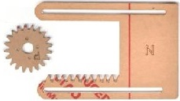|
|3|ESP32 PLUS开发板|1|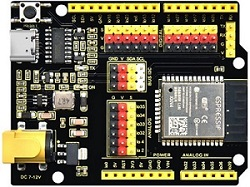|
|4|SK6812 RGB模块|1|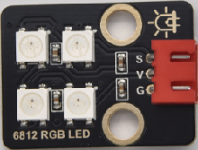|
|5|MQ-2模拟气体传感器|1|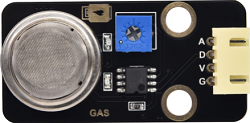|
|6|单路按键模块|2||
|7|RFID刷卡模块|1|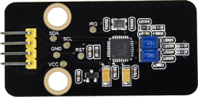|
|8|无源蜂鸣器模块|1|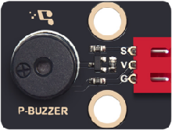|
|9|130电机模块|1|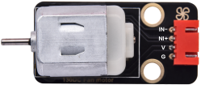|
|10|水滴传感器|1||
|11|XHT11温湿度传感器(兼容DHT11)|1|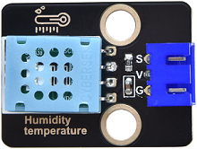|
|12|人体红外热释电传感器|1|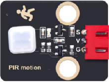|
|13|黄色LED模块|1|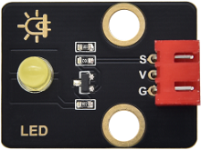|
|14|智能语音模块|1|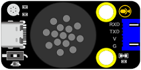|
|15|舵机|2||
|16| 舵机控制模块| 1|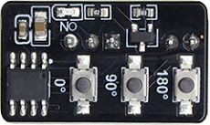|
|17|I2C1602液晶屏模块|1|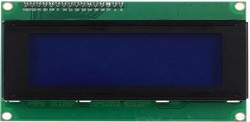|
|18|3 Pin 线材|8||
|19|4 Pin 线材 |4||
|20|4 pin 母对母连拼(黑红蓝绿)|1||
|21|公对母杜邦线|4|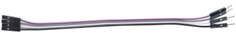|
|22|M1.4*6MM 圆头 十字 自攻螺钉|10|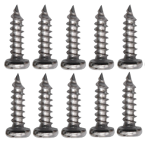|
|23|M3 镀镍 自锁|5|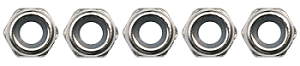|
|24|M4*8MM 圆头 十字|24|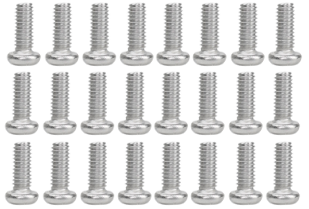|
|25|M3*6MM 圆头 十字|9|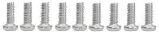|
|26|M3*10MM 圆头 十字|5|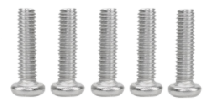|
|27|M2*12MM 圆头 十字|5|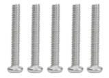|
|28|M4 镀镍|24|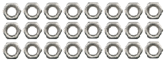|
|29|M3 镀镍|7|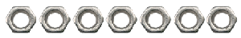|
|30|M2 镀镍|6|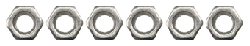|
|31|M3*8MM 平头 十字|3|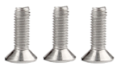|
|32|M1.2*4MM 圆头 十字 自攻 螺丝钉|4|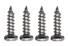|
|33|十字扳手 M2、M3、M4螺母|1||
|34|3.0*40MM 红黑色 十字螺丝刀|1||
|35|2.0*40MM 紫黑色 十字螺丝刀|1||
|36|M3*10MM 双通|4|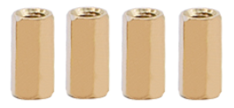|
|37|USB线|1|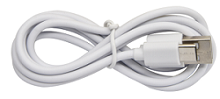|
|38|6节5号电池盒|1|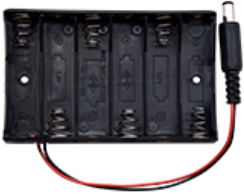|
|39|三叶软桨|1||
|40|M3*12MM 圆头 十字 螺钉|4|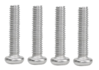|
|41|白色IC磁卡|1||
|42|绿色钥匙扣|1||
|43|双面胶|1|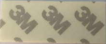|

