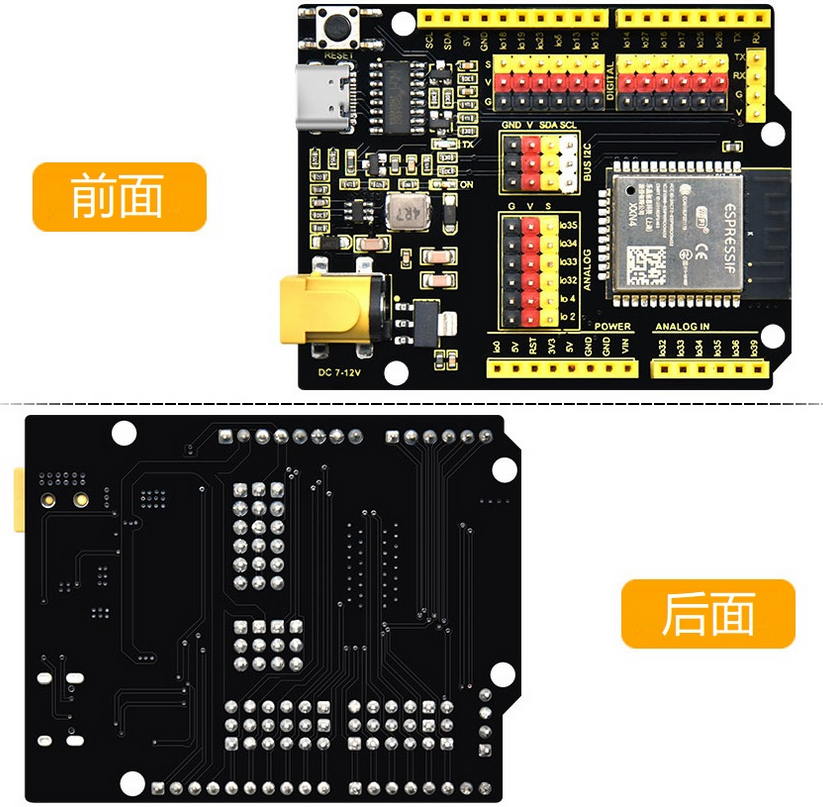
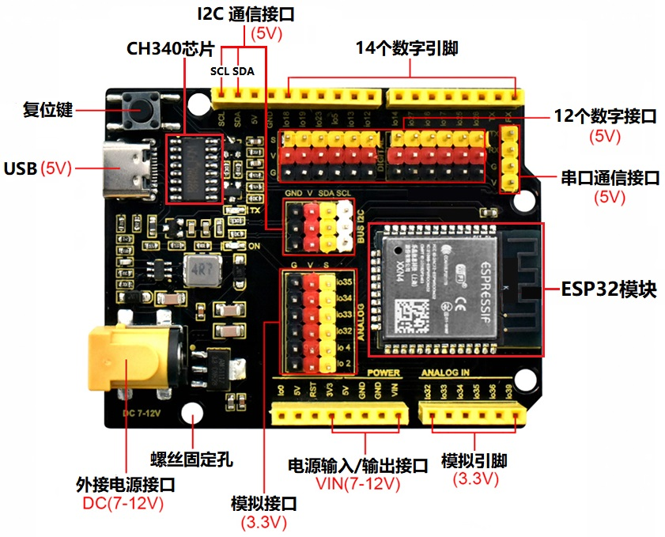

# 3. KEYES ESP32 PLUS开发板介绍

**3.1\. 简介：**

这是一款基于ESP32开发板，集成了ESP32-WOROOM-32模组，是一款通用型的WIFI加蓝牙开发板，引脚兼容Arduino。有丰富的外设，包括霍尔传感器，高速SDIO/SPI、UART、I2S和I2C等，并且可以搭载freeRTOS操作系统，非常适用于物联网、智能家居方案。

**3.2\. 参数：**

|输出电压|3.3V-5V|
|-|-|
|输出电流|MAX：1.2A|
|最大功率|最大输出10W|
|工作温度范围|-10~50摄氏度|
|尺寸|69*54*14.5mm|
|重量|25.5g|
|环保属性|ROHS|

**3.3\. 接口图：**

**引脚功能简介**

| 引脚 |   输入   | 输出 | 说明  |
| :--: | :-------: | :----: | :----: |
|  0   | pulled up |   OK   | 开机时输出 PWM 信号，必须为 LOW 才能进入烧录模式 |
|  1   |  TX pin   |   OK   | 开机调试输出                                                 |
|  2   |    OK     |   OK   | 连接到板载 LED，必须悬空或处于低电平才能进入烧录模式 |
|  3   |    OK     | RX pin | 开机时高                                                     |
|  4   |    OK     |   OK   |                                                              |
|  5   |    OK     |   OK   | 在启动时输出 PWM 信号，捆扎引脚                              |
|  6   |     x     |   x    | 连接到集成 SPI 闪存                                          |
|  7   |     x     |   x    | 连接到集成 SPI 闪存                                          |
|  8   |     x     |   x    | 连接到集成 SPI 闪存                                          |
|  9   |     x     |   x    | 连接到集成 SPI 闪存                                          |
|  10  |     x     |   x    | 连接到集成 SPI 闪存                                          |
|  11  |     x     |   x    | 连接到集成 SPI 闪存                                          |
|  12  |    OK     |   OK   | 如果拉高，则启动失败，捆扎针 |
|  13  |    OK     |   OK   |                                                              |
|  14  |    OK     |   OK   | 开机输出PWM信号                                              |
|  15  |    OK     |   OK   | 在启动时输出 PWM 信号，捆扎引脚                              |
|  16  |    OK     |   OK   |                                                              |
|  17  |    OK     |   OK   |                                                              |
|  18  |    OK     |   OK   |                                                              |
|  19  |    OK     |   OK   |                                                              |
|  21  |    OK     |   OK   |                                                              |
|  22  |    OK     |   OK   |                                                              |
|  23  |    OK     |   OK   |                                                              |
|  25  |    OK     |   OK   |                                                              |
|  26  |    OK     |   OK   |                                                              |
|  27  |    OK     |   OK   |                                                              |
|  32  |    OK     |   OK   |                                                              |
|  33  |    OK     |   OK   |                                                              |
|  34  |    OK     |   x    |                                                              |
|  35  |    OK     |   x    |                                                              |
|  36  |    OK     |   x    |                                                              |
|  39  |    OK     |   x    |                                                              |

