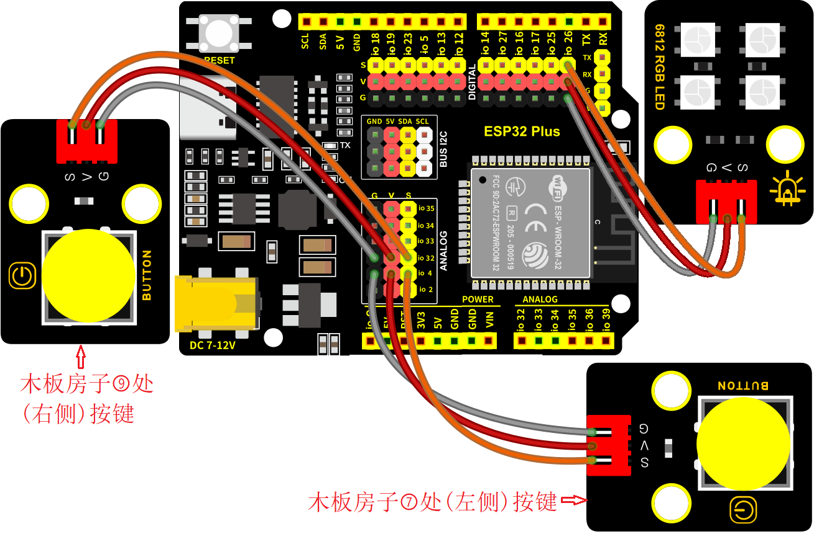

### 第7课 氛围灯

#### 7.1 项目介绍

智能家居的氛围灯是4个SK6812RGB LED，RGB LED属于简单的发光模块，可以通过调节色彩调出不同颜色的灯效，可广泛应用于建筑物、桥梁、道路、花园、庭院、地板等领域的装饰照明与会场布置、圣诞节、万圣节、情人节、复活节、国庆节等节日期间烘托气氛等场景。在本实验中，实现各种灯光效果。

#### 7.2 模块相关资料

**SK6812RGB：** 从原理图中可以看出，这4个RGBLED都是串联起来的，在电压电流充足的情况下可以接几百个RGB LED，都可以用一根信号线控制任意一个RGB LED，并且让它显示任意一种颜色。每一颗RGBLED都是一个独立的像素点，每个像素点都是由R、G、B三基色颜色组成，可实现256级亮度显示，完成16777216种颜色的全真色彩显示，同时像素点内部包含了智能数字接口数据锁存信号整形放大驱动电路，还内置信号整形电路，有效保证了像素点光的颜色高度一致。

数据协议采用单线归零码的通讯方式，像素点在上电复位以后，S端接受从控制器传输过来的数据，首先送过来的24bit数据被第一个像素点提取后，送到像素点内部的数据锁存器。这个6812RGB通讯协议与驱动已经在底层封装好了，我们直接调用函数的接口就可以使用，简单方便，LED具有低电压驱动，环保节能，亮度高，散射角度大，一致性好，超低功率，超长寿命等优点。


#### 7.3 实验组件

||||||
|-|-|-|-|-|
|ESP32 Plus主板 *1|按键 *2|SK6812RGB灯 *1|3P线 *3|USB线 *1|

#### 7.4 模块接线图

木板房子⑦处(左侧)按键1，木板房子⑨处(右侧)按键2和SK6812RGB灯模块的控制引脚：

|SK6812RGB灯（S引脚）|io26|
|-|-|
|木板房子⑦处(左侧)按键1（S引脚）|io4|
|木板房子⑨处(右侧)按键2（S引脚）|io32|

⚠️ **特别注意：智能家居已经组装好了，这里不需要把LED模块拆下来又重新组装和接线，这里再次提供接线图，是为了方便您编写代码！**



#### 7.5 控制SK6812的实验代码1 

控制SK6812显示各种灯效

```c
/*  
 * 项目: SK6812
 * 描述: SK6812发出多种灯光颜色
 * 编译IDE：ARDUINO IDE
 * 作者: http//www.keyes-robot.com
*/
#include <Adafruit_NeoPixel.h>
#ifdef __AVR__
 #include <avr/power.h> // 需要16兆赫Adafruit饰品
#endif
// Arduino的哪个引脚连接到NeoPixels？
//如果是Trinket或Gemma，我们建议将其更改为1：
#define LED_PIN    26
// 有多少NeoPixels连接到Arduino？
#define LED_COUNT 4
// 声明我们的NeoPixel条带对象：
Adafruit_NeoPixel strip(LED_COUNT, LED_PIN, NEO_GRB + NEO_KHZ800);

void setup() {
  // 这些线路专门支持Adafruit Trinket 5V 16 MHz.
  // 任何其他板，可以移除该部分（无影响）：
#if defined(__AVR_ATtiny85__) && (F_CPU == 16000000)
  clock_prescale_set(clock_div_1);
#endif
  // 结束特定于Trinket的代码

  strip.begin();           // 初始化NeoPixel条带对象（REQUIRED）
  strip.show();            // 尽快关闭所有像素
  strip.setBrightness(50); // 将亮度设置为1/5 （max = 255）
}


// Loop（）函数——只要单板打开就会重复运行 ---------------

void loop() {
  // 沿着条的长度用不同的颜色填充...
  colorWipe(strip.Color(255,   0,   0), 50); // 红
  colorWipe(strip.Color(  0, 255,   0), 50); // 绿
  colorWipe(strip.Color(  0,   0, 255), 50); // 蓝

  // 做一个剧院的帐篷效果在不同的颜色...
  theaterChase(strip.Color(127, 127, 127), 50); // 白，半亮度
  theaterChase(strip.Color(127,   0,   0), 50); // 红，半亮度
  theaterChase(strip.Color( 0,   0, 127), 50); // 蓝，半亮度

  rainbow(10);             // 流动的彩虹循环沿着整个地带
  theaterChaseRainbow(50); // 彩虹增强型剧场追逐型
}


// 我们自己创建的一些动画效果 -----------------

//用颜色逐个填充条形像素。带材未首先清除；任何东西都将被逐像素覆盖。
//传入color(作为一个‘打包’的32位值，你可以通过调用strip来获得。颜色（红，绿，蓝）如上面loop（）函数所示，
//像素之间的延迟时间（毫秒）。
void colorWipe(uint32_t color, int wait) {
  for(int i=0; i<strip.numPixels(); i++) { // 对于条带中的每个像素...
    strip.setPixelColor(i, color);         //  设置像素的颜色（RAM）
    strip.show();                          //  更新条带以匹配
    delay(wait);                           //  暂停一会儿
  }
}

//剧院式的追逐灯。传入一个颜色（32位值，如上面提到的strip.Color(r,g,b)），
//帧与帧之间的延迟时间（毫秒）。
void theaterChase(uint32_t color, int wait) {
  for(int a=0; a<10; a++) {  // 重复10次...
    for(int b=0; b<3; b++) { //  ‘b’从0到2...
      strip.clear();         //  将RAM中的所有像素设置为0（关闭）
      // ‘c’从‘b’开始计数，以3为步...
      for(int c=b; c<strip.numPixels(); c += 3) {
        strip.setPixelColor(c, color); // 设置像素c的值为color
      }
      strip.show(); // 用新内容更新条带
      delay(wait);  // 暂停一会儿
    }
  }
}

// 彩虹沿着整个条带循环。在帧之间传递延迟时间（毫秒）。
void rainbow(int wait) {
//第一个像素的色相通过色轮运行5个完整的循环。
//色轮的范围是65536，但是如果我们翻转它是可以的，所以只从0到5*65536计数。
//每次给firstPixelHue添加256意味着我们将让5*65536/256 = 1280次通过这个外部循环：
  for(long firstPixelHue = 0; firstPixelHue < 5*65536; firstPixelHue += 256) {
    for(int i=0; i<strip.numPixels(); i++) { // 对于条带中的每个像素...
      // 偏移像素色相的数量，使一个完整的旋转色轮（范围65536）沿着条的长度（strip. numpixels（）步骤）：
      int pixelHue = firstPixelHue + (i * 65536L / strip.numPixels());
      // strip.ColorHSV（）可以接受1或3个参数：色调（0到65535）或可选地添加饱和度和值（亮度）（每个0到255）。
      // 这里我们只使用单参数的hue变量。
      // 结果通过strip.gamma32（）传递，以便在分配每个像素之前提供“更真实”的颜色：
      strip.setPixelColor(i, strip.gamma32(strip.ColorHSV(pixelHue)));
    }
    strip.show(); // 用新内容更新条带
    delay(wait);  // 暂停一会儿
  }
}

// 彩虹增强剧院帐篷。在帧之间传递延迟时间（毫秒）。
void theaterChaseRainbow(int wait) {
  int firstPixelHue = 0;     // 第一个像素以红色开始（色调0）
  for(int a=0; a<30; a++) {  // 重复30次...
    for(int b=0; b<3; b++) { //  ‘b’从0到2...
      strip.clear();         //  将RAM中的所有像素设置为0（关闭）
      // “c”从“b”开始计数，以3为增量到条带的末尾…
      for(int c=b; c<strip.numPixels(); c += 3) {
        // 像素‘c’的色调被偏移一定的量，
        // 使色轮沿着条带的长度（strip. numpixels（）步骤）完整旋转一次（范围65536）：
        int hue   = firstPixelHue + c * 65536L / strip.numPixels();
        uint32_t color = strip.gamma32(strip.ColorHSV(hue)); // hue -> RGB
        strip.setPixelColor(c, color); // 设置像素c的值为color
      }
      strip.show();                // 用新内容更新条带
      delay(wait);                 // 暂停一会儿
      firstPixelHue += 65536 / 90; // 一个周期的色轮超过90帧
    }
  }
}
```

#### 7.6 实验结果1

按照接线图接好线，外接电源，选择好正确的开发板板型（ESP32 Dev Module）和 适当的串口端口（COMxx），然后单击按钮上传示例代码至ESP32主控板。示例代码上传成功后，智能家居的氛围灯显示各种颜色和各种灯效。


#### 7.7 代码流程图


#### 7.8 按钮切换灯颜色的实验代码2

两个按键，左右切换氛围灯的颜色。

```c
/*  
 * 项目: btn_sk6812
 * 描述: 按键控制SK6812,按键切换灯光颜色
 * 编译IDE：ARDUINO IDE
 * 作者: http//www.keyes-robot.com
*/
#define btn1 4    // 按钮1引脚
#define btn2 32    // 按钮2引脚

#include <Adafruit_NeoPixel.h>
#ifdef __AVR__
 #include <avr/power.h> // 需要 16 MHz Adafruit Trinket
#endif

#define LED_PIN    26    // NeoPixel数据引脚
#define LED_COUNT 4      // 新像素数
Adafruit_NeoPixel strip(LED_COUNT, LED_PIN, NEO_GRB + NEO_KHZ800);

int btn_count = 0; // 按键计数器

void setup() 
{
  Serial.begin(9600);
  pinMode(btn1, INPUT);
  pinMode(btn2, INPUT);
  
  #if defined(__AVR_ATtiny85__) && (F_CPU == 16000000)
    clock_prescale_set(clock_div_1);
  #endif

  strip.begin();           // 初始化新像素条
  strip.show();            // 关闭所有像素
  strip.setBrightness(50); // 设置亮度（最大255）
}

void loop() 
{
  boolean btn1_val = digitalRead(btn1);
  boolean btn2_val = digitalRead(btn2);
  
  // 按钮1（减量）处理
  if(btn1_val == 0) // 按下按钮
  {
    delay(10);  // 防反跳延迟
    if(btn1_val == 0) // 按下确认按钮
    {
      boolean btn_state = 1;
      while(btn_state == 1) // 等待松开按钮
      {
        boolean btn_val = digitalRead(btn1);
        if(btn_val == 1)  // 松开按钮
        {
          btn_count--;    // 减量计数器
          if(btn_count <= 0) // 极限最小值
          {
            btn_count = 0;
          }
          Serial.println(btn_count);
          btn_state = 0;  // 退出循环
        }
      }
    }
  }
    
  // 按钮2（增量）处理
  if(btn2_val == 0) // 按下按钮
  {
    delay(10);  // 防反跳延迟
    if(btn2_val == 0) // 按下确认按钮
    {
      boolean btn_state2 = 1;
      while(btn_state2 == 1) // 等待松开按钮
      {
        boolean btn2_val = digitalRead(btn2);
        if(btn2_val == 1)  // 松开按钮
        {
          btn_count++;    // 增量计数器
          if(btn_count >= 6) // 极限最大值
          {
            btn_count = 6;
          }
          Serial.println(btn_count);
          btn_state2 = 0;  // 退出循环
        }
      }
    }
  }

  // 根据按钮计数改变LED颜色
  switch(btn_count)
  {
    case 0: colorWipe(strip.Color(0,   0,   0), 50); break;    // 关
    case 1: colorWipe(strip.Color(255,  0,   0), 50); break;   // 红
    case 2: colorWipe(strip.Color(0,   255,   0), 50); break;  // 绿
    case 3: colorWipe(strip.Color(0,   0,   255), 50); break;  // 蓝
    case 4: colorWipe(strip.Color(255, 255,   0), 50); break;  // 黄
    case 5: colorWipe(strip.Color(255, 0,   255), 50); break;  // 品红
    case 6: colorWipe(strip.Color(255, 255, 255), 50); break;  // 白
  }
}

// 用一种颜色填充灯带
void colorWipe(uint32_t color, int wait) 
{
  for(int i=0; i<strip.numPixels(); i++) 
  { 
    strip.setPixelColor(i, color); // 设置像素颜色
    strip.show();                  // 更新灯带
    delay(wait);                   // 暂停
  }
}
```

#### 7.9 实验结果2

按照接线图接好线，外接电源，选择好正确的开发板板型（ESP32 Dev Module）和 适当的串口端口（COMxx），然后单击按钮上传示例代码至ESP32主控板。示例代码上传成功后，上电后，点击木板房子⑨处(右侧)按键2，SK6812RGB模块依次亮红、绿、蓝、黄、品红、白等颜色灯；点击木板房子⑦处(左侧)按键1，SK6812RGB模块依次亮品红、黄、蓝、绿、红等颜色灯和熄灭。通过点击木板房子⑦处(左侧)按键1和木板房子⑨处(右侧)按键2来切换氛围灯的颜色。


