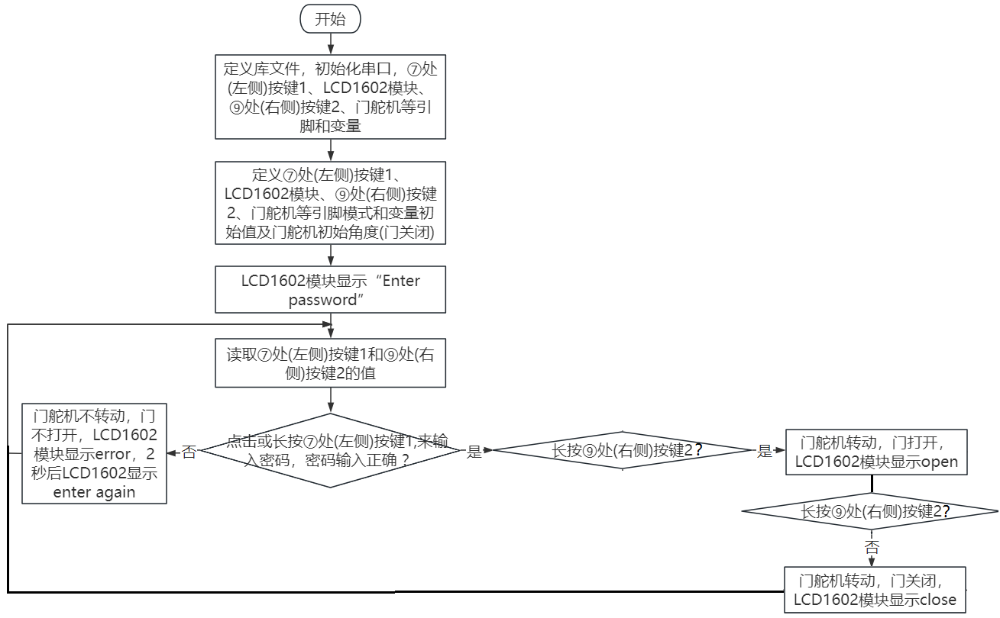

### 第13课 摩斯密码

#### 13.1 项目介绍

摩尔斯电码也被称作摩斯密码，是一种时通时断的信号代码，通过不同的排列顺序来表达不同的英文字母、数字和标点符号。

现在我们使用它来作为我们的密码门。

#### 13.2 摩斯密码的相关资料

摩斯密码对应的字符如下：


#### 13.3 实验组件

|||||
|-|-|-|-|
|ESP32 Plus主板 *1|按键 *2|180度舵机 *1|3P线 *2|
|||| |
|I2C LCD1602模块 *1|4P线 *1|USB线 *1| |

#### 13.4 模块接线图

木板房子⑦处(左侧)按键1，木板房子⑨处(右侧)按键2，门舵机和I2C 1602 LCD模块的控制引脚：

|木板房子⑦处(左侧)按键1（S引脚）|io4|
|-|-|
|木板房子⑨处(右侧)按键2（S引脚）|io32|
|门舵机（橙黄色线引脚）|io13|
|I2C 1602 LCD模块（SDA引脚）|SDA|
|I2C 1602 LCD模块（SCL引脚）|SCL|

⚠️ **特别注意：智能家居已经组装好了，这里不需要把按键、舵机和I2C 1602 LCD模块拆下来又重新组装和接线，这里再次提供接线图，是为了方便您编写代码！**


#### 13.5 代码流程图



#### 13.6 实验代码 

简单的使用作为正确密码。

还使用到了一个很好用的按钮库文件OneButton，非常简单的实现按钮的点击、双击、长按等功能。对应摩斯密码，点击为“.”，长按再松开为“-”。(“.”的意思是点击按钮，“-”的意思是长按按钮2秒以上)

```c
/*  
 * 项目: mosDoor
 * 描述: 两个按键控制门模拟密码锁
 * 编译IDE：ARDUINO IDE
 * 作者: http//www.keyes-robot.com
*/
#include <Wire.h>
#include <LiquidCrystal_I2C.h>
LiquidCrystal_I2C mylcd(0x27,16,2);
#include "OneButton.h"
// 设置一个新的OneButton引脚 4.  
OneButton button1(4, true);
// 设置一个新的OneButton引脚 32.  
OneButton button2(32, true);
#include <ESP32Servo.h>
Servo myservo;
int servoPin = 13;
String password = "";
String correct_p = "-.-";  //密码

void setup() {
  Serial.begin(115200);
  mylcd.init();
  mylcd.backlight();
  // 链接按钮1功能。
  button1.attachClick(click1);
  button1.attachLongPressStop(longPressStop1);
  // 链接按钮2功能。
  button2.attachClick(click2);
  button2.attachLongPressStop(longPressStop2);

  myservo.attach(servoPin); // 将引脚13上的伺服连接到伺服对象上
  myservo.write(0);  //初始状态是关门
  delay(1000);
  mylcd.setCursor(0, 0);
  mylcd.print("Enter password");
}

void loop() {
  // 继续看按钮：
  button1.tick();
  button2.tick();
  delay(10);
}

// ----- 按键1回调函数
// 这个函数将在button1被按下1次（而不是2次）时被调用。按下按钮)。
void click1() {
  Serial.print(".");
  password = password + '.';
  mylcd.setCursor(0, 1);
  mylcd.print(password);
} // click1

// 当长时间按下button1释放时，该函数将被调用一次。
void longPressStop1() {
  Serial.print("-");
  password = password + '-';
  mylcd.setCursor(0, 1);
  mylcd.print(password);
} // longPressStop1

// ... 按钮2同理：
void click2() {
  Serial.println(password);
  if(password == correct_p)
  {
    myservo.write(180);  //如果密码正确，开门
    delay(1000);
    mylcd.clear();
    mylcd.setCursor(0, 0);
    mylcd.print("open");
  }
  else
  {
    mylcd.clear();
    mylcd.setCursor(0, 0);
    mylcd.print("error");
    delay(2000);
    mylcd.clear();
    mylcd.setCursor(0, 0);
    mylcd.print("enter again");
  }
  password = "";
} // click2

void longPressStop2() {
  //Serial.println("Button 2 longPress stop");
   myservo.write(0);  //关门
   delay(1000);
   mylcd.clear();
   mylcd.setCursor(0, 0);
   mylcd.print("close");
} // longPressStop2
```

#### 13.7 实验结果

按照接线图接好线，外接电源，选择好正确的开发板板型（ESP32 Dev Module）和 适当的串口端口（COMxx），然后单击按钮上传示例代码至ESP32主控板。示例代码上传成功后，上电后，开始LCD1602显示“Enter password”，点击或长按木板房子⑦处(左侧)按键1，来输入密码，如果输入正确密码是 “-.-” (“.”的意思是点击按钮，“-”的意思是长按按钮2秒以上)，再点击按木板房子⑨处(右侧)按键2，门就转动打开，LCD1602显示“open”；然后，长按木板房子⑨处(右侧)按键2再松开，门就转动关门。如果是输入了其它错误的密码，门不会动，LCD1602显示error，两秒后显示enter again。


