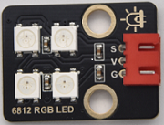
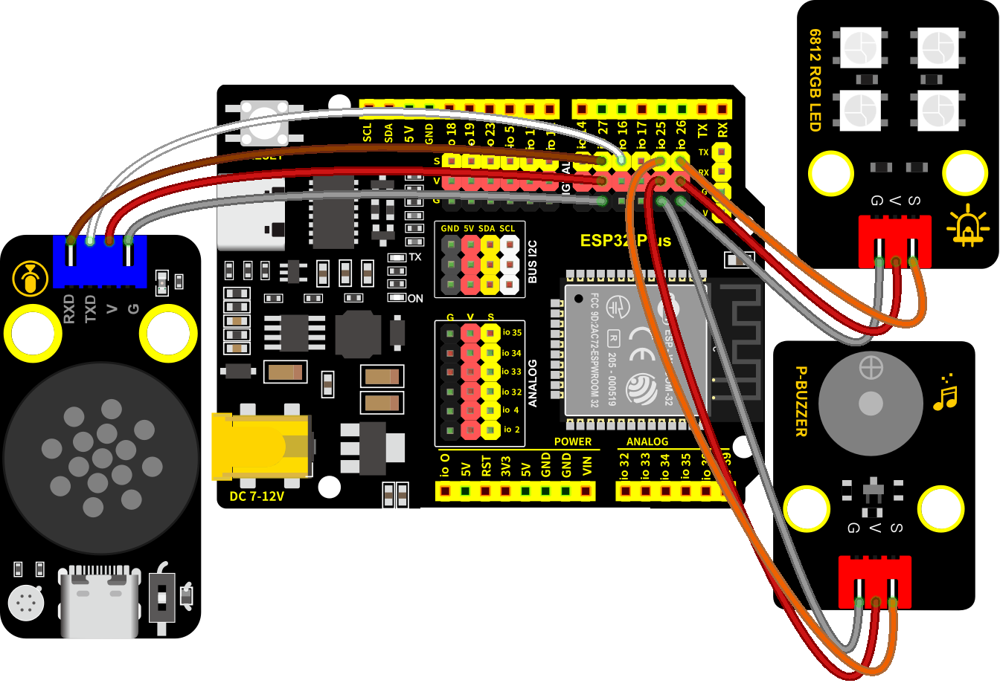

### 第15课 语音动感世界

#### 15.1 项目介绍

在前面的教程中，已经了解过SK6812模块、智能语音模块和无源蜂鸣器的工作原理和应用。

在本项目中，使用智能语音模块来控制SK6812RGB灯模块和无源蜂鸣器，实现自动化语音控制多彩灯光及蜂鸣器发出鸣叫声与播放美妙音乐。


#### 15.2 实验组件

|||||
|-|-|-|-|
|ESP32 Plus主板 *1|智能语音模块 *1|SK6812RGB灯 *1|4P线 *1 |
|||| |
|无源蜂鸣器模块 *1|3P线 *2|USB线 *1| |

#### 15.3 模块接线图

智能语音模块、无源蜂鸣器和SK6812RGB灯模块的控制引脚：

|SK6812RGB灯（S引脚）|io26|
|-|-|
|无源蜂鸣器（S引脚）|io25|
|智能语音模块（TXD引脚）|io16|
|智能语音模块（RXD引脚）|io27|

⚠️ **特别注意：智能家居已经组装好了，这里不需要把智能语音模块、无源蜂鸣器和SK6812RGB灯模块拆下来又重新组装和接线，这里再次提供接线图，是为了方便您编写代码！**



#### 15.4 代码流程图


#### 15.5 实验代码

```c++
/*
 * 项目: voice_control_sk6812_buzzer
 * 描述: 智能语音模块控制SK6812和蜂鸣器来模拟语音智能多彩世界
 * 编译IDE：ARDUINO IDE
 * 作者: http//www.keyes-robot.com
*/

//导入相关库文件
#include <SoftwareSerial.h>
#include <BuzzerESP32.h> 
#include <Adafruit_NeoPixel.h>
#ifdef __AVR__
 #include <avr/power.h> // 需要 16 MHz Adafruit Trinket
#endif

// 定义引脚常量
const int RX_PIN = 27;   // 引脚 GPIO27 为 RX
const int TX_PIN = 16;   // 引脚 GPIO16 为 TX
const int LED_PIN = 26;  // NeoPixel数据引脚
const int LED_COUNT = 4; // 新像素数

BuzzerESP32 buzzer(25); // 初始化GPIO25的蜂鸣器

Adafruit_NeoPixel strip(LED_COUNT, LED_PIN, NEO_GRB + NEO_KHZ800);

SoftwareSerial mySerial(RX_PIN, TX_PIN); // 定义软件串口引脚（RX, TX）

void setup() {
  Serial.begin(9600); // 硬件串口（与电脑通信）
  mySerial.begin(9600); // 软件串口（与外设通信）

  #if defined(__AVR_ATtiny85__) && (F_CPU == 16000000)
    clock_prescale_set(clock_div_1);
  #endif

  strip.begin();           // 初始化新像素条
  strip.show();            // 关闭所有像素
  strip.setBrightness(50); // 设置亮度（最大255）
}

void loop() { 
  if (mySerial.available()) { // 接收语音控制模块的外设数据
    int yuyin = mySerial.read(); // 将接收到的外设数据进行赋值   
    switch(yuyin) { //进行判断
      case 11: birthday(); break;  // 接收到的数据为11,播放音乐
      case 12: buzzer.playTone(0, 0); break;  // 接收到的数据为12,关闭蜂鸣器
      case 13: colorWipe(strip.Color(255, 0, 0), 50); break;  // 接收到的数据为13,打开红灯   
      case 14: colorWipe(strip.Color(0, 0, 0), 50); break;   // 接收到的数据为14,关闭红灯
      case 15: colorWipe(strip.Color(0, 255, 0), 50); break; // 接收到的数据为15,打开绿灯
      case 16: colorWipe(strip.Color(0, 0, 0), 50); break;   // 接收到的数据为16,关闭绿灯
      case 17: colorWipe(strip.Color(0, 0, 255), 50); break; // 接收到的数据为17,打开蓝灯
      case 18: colorWipe(strip.Color(0, 0, 0), 50); break;   // 接收到的数据为18,关闭蓝灯
      case 36: theaterChaseRainbow(50); break; // 接收到的数据为36,打开彩灯,彩虹增强型追逐型
      case 37: colorWipe(strip.Color(0, 0, 0), 50); break;   // 接收到的数据为37,关闭彩灯
      case 38: buzzer.playTone(784, 250);  break;   // 接收到的数据为37,打开蜂鸣器
      case 39: buzzer.playTone(0, 0); break;   // 接收到的数据为37,关闭蜂鸣器
    }
    mySerial.println(yuyin);
    Serial.println(yuyin);
  }
}

// 用一种颜色填充灯带
void colorWipe(uint32_t color, int wait) {
  for(int i=0; i<strip.numPixels(); i++) { 
    strip.setPixelColor(i, color); // 设置像素颜色
    strip.show();                  // 更新灯带
    delay(wait);                   // 暂停
  }
}

// 彩虹增强剧院帐篷。在帧之间传递延迟时间（毫秒）。
void theaterChaseRainbow(int wait) {
  int firstPixelHue = 0;     // 第一个像素以红色开始（色调0）
  for(int a=0; a<30; a++) {  // 重复30次...
    for(int b=0; b<3; b++) { //  ‘b’从0到2...
      strip.clear();         //  将RAM中的所有像素设置为0（关闭）
      // “c”从“b”开始计数，以3为增量到条带的末尾…
      for(int c=b; c<strip.numPixels(); c += 3) {
        // 像素‘c’的色调被偏移一定的量，
        // 使色轮沿着条带的长度（strip. numpixels（）步骤）完整旋转一次（范围65536）：
        int hue = firstPixelHue + c * 65536L / strip.numPixels();
        uint32_t color = strip.gamma32(strip.ColorHSV(hue)); // hue -> RGB
        strip.setPixelColor(c, color); // 设置像素c的值为color
      }
      strip.show();                // 用新内容更新条带
      delay(wait);                 // 暂停一会儿
      firstPixelHue += 65536 / 90; // 一个周期的色轮超过90帧
    }
  }
}

void birthday() {
  // 演奏生日旋律 - 参数为（频率，持续时间）
  buzzer.playTone(294, 250);  // D4
  buzzer.playTone(440, 250);  // A4
  buzzer.playTone(392, 250);  // G4
  buzzer.playTone(532, 250);  // C5  
  buzzer.playTone(494, 250);  // B4
  buzzer.playTone(392, 250);  // G4
  buzzer.playTone(440, 250);  // A4
  buzzer.playTone(392, 250);  // G4
  buzzer.playTone(587, 250);  // D5
  buzzer.playTone(532, 250);  // C5  
  buzzer.playTone(392, 250);  // G4
  buzzer.playTone(784, 250);  // G5
  buzzer.playTone(659, 250);  // E5
  buzzer.playTone(532, 250);  // C5  
  buzzer.playTone(494, 250);  // B4
  buzzer.playTone(440, 250);  // A4
  buzzer.playTone(698, 250);  // F5
  buzzer.playTone(659, 250);  // E5
  buzzer.playTone(532, 250);  // C5  
  buzzer.playTone(587, 250);  // D5
  buzzer.playTone(532, 500);  // C5   - 长时
  buzzer.playTone(0, 0);      // 关闭蜂鸣器
}
```

#### 15.6 实验结果

按照接线图接好线，外接电源，选择好正确的开发板板型（ESP32 Dev Module）和 适当的串口端口（COMxx），然后单击按钮上传代码。上传代码成功后，通过智能语音模块来控制无源蜂鸣器和SK6812RGB灯。

对着智能语音模块上的麦克风，使用唤醒词 “你好，小智” 或 “小智小智” 来唤醒智能语音模块，同时喇叭播放回复语 “有什么可以帮到您”；

智能语音模块唤醒后，对着麦克风说：“播放音乐” 等命令词时，喇叭播放对应的回复语 “已为您播放音乐”，同时蜂鸣器播放音乐；

对着麦克风说：“关闭音乐” 等命令词时，喇叭播放对应的回复语 “已为您停止音乐”，同时蜂鸣器停止播放音乐；

对着麦克风说：“打开红灯” 等命令词时，喇叭播放对应的回复语 “已为您打开红灯”，同时SK6812灯亮红色灯；

对着麦克风说：“关闭红灯” 等命令词时，喇叭播放对应的回复语 “已为您关闭红灯”，同时SK6812灯熄灭；

对着麦克风说：“打开绿灯” 等命令词时，喇叭播放对应的回复语 “已为您打开绿灯”，同时SK6812灯亮绿色灯；

对着麦克风说：“关闭绿灯” 等命令词时，喇叭播放对应的回复语 “已为您关闭绿灯”，同时SK6812灯熄灭；

对着麦克风说：“打开蓝灯” 等命令词时，喇叭播放对应的回复语 “已为您打开蓝灯”，同时SK6812灯亮蓝色灯；

对着麦克风说：“关闭蓝灯” 等命令词时，喇叭播放对应的回复语 “已为您关闭蓝灯”，同时SK6812灯熄灭；

对着麦克风说：“打开彩灯” 等命令词时，喇叭播放对应的回复语 “已为您打开彩灯”，同时SK6812灯亮彩色灯；

对着麦克风说：“关闭彩灯” 等命令词时，喇叭播放对应的回复语 “已为您关闭彩灯”，同时SK6812灯熄灭；

对着麦克风说：“打开蜂鸣器” 或 “蜂鸣器开始鸣叫”等命令词时，喇叭播放对应的回复语 “已打开蜂鸣器”，同时蜂鸣器开始鸣叫；

对着麦克风说：“关闭蜂鸣器” 或 “蜂鸣器停止鸣叫” 等命令词时，喇叭播放对应的回复语 “已关闭蜂鸣器”，同时蜂鸣器停止鸣叫。

