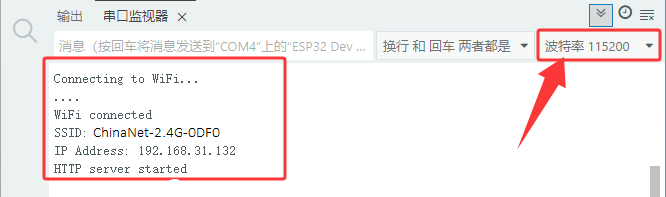
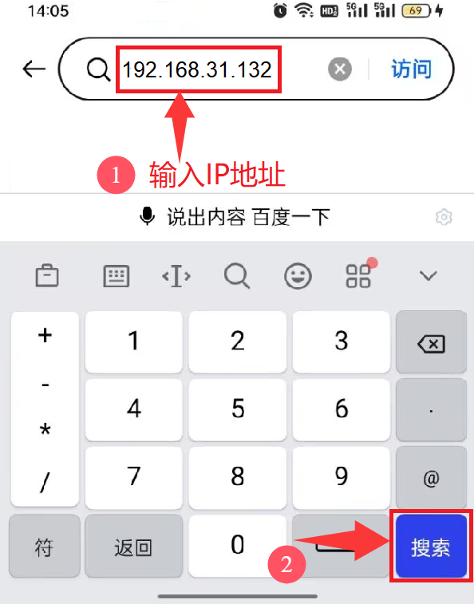
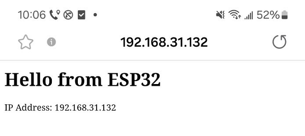
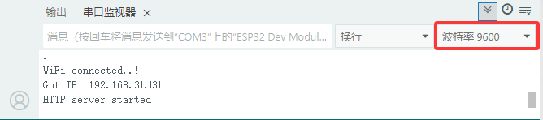
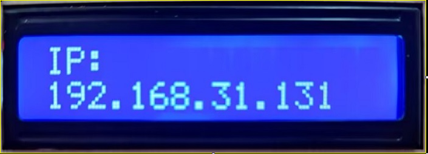

### 第21课 WiFi+网页控制

#### 21.1 项目介绍

物联网，就是将硬件设备接入网络。接入网络最便捷的方法就是使用WiFi连接了。ESP32 Plus主控板自带有WiFi模块，所以将我们的智能家居接入网络还是比较简单的。

我们将智能家居连接到局域网，也就是你家里的WiFi或者你手机开启的热点。连接成功后就会分配一个地址，这个地址就可以用来通讯了，我们将分配到的地址在串口监视器中打印出来。

本项目内容包括ESP32的WiFi配置、网页设置以及如何编写代码等实现WiFi网页远程监控和控制LED和风扇。

#### 21.2 相关资料

Station模式：当ESP32选择Station模式时，它作为一个WiFi客户端。它可以连接路由器网络，通过WiFi连接与路由器上的其他设备通信。如下图所示，PC和路由器已经连接，ESP32如果要与PC通信，需要将PC和路由器连接起来。


#### 21.3 实验组件

|||||
|-|-|-|-|
|ESP32 Plus主板 *1|130电机模块 *1|黄色LED模块 *1|3P线 *1|
|||||
|I2C LCD1602模块 *1|风扇叶 *1|4P线 *2|USB线 *1|

#### 21.4 模块接线图

黄色LED灯，I2C 1602 LCD模块和130电机模块的控制引脚：

|黄色LED灯（S引脚）|io12|
|-|-|
|130电机模块（IN+引脚）|io19|
|130电机模块（IN-引脚）|io18|
|I2C 1602 LCD模块（SDA引脚）|SDA|
|I2C 1602 LCD模块（SCL引脚）|SCL|

⚠️ **特别注意：智能家居已经组装好了，这里不需要把黄色LED灯，I2C 1602 LCD模块和130电机模块拆下来又重新组装和接线，这里再次提供接线图，是为了方便您编写代码！**


#### 21.5 智能家居连接WiFi的实验代码1

⚠️ <span style="color: rgb(255, 76, 65);">**特别提醒：**</span> 打开代码文件后，需要修改ESP32开发板需要连接的WiFi名称与密码，您需要分别将 `ChinaNet-2.4G-0DF0` 和 `ChinaNet@233` 替换为您自己的 Wi-Fi 名称和 WiFi 密码。WiFi名称和WiFi密码修改后才能上传代码，否则你的ESP32开发板将无法连接网络。

```c
const char* ssid = "ChinaNet-2.4G-0DF0";  //输入你自己的WiFi名称
const char* password = "ChinaNet@233"; //输入你自己的WiFi密码
```

⚠️ **<span style="color: rgb(255, 76, 65);">注意：</span> 请确保代码中的WiFi名称和WiFi密码与连接到您的计算机、手机/平板电脑、ESP32开发板和路由器的网络相同，它们必须在同一局域网（WiFi）内。**

⚠️ **<span style="color: rgb(255, 76, 65);">注意：</span>WiFi必须是2.4Ghz频率的，否则ESP32无法连接WiFi，不支持连接5GHz频段的WiFi。**。

```c
/*  
 * 项目: wifi_test
 * 描述: 智能家居连接WiFi，串口打印IP地址
 * 编译IDE：ARDUINO IDE
 * 作者: http//www.keyes-robot.com
*/
#include <Arduino.h>
#include <WiFi.h>
#include <ESPmDNS.h>
#include <WiFiClient.h>

// 网络配置
const char* ssid = "ChinaNet-2.4G-0DF0";  // 输入你自己的WiFi名称
const char* password = "ChinaNet@233";  // 输入你自己的WiFi密码
WiFiServer server(80);

// 全局变量
String requestPath = "/";  // 存储HTTP请求路径

void setup() {
  Serial.begin(115200);
  
  // 连接 WiFi
  Serial.println("\nConnecting to WiFi...");
  WiFi.begin(ssid, password);
  
  while (WiFi.status() != WL_CONNECTED) {
    delay(500);
    Serial.print(".");
  }
  
  // 网络信息
  Serial.println("\nWiFi connected");
  printNetworkInfo();
  
  // 启动服务器和mDNS
  server.begin();
  if (!MDNS.begin("esp32")) {
    Serial.println("Error setting up MDNS responder!");
  }
  MDNS.addService("http", "tcp", 80);
  Serial.println("HTTP server started");
}

void loop() {
  WiFiClient client = server.available();
  
  if (!client) {
    return;
  }
  
  // 等待客户端数据
  while (client.connected() && !client.available()) {
    delay(1);
  }
  
  // 读取HTTP请求
  String request = client.readStringUntil('\r');
  parseHttpRequest(request);
  
  // 处理请求
  String response;
  if (requestPath == "/") {
    response = buildHomepageResponse();
    Serial.println("Serving homepage");
  } else {
    response = buildNotFoundResponse();
    Serial.println("Unknown request: " + requestPath);
  }
  
  // 发送HTTP响应
  client.println(response);
  client.stop();
  
  // 请求之间的小延迟
  delay(100);
}

// Helper Functions
void printNetworkInfo() {
  Serial.print("SSID: ");
  Serial.println(WiFi.SSID());
  Serial.print("IP Address: ");
  Serial.println(WiFi.localIP());
}

void parseHttpRequest(String req) {
  int addr_start = req.indexOf(' ');
  int addr_end = req.indexOf(' ', addr_start + 1);
  
  if (addr_start == -1 || addr_end == -1) {
    Serial.print("Invalid request: ");
    Serial.println(req);
    requestPath = "/404";
    return;
  }
  
  requestPath = req.substring(addr_start + 1, addr_end);
  Serial.println("Requested path: " + requestPath);
}

String buildHomepageResponse() {
  IPAddress ip = WiFi.localIP();
  String ipStr = String(ip[0]) + '.' + ip[1] + '.' + ip[2] + '.' + ip[3];
  
  String html = "HTTP/1.1 200 OK\r\n";
  html += "Content-Type: text/html\r\n";
  html += "Connection: close\r\n";
  html += "\r\n";
  html += "<!DOCTYPE HTML>\n";
  html += "<html><head><title>ESP32 Web Server</title></head>\n";
  html += "<body><h1>Hello from ESP32</h1>\n";
  html += "<p>IP Address: " + ipStr + "</p>\n";
  html += "</body></html>\n";
  
  return html;
}

String buildNotFoundResponse() {
  String html = "HTTP/1.1 404 Not Found\r\n";
  html += "Content-Type: text/html\r\n";
  html += "Connection: close\r\n";
  html += "\r\n";
  html += "<!DOCTYPE HTML>\n";
  html += "<html><head><title>404 Not Found</title></head>\n";
  html += "<body><h1>404</h1><p>Page not found</p></body></html>\n";
  
  return html;
}
```

#### 21.6 实验结果1

按照接线图接好线，外接电源，选择好正确的开发板板型（ESP32 Dev Module）和 适当的串口端口（COMxx），然后单击按钮上传示例代码至ESP32主控板。示例代码上传成功后，上电后，打开串口监视器，设置波特率为115200。

⚠️ <span style="color: rgb(255, 76, 65);">**注意：手机/平板需要和智能家居连接同一个WiFi，或者手机/平板打开热点，智能家居连接手机/平板的热点，且示例代码中的WiFi名称与WiFi密码和手机/平板、智能家居是同一个WiFi名称与密码。** </span>

⚠️ **<span style="color: rgb(255, 76, 65);">注意：</span>WiFi必须是2.4Ghz频率的，否则ESP32无法连接WiFi，不支持连接5GHz频段的WiFi。**。

⚠️ **<span style="color: rgb(255, 76, 65);">特别注意：</span> 手机或平板一定要与ESP32开发板连接的是同一个WiFi，否则将无法进入控制页面。还有就是ESP32开发板在使用WiFi功能时功耗很大，需要外接DC电源(电源电压必须充足，最好使用新电池)才能满足它的工作电力需求，如果达不到它的工作电力需求ESP32板将会一直复位导致代码无法正常运行。**

如果成功连接上WiFi，串口监视器会打印出分配到的IP地址（假如串口监视器没打印出分配到的IP地址，可以按下ESP32主控板上的复位键重启，重新连接WiFi）。不同的网络（WiFi），IP地址不一样。



您可以在手机端/平板端的浏览器中输入串口监视器窗口中打印的 ESP32 IP地址，使用浏览器打开ESP32的IP地址，并访问IP地址。在本例中，您可以在浏览器中输入你自己的**ESP32 IP地址**(**这里是以192.168.31.132为例，而你需要将IP地址：192.168.31.132 修改成你自己的 ESP32 IP地址**)。



然后，将会读取到代码中client.println(s);发送出去的字符串S的内容。



#### 21.7 浏览器控制智能家居的实验代码2 

在上面实验，我们知道浏览器怎么和智能家居通讯了，就是访问地址就行。地址只有一个，但是可以在地址下添加些字符串，就可以通过访问地址下不同的字符串而实现控制智能家居不同的功能。

我们有LCD显示屏，通过显示屏打印出ip地址，这更方便了。

⚠️ <span style="color: rgb(255, 76, 65);">**特别提醒：**</span> 打开代码文件后，需要修改ESP32开发板需要连接的WiFi名称与密码，您需要分别将 `ChinaNet-2.4G-0DF0` 和 `ChinaNet@233` 替换为您自己的 Wi-Fi 名称和 WiFi 密码。WiFi名称和WiFi密码修改后才能上传代码，否则你的ESP32开发板将无法连接网络。

```c
const char* ssid = "ChinaNet-2.4G-0DF0";  //输入你自己的WiFi名称
const char* password = "ChinaNet@233"; //输入你自己的WiFi密码
```

⚠️ **<span style="color: rgb(255, 76, 65);">注意：</span> 请确保代码中的WiFi名称和WiFi密码与连接到您的计算机、手机/平板电脑、ESP32开发板和路由器的网络相同，它们必须在同一局域网（WiFi）内。**

⚠️ **<span style="color: rgb(255, 76, 65);">注意：</span>WiFi必须是2.4Ghz频率的，否则ESP32无法连接WiFi，不支持连接5GHz频段的WiFi。**。

```c
/*  
 * 项目: wifi_control_led_fan
 * 描述: WiFi网页控制LED和风扇
 * 编译IDE：ARDUINO IDE
 * 作者: http//www.keyes-robot.com
*/
#include <WiFi.h>       // 引入WiFi库，控制ESP32的WiFi连接功能
#include <WebServer.h>  // 引入WebServer库，创建HTTP服务器
#include <LiquidCrystal_I2C.h> // 引入LiquidCrystal_I2C库

//初始化LCD模块
LiquidCrystal_I2C lcd(0x27, 16, 2);

/*替换为您的网络凭据（输入您自己的WiFi名称和密码）*/
const char* ssid = "ChinaNet-2.4G-0DF0";  // 输入你自己的WiFi名称
const char* password = "ChinaNet@233"; // 输入你自己的WiFi密码

WebServer server(80);  // 创建一个Web服务器对象，监听80端口

uint8_t led_Pin = 12;    // 蜂鸣器连接到GPIO12
bool LED_State = false;  // 蜂鸣器的状态，初始为关闭

uint8_t motor_Pin1 = 19;    // 电机IN+引脚连接到GPIO19
uint8_t motor_Pin2 = 18;    // 电机IN-引脚连接到GPIO18
bool Motor_State = false;  // 电机的状态，初始为关闭

void setup() {
  Serial.begin(9600);           // 初始化串口通信，波特率9600
  delay(100);                   // 延时100毫秒
  pinMode(led_Pin, OUTPUT);  // 设置GPIO12为输出模式
  pinMode(motor_Pin1, OUTPUT);  // 设置GPIO18为输出模式
  pinMode(motor_Pin2, OUTPUT);  // 设置GPIO19为输出模式

  Serial.println("Connecting to ");
  Serial.println(ssid);  // 打印正在连接的Wi-Fi名称

  // 连接到Wi-Fi网络
  WiFi.begin(ssid, password);

  // 检查Wi-Fi是否连接成功
  while (WiFi.status() != WL_CONNECTED) {
    delay(1000);
    Serial.print(".");  // 每隔1秒打印一个点，表示正在连接
  }
  Serial.println("");
  delay(500);
  Serial.println("WiFi connected..!");  // Wi-Fi连接成功
  Serial.print("Got IP: ");
  Serial.println(WiFi.localIP());  // 打印分配到的IP地址

  // 初始化LCD
  lcd.init();
  lcd.backlight();
  lcd.clear();
  lcd.setCursor(0, 0);
  lcd.print("IP:");
  lcd.setCursor(0, 1);
  lcd.print(WiFi.localIP());

  // 设置不同URL路径的处理函数
  server.on("/", handle_OnConnect);            // 根路径，初始化页面
  server.on("/LED_ON", handle_LED_ON);         // 黄色LED打开
  server.on("/LED_OFF", handle_LED_OFF);      // 黄色LED关闭
  server.on("/Motor_ON", handle_Motor_ON);    // 风扇打开
  server.on("/Motor_OFF", handle_Motor_OFF);  // 风扇关闭
  server.onNotFound(handle_NotFound);         // 处理未找到的路径

  server.begin();                         // 启动Web服务器
  Serial.println("HTTP server started");  // 打印服务器启动信息
}

void loop() {
  server.handleClient();  // 处理客户端请求
  if (LED_State) {
    digitalWrite(led_Pin, HIGH);  // 如果黄色LED状态为开，则输出高电平，LED点亮
    delay(1);
    digitalWrite(led_Pin, LOW);  // 否则输出低电平关闭黄色LED
    delay(1);
  } else {
    digitalWrite(led_Pin, LOW);  // 否则输出低电平关闭黄色LED
  }
  if (Motor_State) {
    // 如果风扇状态为开，则打开风扇
    analogWrite(motor_Pin1, 70);  
    analogWrite(motor_Pin2, 0);
  } else {
    // 否则关闭风扇
    analogWrite(motor_Pin1, 0);
    analogWrite(motor_Pin2, 0); 
  }
}

// 处理根路径请求，显示初始页面
void handle_OnConnect() {
  LED_State = false;  // 初始时关闭蜂鸣器
  Motor_State = false;   // 初始时关闭风扇
  Serial.println("GPIO12 Status: OFF | GPIO18 Status: OFF | GPIO19 Status: OFF");  // 打印LED和风扇状态
  server.send(200, "text/html", SendHTML(LED_State, Motor_State));  // 返回初始HTML页面
}

// 处理黄色LED打开请求
void handle_LED_ON() {
  LED_State = true;    // 设置LED状态为开
  Serial.println("GPIO12 Status: ON");   // 打印LED状态
  server.send(200, "text/html", SendHTML(LED_State, Motor_State));  // 返回更新后的HTML页面
}

// 处理黄色LED关闭请求
void handle_LED_OFF() {
  LED_State = LOW;     // 设置蜂鸣器状态为关
  Serial.println("GPIO12 Status: OFF");  // 打印蜂鸣器状态
  server.send(200, "text/html", SendHTML(LED_State, Motor_State));  // 返回更新后的HTML页面
}

// 处理风扇打开请求
void handle_Motor_ON() {
  Motor_State = true;   // 设置风扇状态为开
  Serial.println("GPIO18 Status: ON | GPIO19 Status: ON");  // 打印风扇状态
  server.send(200, "text/html", SendHTML(LED_State, Motor_State));  // 返回更新后的HTML页面
}

// 处理风扇关闭请求
void handle_Motor_OFF() {
  Motor_State = false;  // 设置风扇状态为关
  Serial.println("GPIO18 Status: OFF | GPIO19 Status: OFF"); // 打印风扇状态
  server.send(200, "text/html", SendHTML(LED_State, Motor_State));  // 返回更新后的HTML页面
}

// 处理未找到的路径
void handle_NotFound() {
  server.send(404, "text/plain", "Not found");  // 返回404错误
}

// 生成HTML页面，用来显示蜂鸣器与风扇状态和控制按钮
String SendHTML(uint8_t BuzzerState, uint8_t MotorState) {
  String ptr = "<!DOCTYPE html> <html>\n";
  ptr += "<head><meta name=\"viewport\" content=\"width=device-width, initial-scale=1.0, user-scalable=no\">\n";
  ptr += "<title>Buzzer-Motor Control</title>\n";
  ptr += "<style>html { font-family: Helvetica; display: inline-block; margin: 0px auto; text-align: center;}\n";
  ptr += "body{margin-top: 50px;} h1 {color: #444444;margin: 50px auto 30px;} h3 {color: #444444;margin-bottom: 50px;}\n";
  ptr += ".button {display: block;width: 80px;background-color: #3498db;border: none;color: white;padding: 13px 30px;text-decoration: none;font-size: 25px;margin: 0px auto 35px;cursor: pointer;border-radius: 4px;}\n";
  ptr += ".button-on {background-color: #3498db;}\n";
  ptr += ".button-on:active {background-color: #2980b9;}\n";
  ptr += ".button-off {background-color: #34495e;}\n";
  ptr += ".button-off:active {background-color: #2c3e50;}\n";
  ptr += "p {font-size: 14px;color: #888;margin-bottom: 10px;}\n";
  ptr += "</style>\n";
  ptr += "</head>\n";
  ptr += "<body>\n";
  ptr += "<h1>ESP32 Web Server</h1>\n";
  ptr += "<h3>Using Station(STA) Mode</h3>\n";

  // 根据黄色LED状态生成HTML按钮
  if (BuzzerState) {
    ptr += "<p>LED State: ON</p><a class=\"button button-off\" href=\"/LED_OFF\">OFF</a>\n";
  } else {
    ptr += "<p>LED State: OFF</p><a class=\"button button-on\" href=\"/LED_ON\">ON</a>\n";
  }

  // 根据风扇状态生成HTML按钮
  if (MotorState) {
    ptr += "<p>Motor State: ON</p><a class=\"button button-off\" href=\"/Motor_OFF\">OFF</a>\n";
  } else {
    ptr += "<p>Motor State: OFF</p><a class=\"button button-on\" href=\"/Motor_ON\">ON</a>\n";
  }

  ptr += "</body>\n";
  ptr += "</html>\n";
  return ptr;  // 返回生成的HTML页面
}
```

#### 21.8 实验结果2

按照接线图接好线，外接电源，选择好正确的开发板板型（ESP32 Dev Module）和 适当的串口端口（COMxx），然后单击按钮上传示例代码至ESP32主控板。示例代码上传成功后，上电后，打开串口监视器，设置波特率为115200。

⚠️ <span style="color: rgb(255, 76, 65);">**注意：手机/平板需要和智能家居连接同一个WiFi，或者手机/平板打开热点，智能家居连接手机/平板的热点，且示例代码中的WiFi名称与WiFi密码和手机/平板、智能家居是同一个WiFi名称与密码。** </span>

⚠️ **<span style="color: rgb(255, 76, 65);">注意：</span>WiFi必须是2.4Ghz频率的，否则ESP32无法连接WiFi，不支持连接5GHz频段的WiFi。**。

⚠️ **<span style="color: rgb(255, 76, 65);">特别注意：</span> 手机或平板一定要与ESP32开发板连接的是同一个WiFi，否则将无法进入控制页面。还有就是ESP32开发板在使用WiFi功能时功耗很大，需要外接DC电源(电源电压必须充足，最好使用新电池)才能满足它的工作电力需求，如果达不到它的工作电力需求ESP32板将会一直复位导致代码无法正常运行。**

当智能家居成功连接上WiFi时，串口监视器窗口便会显示连接成功后的IP地址 (假如串口监视器没打印出分配到的IP地址，可以按下ESP32主控板上的复位键重启，重新连接WiFi)。不同的网络（WiFi），IP地址不一样。



同时LCD1602显示屏也会显示对应的IP地址。



然后，您可以在手机端/平板端的浏览器中输入串口监视器窗口中打印的 ESP32 IP地址（或LCD1602显示的 ESP32 IP地址），使用浏览器打开ESP32的IP地址，并访问网页。在本例中，您可以在浏览器中输入你自己的**ESP32 IP地址**(**这里是以192.168.31.131为例，而你需要将IP地址：192.168.31.131 修改成你自己的 ESP32 IP地址**)，在浏览器中打开ESP32的IP地址来查看风扇模块和黄色LED模块的控制网页。


⚠️ **注意：当电脑、手机/平板和ESP32开发板，连接到同一个网络(WiFi)时，可在手机端/平板端打开这个网页。此处是你自己ESP32的IP地址**。

在手机端/平板端的浏览器中打开对应的IP地址，即可在WiFi网页中控制黄色LED和风扇等功能。

