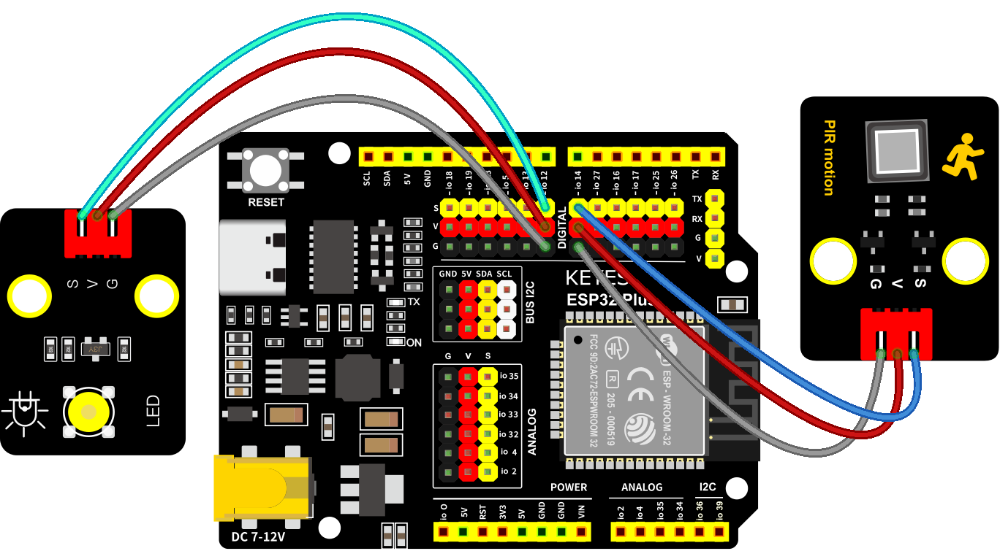
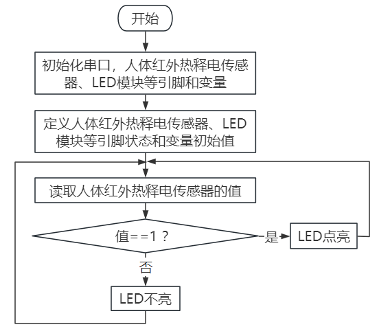

### 第4课 人体感应灯

#### 4.1 项目介绍

人体红外热释电传感器和按钮一样也是数字传感器，也就是有两个状态值0或1。还有需要人在动时才能感应的到。

人体红外热释电传感器在日常生活中是有很多应用场景的，例如，楼梯的自动感应灯，洗手台的自动感应水龙头等。

#### 4.2 模块相关资料

|工作电压：|DC 4.5-6.5V|
|-|-|
|最大工作电流：|50MA|
|静态电流:|50uA|
|控制接口：|数字输出(高电平为3.3V ，低电平0V)|
|控制信号：|数字信号1/0|
|工作温度：|-10 ~ 50 ℃|
|最大探测距离：|4米|
|感应角度：|＜100°锥角|

#### 4.3 元件知识 

**人体红外热释电传感器：** 它是一款基于热释电效应的人体热释电红外运动传感器，能检测运动的人体或动物身上发出的红外信号，配合菲涅尔透镜能使传感器探测范围更远更广。它主要采用RE200B-P传感器元件，当附近有人或动物运动时，人体红外热释电传感器能根据检测到的红外线，将红外线信号转化为数字信号并输出一个高电平。它可以应用于多种场合来检测人体的运动。传统的热释电红外传感器体积大，电路复杂，可靠性低。

现在我们推出这款一款新的热释电红外运动传感器，该传感器集成了数字热释电红外传感器和连接管脚。具有灵敏度高、可靠性强、超低功耗，体积小、重量轻，超低电压工作模式和外围电路简单等特点。

#### 4.4 实验组件

||||||
|-|-|-|-|-|
|ESP32 Plus主板 *1|人体红外热释传感器 *1|黄色LED模块 *1|3P线 *2|USB线 *1|

#### 4.5 模块接线图

人体红外热释传感器和黄色LED灯的控制引脚：

|人体红外热释传感器（S引脚）|io14|
|-|-|
|黄色LED灯（S引脚）|io12|

⚠️ **特别注意：智能家居已经组装好了，这里不需要把人体红外热释传感器和LED模块拆下来又重新组装和接线，这里再次提供接线图，是为了方便您编写代码！**

#### 4.6 读取人体红外热释电传感器值的实验代码1

通过串口打印出人体红外热释电传感器的状态值。

#### 4.7 实验结果1

按照接线图接好线，外接电源，选择好正确的开发板板型（ESP32 Dev Module）和 适当的串口端口（COMxx），然后单击按钮上传示例代码至ESP32主控板。示例代码上传成功后，上电后，在串口监视器窗口点击，设置波特率为9600，通过串口监视器打印的数据可以看到，当你在传感器前静止不动，读取到的值是0，稍微动一下，读取到的值就变为1.

#### 4.8 代码流程图

#### 4.9 人体感应灯的实验代码2

只要有人在人体红外热释电传感器前面移动一下，LED灯就会亮起。

#### 4.10 实验结果2

按照接线图接好线，外接电源，选择好正确的开发板板型（ESP32 Dev Module）和 适当的串口端口（COMxx），然后单击按钮上传示例代码至ESP32主控板。示例代码上传成功后，用手在传感器前面移动一下，LED灯亮起，人静止不动几秒后，LED灯关闭。

