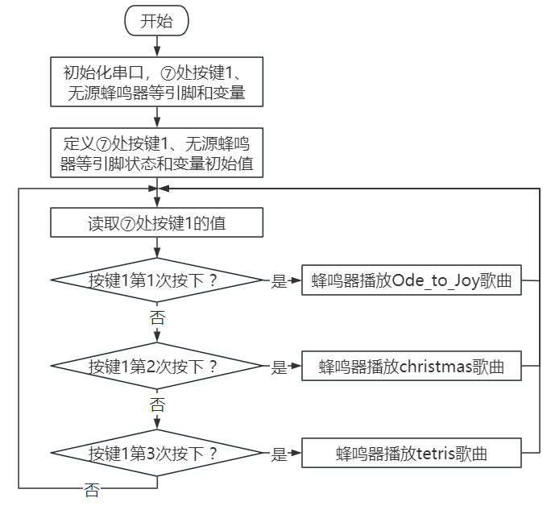
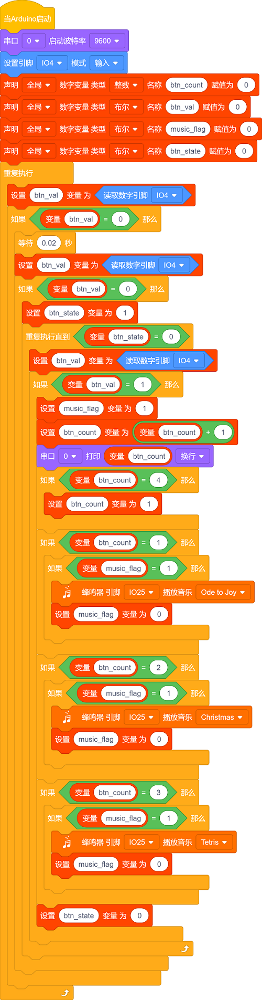

### 第5课 演奏音乐

#### 5.1 项目介绍

本实验用无源蜂鸣器播放音乐，无源蜂鸣器是通过PWM脉冲宽度调制脉冲进而调节音调，

PWM比较多用于调节LED灯的亮度或者调节无源蜂鸣器的频率，或者是电机的转动速度，电机带动的车轮速度也就能很容易控制了，在玩一些Arduino机器人时，更能体现PWM的好处。

音乐除了要“唱的准”，还要“节奏对”，每一个音符的持续时间，就是节拍啦。我们可以用延时多少来设置节拍的，例如：1拍，1秒即1000毫秒；1/2拍，0.5秒即500毫秒；1/4拍，0.25秒即250毫秒；1/8拍，0.125秒即125毫秒….，我们可以试一试组合不同的音调和节拍，看看会有什么不同的效果。

#### 5.2 模块相关资料

工作电压：3.3-5V（DC）

电流：50MA

工作温度：-10摄氏度 到 +50摄氏度

尺寸：31.6mmx23.7mm

接口：3PIN接口

输入信号：数字信号（方波）

#### 5.3 元件知识  

无源蜂鸣器：其内部不带震荡电路，控制时需要在元件正极输入不同频率的方波，负极接地，从而控制喇叭功放元件响起不同频率的声音。

#### 5.4 实验组件

||||||
|-|-|-|-|-|
|ESP32 Plus主板 *1|无源蜂鸣器模块 *1|按键 *1|3P线 *2|USB线 *1|

#### 5.5 模块接线图

木板房子⑦处(左侧)按键1和无源蜂鸣器的控制引脚：

|木板房子⑦处(左侧)按键1（S引脚）|io4|
|-|-|
|无源蜂鸣器（S引脚）|io25|

⚠️ **特别注意：智能家居已经组装好了，这里不需要把按键模块和无源蜂鸣器拆下来又重新组装和接线，这里再次提供接线图，是为了方便您编写代码！**

#### 5.6 播放生日快乐的实验代码1 

#### 5.7 实验结果1

按照接线图接好线，外接电源，选择好正确的开发板板型（ESP32 Dev Module）和 适当的串口端口（COMxx），然后单击按钮上传示例代码至ESP32主控板。示例代码上传成功后，上电后，就会听到无源蜂鸣器播放一次生日快乐。

#### 5.8 代码流程图

#### 5.9 音乐盒的实验代码 

做个音乐盒，通过木板房子⑦处(左侧)按键1来切换曲子。

#### 5.10 实验结果2

按照接线图接好线，外接电源，选择好正确的开发板板型（ESP32 Dev Module）和 适当的串口端口（COMxx），然后单击按钮上传示例代码至ESP32主控板。示例代码上传成功后，上电后，点击一次木板房子⑦处(左侧)按键1，播放一曲Ode_to_Joy，播放完之后，再点击木板房子⑦处(左侧)按键1，播放christmas，播放完之后，再点击木板房子⑦处(左侧)按键1，播放tetris。

