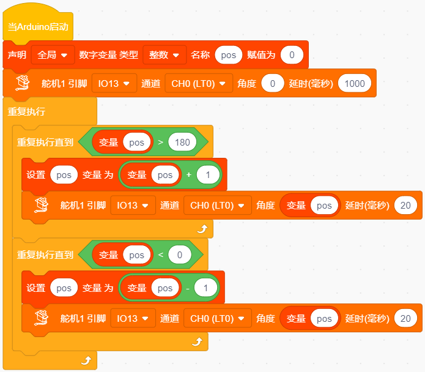
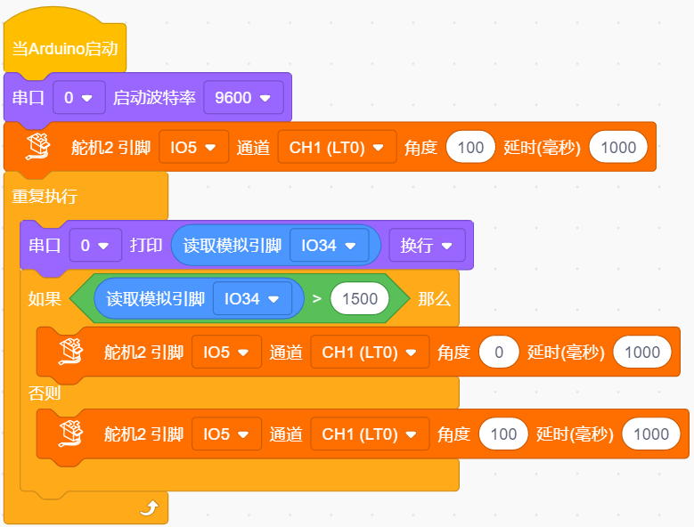

### 第6课 自动门窗

#### 6.1 项目介绍

当我们在制作智能家居时，经常会将舵机和门、窗等固定在一起。这样，我们就可以利用舵机转动，带动门、窗等开或关，从而起到家居生活的智能化功能。既然是自动门窗，那就需要动力装置，我们使用的是180度的舵机。再加上一些传感器，就会变得更加自动化，例如添加个雨滴传感器，就可以做下雨自动关窗；增加个RFID，就可以实现刷卡开门等。

#### 6.2 舵机相关资料

**舵机：** 舵机是一种位置伺服的驱动器，主要是由外壳、电路板、无核心马达、齿轮与位置检测器所构成。其工作原理是由接收机或者单片机发出信号给舵机，其内部有一个基准电路，产生周期为20ms，宽度为1.5ms的基准信号，将获得的直流偏置电压与电位器的电压比较，获得电压差输出。经由电路板上的IC判断转动方向，再驱动无核心马达开始转动，透过减速齿轮将动力传至摆臂，同时由位置检测器送回信号，判断是否已经到达定位。适用于那些需要角度不断变化并可以保持的控制系统。当电机转速一定时，通过级联减速齿轮带动电位器旋转，使得电压差为0，电机停止转动。

伺服电机有多种规格，但它们都有三根连接线，分别是棕色、红色、橙色(不同品牌可能有不同的颜色)。棕色为GND，红色为电源正极，橙色为信号线。

舵机的伺服系统由可变宽度的脉冲来进行控制，橙色的控制线是用来传送脉冲的。一般而言，PWM控制舵机的基准信号周期为20ms（50Hz），理论上脉宽应在1ms到2ms之间，对应控制舵机角度是0°～180°。但是，实际上更多控制舵机的脉宽范围是0.5ms到2.5ms，具体需要自己实际调试下。

经过实测，舵机的脉冲范围为0.65ms~2.5ms。180度舵机，对应的控制关系是这样的：

|高电平时间|舵机角度|基准信号周期时间（20ms）|
|-|-|-|
|0.65ms|0度|0.65ms高电平+19.35ms低电平|
|1.5ms|90度|1.5ms高电平+18.5ms低电平|
|2.5ms|180度|2.5ms高电平+17.5ms低电平|

**舵机的规格参数：**

|工作电压：|DC 4.8V〜6V|可操作角度范围：|大约180°(在500→2500μsec)|
|-|-|-|-|
|脉波宽度范围：|500→2500 μsec|外观尺寸：|22.9*12.2*30mm|

|空载转速：|0.12±0.01 sec/60度（DC 4.8V） 0.1±0.01 sec/60度（DC 6V）|
|-|-|
|空载电流：|200±20mA（DC 4.8V） 220±20mA（DC 6V）|
|停止扭力：|1.3±0.01kg·cm（DC 4.8V） 1.5±0.1kg·cm（DC 6V）|
|停止电流：|≦850mA（DC 4.8V） ≦1000mA（DC 6V）|
|待机电流：|3±1mA（DC 4.8V） 4±1mA（DC 6V）|
|重量:|9±1g (without servo horn)|
|使用温度：|-30℃~60℃|

#### 6.3 实验组件

||||||
|-|-|-|-|-|
|ESP32 Plus主板 *1|水滴传感器模块 *1|180度舵机 *2|3P线 *1|USB线 *1|

#### 6.4 模块接线图

水滴传感器，窗户舵机和门舵机的控制引脚：

|窗户舵机（橙黄色线引脚）|io5|
|-|-|
|门舵机（橙黄色线引脚）|io13|
|水滴传感器（S引脚）|io34|

⚠️ **特别注意：智能家居已经组装好了，这里不需要把水滴传感器和舵机拆下来又重新组装和接线，这里再次提供接线图，是为了方便您编写代码！**

#### 6.5 控制门来回转动的实验代码1 

#### 6.6 实验结果1

按照接线图接好线，外接电源，选择好正确的开发板板型（ESP32 Dev Module）和 适当的串口端口（COMxx），然后单击按钮上传示例代码至ESP32主控板。示例代码上传成功后，上电后，“智能家居的门”0~180度来回转动，并且每15ms转动一度。

#### 6.7 代码流程图

#### 6.8 下雨自动关窗的实验代码2  

使用窗户舵机和雨滴传感器搭配做个下雨自动关窗装置。

**雨滴传感器：** 这是个模拟输入传感器，水分覆盖到检测面上的面积越大，返回的值越大（范围0~4096）

#### 6.9 实验结果2

按照接线图接好线，外接电源，选择好正确的开发板板型（ESP32 Dev Module）和 适当的串口端口（COMxx），然后单击按钮上传示例代码至ESP32主控板。示例代码上传成功后，上电后，开始窗户自动打开，然后用湿润的手触碰一下雨滴传感器(模拟值>1500时)，窗户就会关闭。

