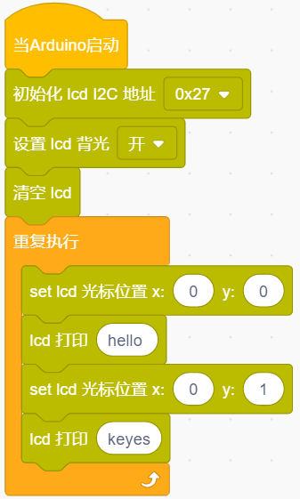
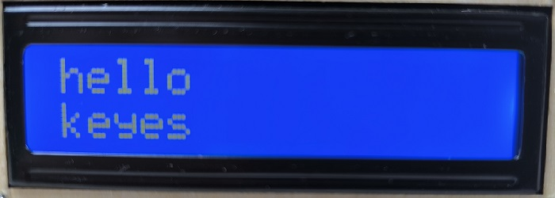

### 第9课 LCD1602显示

#### 9.1 项目介绍

现代社会人类每天面对最多的就是屏幕了吧，电脑、手机和各类电子产品。屏幕是人与电子设备最好的交互方式之一，直观明了。

Keyes I2C 1602 LCD模块是可以显示2行，每行16个字符的液晶显示器模块。液晶显示器显示蓝底白字，自带I2C通信模块，使用时只需连接单片机I2C通信接口，大大节约了单片机资源。最初的1602 LCD需要7个IO端口来启动和运行，而Keyes I2C 1602 LCD模块内置Arduino IIC/I2C接口，节省了5个IO端口。和Arduino液晶库文件兼容，用起来很简单。

LCD非常适合打印数据和显示数字。可以显示32个字符(16x2)。在Keyes I2C 1602 LCD模块的背面有一个蓝色的电位器，可以转动电位器来调整对比度。连接时请注意，LCD的GND和VCC不能接反，否则会损坏LCD。

#### 9.2 模块相关资料

|工作电压：|DC5V|I2C地址：|0x27|控制接口：|I2C|
|-|-|-|-|-|-|
|工作电流：| 130mA|工作环境温度：|0°C ~ 45°C（推荐）|驱动芯片：|PCF8574T|

|GND：一个接地的引脚|VCC：一个连接到+5V电源的引脚|SDA：一个连接到SDA（或A4）的引脚，用于IIC通信|
|-|-|-|
|SCL：一个连接到SCL（或A5）的引脚，用于IIC通信|背光（蓝底白字）|可调对比度|

#### 9.3 实验组件

|||||
|-|-|-|-|
|ESP32 Plus主板 *1|I2C LCD1602模块 *1|4P线 *1|USB线*1|

#### 9.4 模块接线图

I2C 1602 LCD模块的控制引脚：

|I2C 1602 LCD模块（SDA引脚）|SDA|
|-|-|
|I2C 1602 LCD模块（SCL引脚）|SCL|

⚠️ **特别注意：智能家居已经组装好了，这里不需要把I2C 1602 LCD模块拆下来又重新组装和接线，这里再次提供接线图，是为了方便您编写代码！**

#### 9.5 屏幕显示字符串的实验代码

#### 9.6 实验结果

按照接线图接好线，外接电源，选择好正确的开发板板型（ESP32 Dev Module）和 适当的串口端口（COMxx），然后单击按钮上传示例代码至ESP32主控板。示例代码上传成功后，上电后，LCD1602第一行显示hello，第二行显示keyes。

