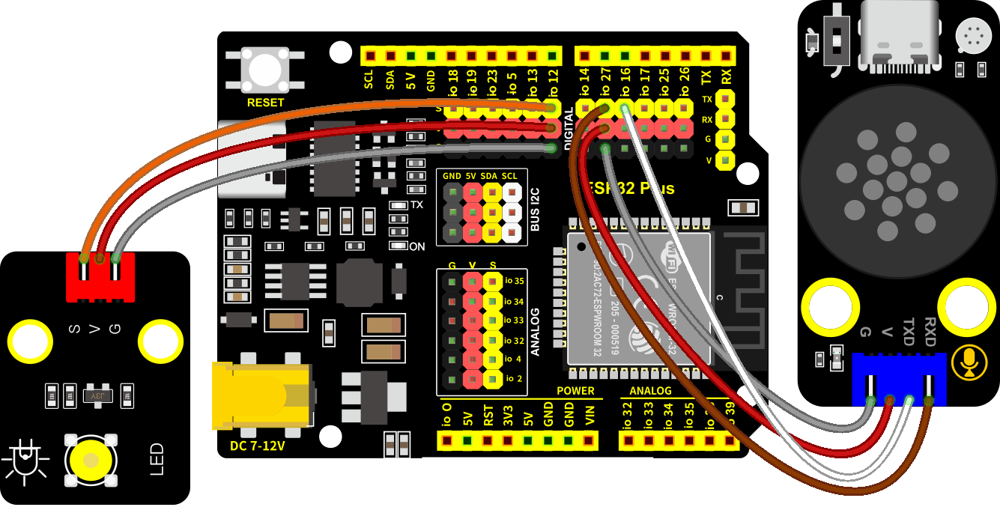
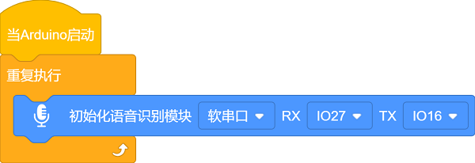
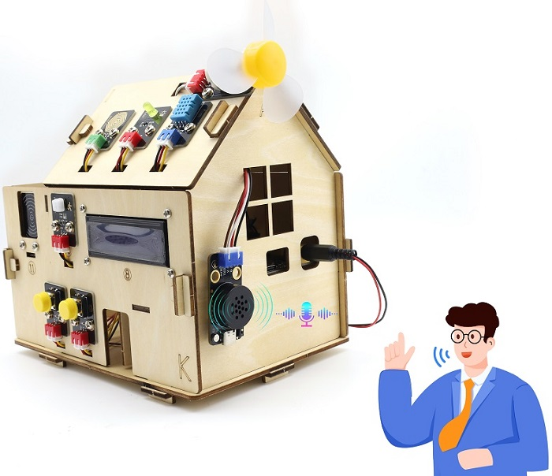
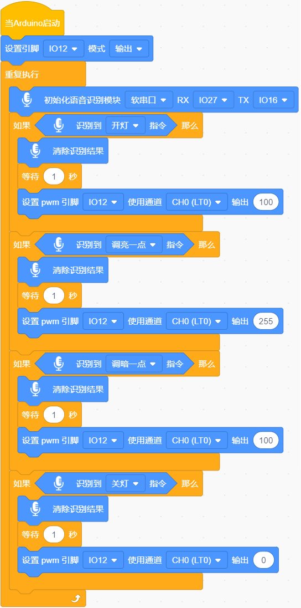

### 第14课 语音照明系统

#### 14.1 项目介绍

本教程将先为您详细介绍智能语音模块的工作原理、引脚功能、电路连接方法以及如何通过微控制器（如ESP32）来控制。然后使用智能语音模块来控制LED，实现自动化语音控制LED亮灭及亮度改变。

#### 14.2 模块相关资料

**智能语音模块：** 语音识别采用了离线语音识别芯片MUS516P6，该芯片采用 32bit RSIC 架构内核，并加入了专门针对信号处理和语音识别所需要的 DSP指令集，支持浮点运算的 FPU 运算单元，以及 FFT 加速器。智能语音模块通过串口通信的方式实现与主机的交互，最多支持150条语音指令，可在用户平台上自主定制语音指令和固件，命令词可任意修改，开发简单，不需要写代码。自带固件下载芯片，只需数据线即可完成固件下载。支持语音调节音量、学习唤醒词，识别灵敏且准确率高。

**技术参数：**

- 工作电压：3.3V~5.5V
- 负载：LDO输出3.3V，外部负载不能超过150MA
- 供电及待机：500MA/60MA
- 硬件: 10个IO口 / 1路uart(串口) / 5个ADC / 2个PWM / 1路I2S / 1路SPI / 1路I2C
- 音频输出：1路MONO功放输出接口
- 语音指令：70条（最大支持150条）
- FLASH: 2M
- 喇叭功率：8欧1W
- 支持语言：默认固件支持中文（也可自行生成英文）
- 工作温度：0~80℃
- 尺寸：47.73mm*23.93mm
- 重量：8.96g

#### 14.3 固件导入

⚠️ **特别提醒：** 智能语音模块在出厂时，已经导入好了默认语音固件，不需要再重复导入。如果你发现语音固件流失了或者想导入你自己的语音固件，请参照链接：[语音固件制作说明](https://www.keyesrobot.cn/projects/KE4084/zh-cn/latest/) 中的说明。

⚠️ **特别提醒：** 我们提供的语音固件，包括默认的语音命令词和语音播报，想了解请参照链接：[默认语音固件](https://www.keyesrobot.cn/projects/KE4084/zh-cn/latest/)，可以看到一些默认语音命令词和语音播报等内容，请认真查看。

#### 14.4 实验组件

||||
|-|-|-|
|ESP32 Plus主板 *1|黄色LED模块 *1|智能语音模块 *1|
|| ||
|3P线 *1|4P线 *1|USB线 *1|

#### 14.5 接线图

智能语音模块和黄色LED模块的控制引脚：

|黄色LED（S引脚）|io12|
|-|-|
|智能语音模块（TXD引脚）|io16|
|智能语音模块（RXD引脚）|io27|

⚠️ **特别注意：智能家居已经组装好了，这里不需要把智能语音模块和黄色LED模块拆下来又重新组装和接线，这里再次提供接线图，是为了方便您编写代码！**

#### 14.6 语音命令的实验代码1

唤醒智能语音模模块，读取语音命令词和播报语

#### 14.7 实验结果1

按照接线图接好线，外接电源，选择好正确的开发板板型（ESP32 Dev Module）和 适当的串口端口（COMxx），然后单击按钮上传示例代码至ESP32主控板。示例代码上传成功后，上电后，设置串口波特率为9600。

对着智能语音模块上的麦克风，使用唤醒词 “你好，小智” 或 “小智小智” 来唤醒智能语音模块，同时喇叭播放回复语 “有什么可以帮到您”；接下来即可通过串口打印窗口查看智能语音模块接收到语音命令词所对应的命令参数 等。

智能语音模块唤醒后，对着麦克风说：“打开台灯” 或 “请开灯” 或 “开灯” 或 “打开灯” 或 “我回来了”等命令词时，串口打印命令参数 “1”，同时喇叭播放对应的回复语 “已为您打开照明”；

对着麦克风说：“关闭台灯” 或 “请关灯” 或 “关灯” 或 “睡觉了” 或 “关上灯” 或 “我出去了”等命令词时，串口打印命令参数 “2”，同时喇叭播放对应的回复语 “已为您关闭照明”。

对着麦克风说：“调亮一点” 或 “亮一点”等命令词时，串口打印命令参数 “3”，同时喇叭播放对应的回复语 “灯光已调亮”；

对着智能语音模块上的麦克风说 “调暗一点” 或 “暗一点”等命令词时，串口打印命令参数 “4”，同时喇叭播放对应的回复语 “灯光已调暗”；

其他的这里就不一一分别陈述，请查看下面所列的语音命令词语音播报指令，所对应的命令参数和信息号：

默认的语音命令词和语音播报等等，请参照链接： [默认语音固件](https://www.keyesrobot.cn/projects/KE4084/zh-cn/latest/)

#### 14.8 代码流程图

#### 14.9 语音照明系统的实验代码2

#### 14.10 实验结果2

按照接线图接好线，外接电源，选择好正确的开发板板型（ESP32 Dev Module）和 适当的串口端口（COMxx），然后单击按钮上传示例代码至ESP32主控板。示例代码上传成功后，上电后，通过智能语音模块来控制LED。

对着智能语音模块上的麦克风，使用唤醒词 “你好，小智” 或 “小智小智” 来唤醒智能语音模块，同时喇叭播放回复语 “有什么可以帮到您”；

智能语音模块唤醒后，对着麦克风说：“打开台灯” 或 “请开灯” 或 “开灯” 或 “打开灯” 或 “我回来了” 等命令词时，喇叭播放对应的回复语 “已为您打开照明”，同时LED点亮；

对着麦克风说：“调亮一点” 或 “亮一点” 等命令词时，喇叭播放对应的回复语 “灯光已调亮”，同时LED变亮；

对着麦克风说：“调暗一点” 或 “暗一点” 等命令词时，喇叭播放对应的回复语 “灯光已调暗”，同时LED变暗；

对着麦克风说：“关闭台灯” 或 “请关灯” 或 “关灯” 或 “睡觉了” 或 “关上灯” 或 “我出去了”等命令词时，喇叭播放对应的回复语 “已为您关闭照明”，同时LED熄灭。

