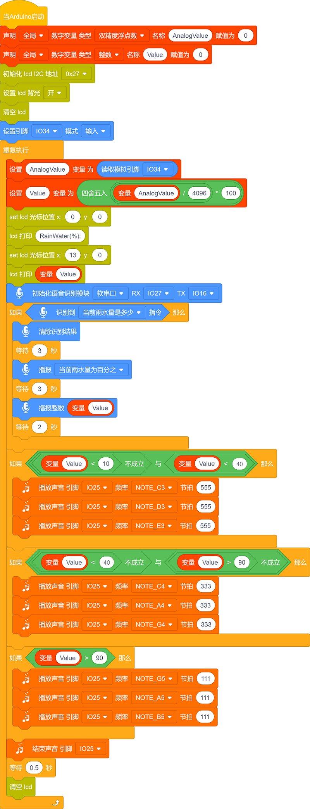

### 第16课 语音雨水检测系统

***注意：水洒在其他传感器上会导致短路，导致设备失效，洒在电池上会导致发热爆炸。请在使用设备时格外小心，尤其是幼儿使用时一定要在家长的监护下进行。为确保设备的安全运行，请遵循相关使用指南和安全规范。***

#### 17.1 项目介绍

本教程介绍了如何使用水滴传感器、蜂鸣器、I2C LCD1602模块、智能语音模块和ESP32来创建一个雨水检测系统。当传感器检测到雨时，ESP32可以触发各种动作，如发送通知、激活洒水器或打开蜂鸣器等。这个系统可用于监测园艺或农业的雨量，或检测屋顶或建筑物的漏水情况。水滴传感器可以很容易地连接到ESP32开发板上，形成一个简单而有效的雨水检测系统。

当水滴传感器检测到雨水时，它会向ESP32开发板发送一个信号，可以触发各种动作。例如，可以用一个蜂鸣器发出警报声，提醒用户正在下雨，在I2C LCD1602模块上显示当前雨水量百分数值，同时对着智能语音模块发出类似于“当前雨水量是多少”等命令词，智能语音模块接收到相应命令词后还能语音播报当前雨水量百分数值。这一功能对户外园艺或农业特别有用，使用户能够采取必要的预防措施，避免过度浇灌植物。

此外，使用水滴传感器和ESP32的雨水检测系统可用于检测屋顶或建筑物的漏水情况，帮助防止水入侵造成的损害。总的来说，水滴传感器是一个多功能的有效工具，可以在各种应用中检测水的存在。

#### 17.2 实验组件

|||||
|-|-|-|-|
|ESP32 Plus主板 *1|智能语音模块 *1|水滴传感器 *1|3P线 *2|
|||||
|I2C LCD1602模块 *1|无源蜂鸣器 *1|4P线 *2|USB线 *1|

#### 17.3 模块接线图

智能语音模块、无源蜂鸣器、I2C LCD1602模块和水滴传感器的控制引脚：

|水滴传感器（S引脚）|io26|
|-|-|
|无源蜂鸣器（S引脚）|io25|
|智能语音模块（TXD引脚）|io16|
|智能语音模块（RXD引脚）|io27|
|I2C 1602 LCD模块（SDA引脚）|SDA|
|I2C 1602 LCD模块（SCL引脚）|SCL|

⚠️ **特别注意：智能家居已经组装好了，这里不需要把水滴传感器、无源蜂鸣器、I2C LCD1602模块和智能语音模块拆下来又重新组装和接线，这里再次提供接线图，是为了方便您编写代码！**

#### 17.4 代码流程图

#### 17.5 实验代码

**注意：代码中的条件阈值可以根据实际情况自行设置。**

#### 17.6 实验结果

按照接线图接好线，外接电源，选择好正确的开发板板型（ESP32 Dev Module）和 适当的串口端口（COMxx），然后单击按钮上传示例代码至ESP32主控板。示例代码上传成功后，上电后，I2C LCD1602模块显示屏显示当前雨水量的百分数相关信息 (用湿润的手触碰一下雨滴传感器上的检测区)，当水滴传感器检测到的雨水量的百分数越大，蜂鸣器报警声音越大。

对着智能语音模块上的麦克风，使用唤醒词 “你好，小智” 或 “小智小智” 来唤醒智能语音模块，同时喇叭播放回复语 “有什么可以帮到您”；

智能语音模块唤醒后，对着麦克风说：“当前雨水量是多少” 或 “当前雨量多少” 等命令词时，接着语音播报 “正在为您读取当前雨水量” + “当前雨水量为百分之” + “水滴传感器模拟值通过计算转化成的雨水量百分数值”。

