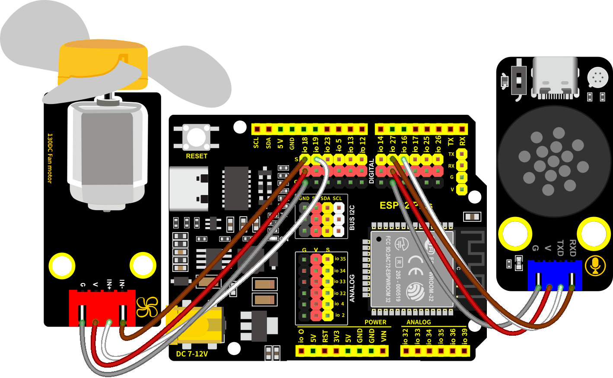
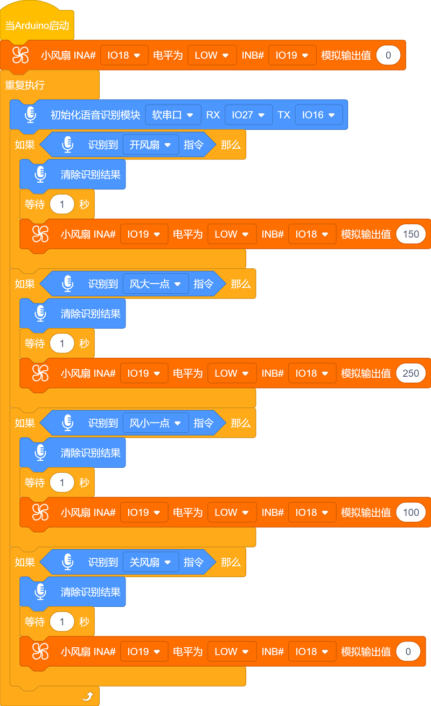

### 第17课 语音控制风扇系统

#### 18.1 项目介绍

夏天来了，风扇成了家里或商场里的“小救星”。但每次手动调节风速，是不是觉得有点麻烦？想象一下，只需动动嘴，风扇就乖乖听话，那该多方便！语音控制风扇，真的是懒人福音！无需动手，只需口头指令，就能轻松实现开关、调节风速等功能。

想象一下，回家一进门，喊一声类似于“打开风扇”等命令词，立刻就能感受到凉风拂面；感觉风速小，喊一声类似于“风大一点”等命令词，又能感受到凉风变大；感觉风速大了需要风速小点，喊一声类似于“风小一点”等命令词，立马能感受到凉风变小；需要外出出门时，喊一声类似于“关闭风扇”等命令词，风扇立刻就能停止。

这种便捷性，对于行动不便者或商场业主来说，更是大大提升了生活质量。

语音控制风扇系统是通过组合智能语音模块和电机模块，实现对家里的温度进行语音智能调节。

#### 18.2 实验组件

||||
|-|-|-|
|ESP32 Plus主板 *1|智能语音模块 *1|130电机模块 *1|
||||
|风扇叶 *1|4P线 *2|USB线 *1|

#### 18.3 接线图

智能语音模块和130电机模块的控制引脚：

|130电机模块（IN+引脚）|io19|
|-|-|
|130电机模块（IN-引脚）|io18|
|智能语音模块（TXD引脚）|io16|
|智能语音模块（RXD引脚）|io27|

⚠️ **特别注意：智能农场已经组装好了，这里不需要把电机模块和智能语音模块拆下来又重新组装和接线，这里再次提供接线图，是为了方便您编写代码！**

#### 18.4 代码流程图

#### 18.5 实验代码

#### 18.6 实验结果

按照接线图接好线，外接电源，选择好正确的开发板板型（ESP32 Dev Module）和 适当的串口端口（COMxx），然后单击按钮上传示例代码至ESP32主控板。示例代码上传成功后，上电后。

对着智能语音模块上的麦克风，使用唤醒词 “你好，小智” 或 “小智小智” 来唤醒智能语音模块，同时喇叭播放回复语 “有什么可以帮到您”；

智能语音模块唤醒后，对着麦克风说：“打开风扇” 或 “请开风扇” 或 “开风扇” 等命令词时，喇叭播放对应的回复语 “已为您打开风扇”，同时风扇转动；

对着麦克风说：“风大一点” 或 “大一点” 等命令词时，喇叭播放对应的回复语 “风速已增加”，同时风扇转速加快；

对着麦克风说 “风小一点” 或 “小一点” 等命令词时，喇叭播放对应的回复语 “风速已减弱”，同时风扇转速减慢；

对着麦克风说：“关闭风扇” 或 “请关风扇” 或 “关风扇” 或 “关上风扇” 等命令词时，喇叭播放对应的回复语 “已为您关闭风扇”，同时风扇不转。

