### 8.2.1 下载安装Thonny IDE(重要)

Thonny是一个免费、开源的软件平台，体积小，界面简单，操作简单，功能丰富，是一个适合初学者的Python IDE。在本教程中，我们使用这个IDE在整个过程中开发ESP32。Thonny支持多种操作系统，包括Windows, Mac OS, Linux。

#### 8.2.1.1 下载安装Thonny

Thonny是一个免费、开源的软件平台，体积小，界面简单，操作简单，功能丰富，是一个适合初学者的Python IDE。在本教程中，我们使用 Thonny 这个IDE在整个实验课程过程中开发ESP32。Thonny支持多种操作系统，包括Windows, Mac OS,  Linux。

（1）软件下载和开源代码库分享

- Thonny软件官网：[https://thonny.org](https://thonny.org) 

  请根据您的操作系统选择相应的版本下载。

  也可以使用我们提供的安装包：

- Windows系统：

  链接: [https://pan.baidu.com/s/1LNCP-fBc-P_SrdiMuaeijg?pwd=te7y](https://pan.baidu.com/s/1LNCP-fBc-P_SrdiMuaeijg?pwd=te7y) 提取码: te7y

- Mac系统：

  链接: [https://pan.baidu.com/s/1Qd7ShCmdWUlR7KQJ7kyzCA?pwd=ee41](https://pan.baidu.com/s/1Qd7ShCmdWUlR7KQJ7kyzCA?pwd=ee41) 提取码: ee41

 **注意：本教程使用的是 4.1.7 版本，请保持一致，以免出现代码不兼容情况。**

（2）鼠标左键双击，选择 **Install for all users** 。你也可以选择 Install for me only 进行操作。

（3）如果你不熟系电脑软件的安装，可以一直单击 **Next** 直至安装完成。

（4）Thonny软件的安装路径。默认此安装路径继续下一步，单击 **Next** 。如果您想选择一个不同的文件夹，请单击 <strong>Browse...</strong> 进行修改。

（5）程序将在下面的开始菜单文件夹中创建程序的快捷方式。默认此文件夹继续下一步，单击 **Next** 。如果您想选择一个不同的文件夹，请单击 **Browse...** 。

（6）选中 **Creak desktop icon** ，在桌面生成快捷方式。

（7）单击 **Install** 安装软件。等待安装成功。

（8）安装完成，单击 **Finish** 结束安装。

---

### 8.2.2 Thonny软件基本配置与介绍

#### 8.2.2.1 Thonny软件基本配置

（1）双击桌面的Thonny软件图标，出现语言选择和初始设置界面。

Language 选择 **简体中文** 。然后单击 **Let's go!** 结束设置。

（2）单击 **视图** ，勾选 **Shell** 和 **文件** 

---

#### 8.2.2.2 Thonny软件的介绍

（1）工具栏介绍

|                      按钮                       |       功能        |
| :---------------------------------------------: | :---------------: |
|   |       新建        |
|   |      打开...      |
|   |       保存        |
|   |   运行当前脚本    |
|   |   调试当前脚本    |
|  |       步过        |
|   |       步进        |
|   |       步出        |
|   |     恢复执行      |
|   | 停止/重启后端进程 |

（2）界面介绍

---

### 8.2.3 烧录固件(重要)

要在ESP32主板上运行Python程序，我们需要先将固件烧入到ESP32主板。

#### 8.2.3.1 下载Micropython固件

本教程中使用的固件是：**esp32-20210902-v1.17.bin** 。我们的资料中也提供了此版本的固件，路径如下图。(提醒：这里是以 **MicroPython资料\MicroPython_库文件** 文件夹转移到D盘为例，你可以将下载的**MicroPython资料** 文件夹复制粘贴到D盘。)

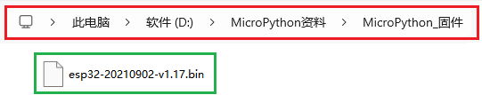

#### 8.2.3.2 烧录Micropython固件

（1）将ESP32主板通过USB线连接到计算机。

（2）打开Thonny，点击 **运行** ，选择 **配置解释器**。

在解释器页面，按下图所示选择（COM号以你电脑的端口为准），**然后单击安装或更新MicroPython（esptool）**。

按下图所示选择，打开固件存放的路径，选中 **esp32-20210902-v1.17.bin** 。

单击 **安装**，等待安装完成提示。

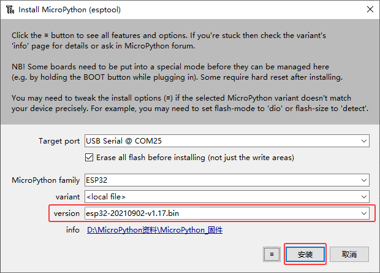

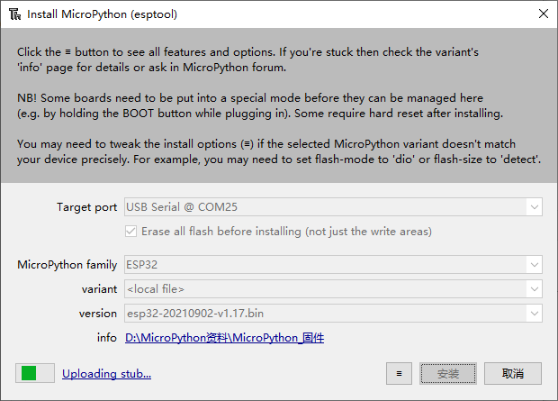

（3）安装完成，单击 **关闭** 。

单击 **确认** 。

（5）点击**停止/重启后端进程**按钮。

现在，一切准备工作都已就绪。

---

### 8.2.4 添加 MicroPython 库(重要)

在某些项目中，您将需要额外的库。所以这里我们先把这些库上传到 ESP32 主控板上，然后我们可以直接运行代码。

1\. 使用 Micro USB 数据线将 ESP32 主控板连接到您的计算机。

2\. 打开 Thonny IDE，并在顶部的菜单栏中，单击 “ **视图** -> **文件** ”。

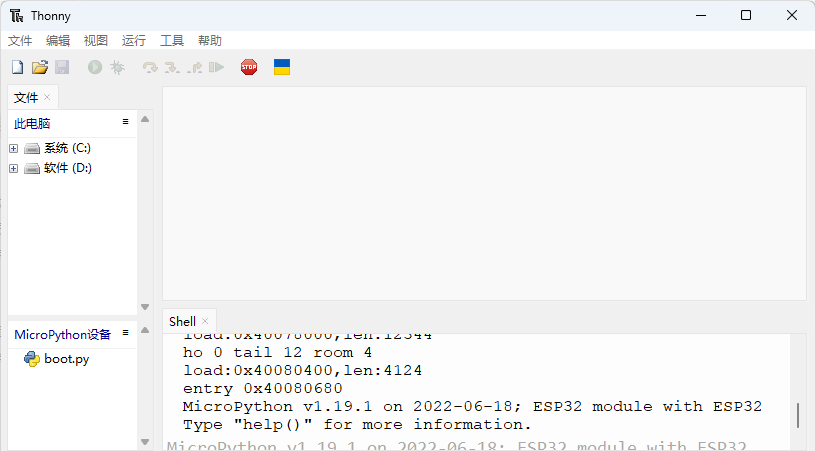

3\. 将路径切换到之前下载的 **MicroPython资料** 文件夹，然后转到 **MicroPython_库文件** 文件夹。
(提醒：这里是以 **MicroPython资料\MicroPython_库文件** 文件夹转移到D盘为例，你可以将下载的**MicroPython资料** 文件夹复制粘贴到D盘。)

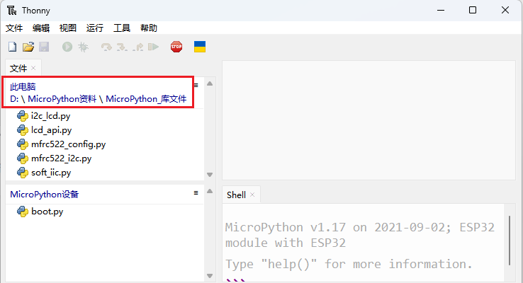

4\. 选中 MicroPython_库文件 文件夹中的 **i2c_lcd\.py** 文件，鼠标右键单击 **i2c_lcd\.py** 文件，然后选择 “**上传到/**” ，这样，**i2c_lcd\.py** 文件被上传到 “**MicroPython 设备**” 驱动器中。

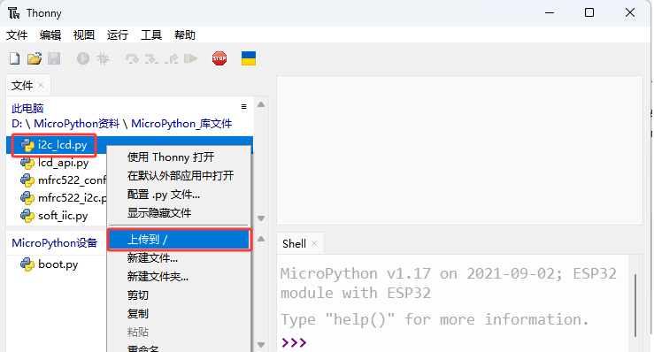

5\. 您将看到您刚刚上传到 “**MicroPython 设备**” 驱动器中的文件。

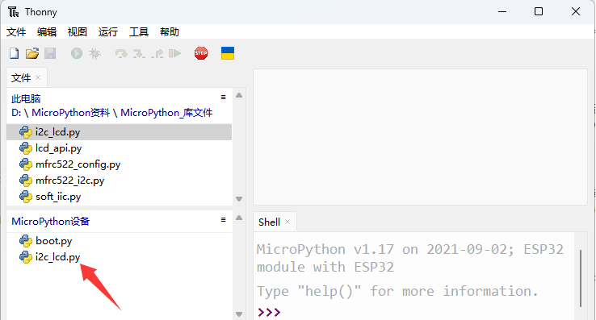

6\. 用相同的方法，将剩余的库文件都上传到 “**MicroPython 设备**” 驱动器中。

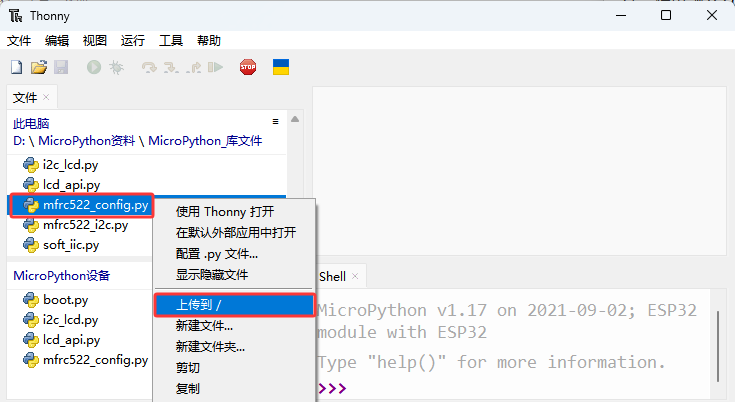

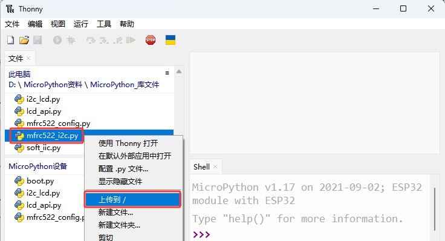

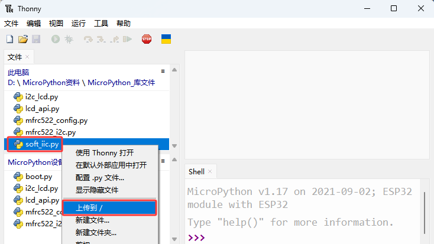

7\. 这样，您将看到您刚刚上传到“**MicroPython 设备**”驱动器中的所有文件。

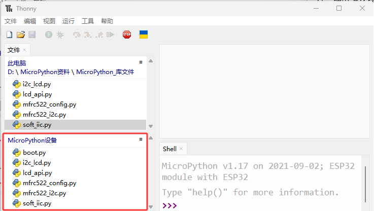

**特别提醒：** 如果添加某些库文件后，发现不再需要它们，也是可以删除它们的，这里是以 **i2c_lcd\.py** 库文件为例的。一般来说，在对应的套件项目教程中，添加好的库文件，是不需要把它们删除的。

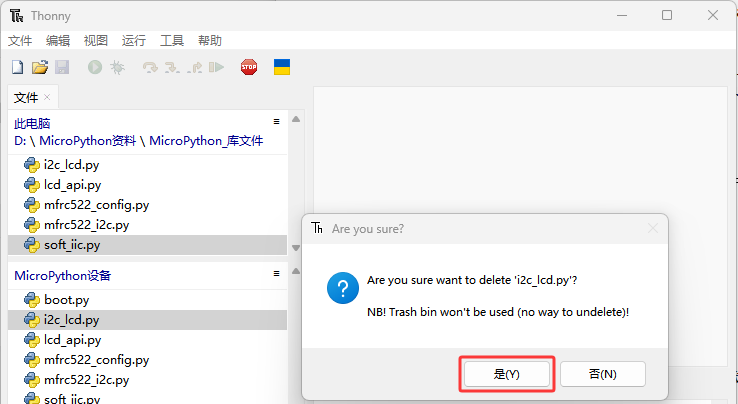