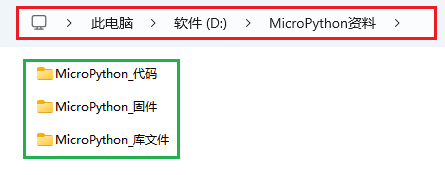

## 代码和库文件下载

请先下载本教程需要用到的 MicroPython资料(包含：MicroPython_代码 MicroPython_固件和 MicroPython_库文件），请点击下载才能进行后续的学习，保存至您方便使用的路径下。

单击下载：[MicroPython资料](./MicroPython资料.7z) 

⚠️ **特别提醒：本MicroPython项目的所有实验都是以将代码文件夹移动到（D:）盘中为例的，移动后路径为**  。

