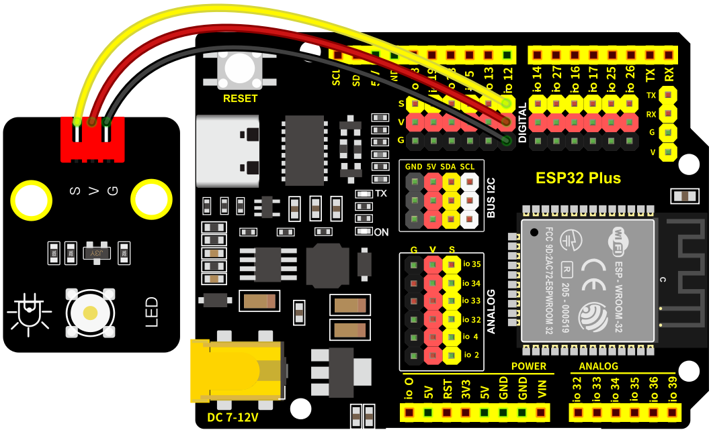

### 第2课 呼吸灯

#### 2.1 项目介绍

在之前的研究中，我们知道LED有亮/灭状态，那么如何进入中间状态呢?如何输出一个中间状态让LED“半亮”?这就是我们将要学习的。呼吸灯，即LED由灭到亮，再由亮到灭，就像“呼吸”一样。那么，如何控制LED的亮度呢?我们将使用ESP32的PWM来实现这个目标。

**1.2. 模块相关资料：**


|工作电压:|DC 3.3-5V|
|-|-|
|工作电流：| 20mA|
|最大功率：|0.1W|
|控制接口:|数字口（数字输入）|
|工作温度：|-10°C ~ +50°C|
|LED显示颜色：|黄色|

#### 2.3 元件知识


**Analog & Digital**

模拟信号在时间和数值上都是连续的信号。相反，数字信号或离散时间信号是由一系列数字组成的时间序列。生活中的大多数信号都是模拟信号。一个熟悉的模拟信号的例子是，全天的温度是如何不断变化的，而不是突然从0到10的瞬间变化。然而，数字信号的值可以瞬间改变。这个变化用数字表示为1和0(二进制代码的基础)。如下图所示，我们可以更容易地看出它们的差异。


在实际应用中，我们经常使用二进制作为数字信号，即一系列的0和1。由于二进制信号只有两个值(0或1)，因此具有很大的稳定性和可靠性。最后，可以将模拟信号和数字信号相互转换。

**PWM：**

脉宽调制(PWM)是一种利用数字信号控制模拟电路的有效方法。普通处理器不能直接输出模拟信号。PWM技术使这种转换(将数字信号转换为模拟信号)非常方便。PWM技术利用数字引脚发送一定频率的方波，即高电平和低电平的输出，交替持续一段时间。每一组高电平和低电平的总时间一般是固定的，称为周期(注:周期的倒数是频率)。高电平输出的时间通常称为脉宽，占空比是脉宽(PW)与波形总周期(T)之比的百分比。高电平输出持续时间越长，占空比越长，模拟信号中相应的电压也就越高。下图显示了对应于脉冲宽度0%-100%的模拟信号电压在0V-3.3V(高电平为3.3V)之间的变化情况.


PWM占空比越长，输出功率越高。既然我们了解了这种关系，我们就可以用PWM来控制LED的亮度或直流电机的速度等等。从上面可以看出，PWM并不是真实的模拟信号，电压的有效值等于相应的模拟信号。因此，我们可以控制LED和其他输出模块的输出功率，以达到不同的效果。

**ESP32 与 PWM**

几乎所有ESP32输入/输出引脚都可用于PWM（脉冲宽度调制）。使用这些引脚可以控制电机、LED灯和颜色等。

#### 2.4 实验组件

|||||
|-|-|-|-|
|ESP32 Plus主板 *1|黄色LED模块 *1|3P线 *1|USB线 *1|

#### 2.5 模块接线图

黄色LED的控制引脚：

* 黄色LED灯（S引脚）io12

⚠️ **特别注意：智能家居已经组装好了，这里不需要把LED模块拆下来又重新组装和接线，这里再次提供接线图，是为了方便您编写代码！**





#### 2.6 实验代码

打开“Thonny”软件，点击“此电脑” → “D:” → “MicroPython资料” → “MicroPython_代码”。并鼠标左键双击“Project_02_breath_led.py”。


```python
# 作者 : www.keyes-robot.com

import time
from machine import Pin,PWM

#ESP32 PWM引脚的输出方式与传统控制器不同.它可以通过初始化阶段的PWM参数来改变频率和占空比.
#定义GPIO 12的输出频率为10000Hz，占空比为0，分配给PWM.
pwm =PWM(Pin(12,Pin.OUT),10000,0)

try:
    while True: 
#占空比范围为0-1023，因此我们使用第一个for环路来控制PWM来改变占空比值，
#使PWM输出0% -100%;使用第二个for循环使PWM输出100%-0%。
 
        for i in range(0,1023):
            pwm.duty(i)
            time.sleep_ms(1)
            
        for i in range(0,1023):
            pwm.duty(1023-i)
            time.sleep_ms(1)  
except:
#每次使用PWM时，将打开硬件定时器配合它。因此，每次使用PWM后,
#需要调用deinit()来关闭计时器。否则，下次PWM可能无法工作.
    pwm.deinit()
```

#### 2.7 实验结果

按照接线图接好线，将 ESP32 主控板通过Micro USB数据线与计算机相连供电，外接电源供电，然后单击按钮，示例代码开始执行。


示例代码开始执行之后，你会看到的现象是：黄色LED灯渐亮渐暗，似乎在呼吸。


单击“停止/启动后端进程”退出程序。

