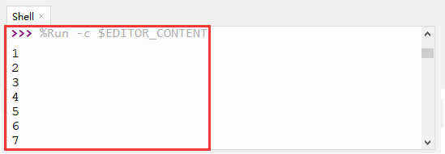

### 第3课 台灯

#### 3.1 项目介绍

常见的台灯，用到了LED灯和按键。通过按按键来控制灯的开与关。

按键按下，我们的单片机读取到低电平，松开读取到高电平。在这一实验课程中，我们利用按键和黄色LED做一个扩展，当按键按下时即读取到低电平时点亮黄色LED灯，松开按键时即读取到高电平时熄灭黄色LED灯，这样就可以通过一个模块控制另一个模块了。

#### 3.2 模块相关资料


附原理图，按键有四个引脚，其中1和3是相连的，2和4是相连的，在我们未按下按键时，13与24是断开的，信号端S读取的是被4.7K的上拉电阻R1所拉高的高电平，而当我们按下按键时，13和24连通。信号端S连接到了GND，此时读取到的电平为低电平，即按下按键，传感器信号端为低电平；松开按键时，信号端为高电平。

#### 3.3 实验组件

||||||
|-|-|-|-|-|
|ESP32 Plus主板 *1|黄色LED模块 *1|按键 *1|3P线 *2|USB线 *1|

#### 3.4 模块接线图

木板房子⑦处(左侧)按键1和黄色LED的控制引脚：

|木板房子⑦处(左侧)按键1（S引脚）|io4|
|-|-|
|黄色LED灯（S引脚）|io12|

⚠️ **特别注意：智能家居已经组装好了，这里不需要把按键模块和LED模块拆下来又重新组装和接线，这里再次提供接线图，是为了方便您编写代码！**


#### 3.5 读取按钮值的实验代码1

读取木板房子⑦处(左侧)按键的状态值，在Shell窗口中打印出来，这样就可以直观的看到按钮的状态值，即可得到0或1两种状态值。

打开“Thonny”软件，点击“此电脑” → “D:” → “MicroPython资料” → “MicroPython_代码”。并鼠标左键双击“Project_03.1_button.py”。

```python
# 作者 : www.keyes-robot.com

from machine import Pin
import time

button1 = Pin(4, Pin.IN, Pin.PULL_UP)

while True:
    btnVal1 = button1.value()  # 读取按钮1的值
    print("button1 =",btnVal1)  #在shell窗口打印出来
    time.sleep(0.1) #延时 0.1秒
```


#### 3.6 实验结果1

按照接线图接好线，将 ESP32 主控板通过Micro USB数据线与计算机相连供电，外接电源供电，然后单击按钮，示例代码开始执行，上电后，你会看到的现象是：未按按键时，Shell窗口打印按键值；再按下木板房子⑦处(左侧)按键1就可以看到按键状态值的改变，如下图。


单击“停止/启动后端进程”退出程序。

#### 3.7 代码流程图


#### 3.8 台灯的实验代码2 

计算木板房子⑦处(左侧)按键1被点击的次数，然后再对计算的次数进行对2求余数，可以看到打印对应的数字。

打开“Thonny”软件，点击“此电脑” → “D:” → “MicroPython资料” → “MicroPython_代码”。并鼠标左键双击“Project_03.2_button_led.py”。

```python
# 作者 : www.keyes-robot.com

from machine import Pin
import time

button1 = Pin(4, Pin.IN, Pin.PULL_UP)
led = Pin(12, Pin.OUT)
count = 0

while True:
    btnVal1 = button1.value()  # 读取按钮1的值
    #print("button1 =",btnVal1)  #在shell窗口打印出来
    if(btnVal1 == 0):
        time.sleep(0.01)
        while(btnVal1 == 0):
            btnVal1 = button1.value()
            if(btnVal1 == 1):
                count = count + 1
                print(count)
    val = count % 2
    if(val == 1):
        led.value(1)
    else:
        led.value(0)
    time.sleep(0.1) #延时 0.1秒
```

#### 3.9 实验结果2

按照接线图接好线，将 ESP32 主控板通过Micro USB数据线与计算机相连供电，外接电源供电，然后单击按钮，示例代码开始执行。


示例代码开始执行之后，你会看到的现象是：在shell窗口中打印出木板房子⑦处(左侧)按键1被点击的次数，并且点击一次木板房子⑦处(左侧)按键1，LED灯就亮，再点击一次，LED关闭。




单击“停止/启动后端进程”退出程序。