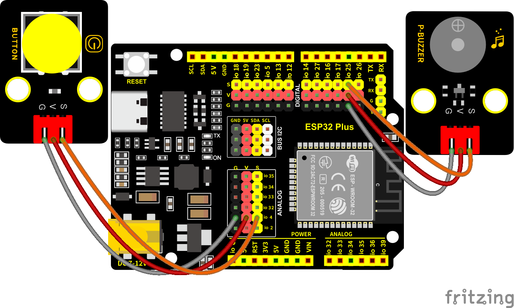

### 第5课 演奏音乐

#### 5.1 项目介绍

本实验用无源蜂鸣器播放音乐，无源蜂鸣器是通过PWM脉冲宽度调制脉冲进而调节音调，

PWM比较多用于调节LED灯的亮度或者调节无源蜂鸣器的频率，或者是电机的转动速度，电机带动的车轮速度也就能很容易控制了，在玩一些Arduino机器人时，更能体现PWM的好处。

音乐除了要“唱的准”，还要“节奏对”，每一个音符的持续时间，就是节拍啦。我们可以用延时多少来设置节拍的，例如：1拍，1秒即1000毫秒；1/2拍，0.5秒即500毫秒；1/4拍，0.25秒即250毫秒；1/8拍，0.125秒即125毫秒….，我们可以试一试组合不同的音调和节拍，看看会有什么不同的效果。

#### 5.2 模块相关资料


工作电压：3.3-5V（DC）

电流：50MA

工作温度：-10摄氏度 到 +50摄氏度

尺寸：31.6mmx23.7mm

接口：3PIN接口

输入信号：数字信号（方波）

#### 5.3 元件知识 

无源蜂鸣器：其内部不带震荡电路，控制时需要在元件正极输入不同频率的方波，负极接地，从而控制喇叭功放元件响起不同频率的声音。

#### 5.4 实验组件

||||||
|-|-|-|-|-|
|ESP32 Plus主板 *1|无源蜂鸣器模块 *1|按键 *1|3P线 *2|USB线 *1|

#### 5.5 模块接线图

木板房子⑦处(左侧)按键1和无源蜂鸣器的控制引脚：

|木板房子⑦处(左侧)按键1（S引脚）|io4|
|-|-|
|无源蜂鸣器（S引脚）|io25|

⚠️ **特别注意：智能家居已经组装好了，这里不需要把按键模块和无源蜂鸣器拆下来又重新组装和接线，这里再次提供接线图，是为了方便您编写代码！**



#### 5.6 播放生日快乐的实验代码1

打开“Thonny”软件，点击“此电脑” → “D:” → “MicroPython资料” → “MicroPython_代码”。并鼠标左键双击“Project_5.1_buzzer.py”。

```python
# 作者 : www.keyes-robot.com

from machine import Pin, PWM
from time import sleep
buzzer = PWM(Pin(25))

buzzer.duty(1000) 

# 生日快乐
buzzer.freq(294)
sleep(0.25)
buzzer.freq(440)
sleep(0.25)
buzzer.freq(392)
sleep(0.25)
buzzer.freq(532)
sleep(0.25)
buzzer.freq(494)
sleep(0.25)
buzzer.freq(392)
sleep(0.25)
buzzer.freq(440)
sleep(0.25)
buzzer.freq(392)
sleep(0.25)
buzzer.freq(587)
sleep(0.25)
buzzer.freq(532)
sleep(0.25)
buzzer.freq(392)
sleep(0.25)
buzzer.freq(784)
sleep(0.25)
buzzer.freq(659)
sleep(0.25)
buzzer.freq(532)
sleep(0.25)
buzzer.freq(494)
sleep(0.25)
buzzer.freq(440)
sleep(0.25)
buzzer.freq(698)
sleep(0.25)
buzzer.freq(659)
sleep(0.25)
buzzer.freq(532)
sleep(0.25)
buzzer.freq(587)
sleep(0.25)
buzzer.freq(532)
sleep(0.5)
buzzer.duty(0)
```

#### 5.7 实验结果1

按照接线图接好线，将 ESP32 主控板通过Micro USB数据线与计算机相连供电，外接电源供电，然后单击按钮，示例代码开始执行，你会看到的现象是：无源蜂鸣器播放一次生日快乐歌曲，就会听到无源蜂鸣器播放一次生日快乐。


单击“停止/启动后端进程”退出程序。

#### 5.8 代码流程图


#### 5.9 音乐盒的实验代码 

做个音乐盒，通过木板房子⑦处(左侧)按键1来切换曲子。

打开“Thonny”软件，点击“此电脑” → “D:” → “MicroPython资料” → “MicroPython_代码”。并鼠标左键双击“Project_5.2_music.py”。

```python
# 作者 : www.keyes-robot.com

from machine import Pin, PWM
import time

# 定义按钮引脚
btn1 = Pin(4, Pin.IN, Pin.PULL_UP)
btn_count = 0
music_flag = False

# 蜂鸣器引脚 (假设使用GPIO25)
buzzer = PWM(Pin(25))

# 音符频率定义 (示例，您可以根据需要调整)
NOTE_B0  = 31
NOTE_C1  = 33
NOTE_CS1 = 35
NOTE_D1  = 37
# ... 更多音符定义

# 简单的音乐播放函数
def play_tone(frequency, duration):
    if frequency == 0:
        buzzer.duty(0)
        time.sleep_ms(duration)
        return
    buzzer.freq(frequency)
    buzzer.duty(512)  # 50%占空比
    time.sleep_ms(duration)
    buzzer.duty(0)    # 停止声音
    time.sleep_ms(10)

def play_ode_to_joy():
    # 欢乐颂简谱 (示例频率和时长)
    melody = [
        (392, 200), (392, 200), (440, 200), (466, 200),
        (466, 200), (440, 200), (392, 200), (349, 200),
        (329, 200), (329, 200), (349, 200), (392, 200),
        (392, 300), (349, 100), (349, 400)
    ]
    for note in melody:
        play_tone(note[0], note[1])

def play_christmas():
    # 圣诞歌简谱
    melody = [
        (262, 200), (262, 200), (294, 400),
        (262, 400), (349, 400), (330, 800)
    ]
    for note in melody:
        play_tone(note[0], note[1])

def play_tetris():
    # 俄罗斯方块主题曲
    melody = [
        (330, 200), (247, 200), (262, 200), (294, 200),
        (330, 200), (247, 200), (262, 200), (330, 200),
        (294, 200), (262, 200), (247, 200), (196, 200)
    ]
    for note in melody:
        play_tone(note[0], note[1])

def setup():
    buzzer.duty(0)  # 初始关闭蜂鸣器

def loop():
    global btn_count, music_flag
    
    btn1_val = btn1.value()
    
    if btn1_val == 0:  # 按钮按下
        time.sleep_ms(10)  # 防抖延迟
        
        if btn1_val == 0:  # 确认按钮仍按下
            btn_state = True
            
            while btn_state:
                btn_val = btn1.value()
                
                if btn_val == 1:  # 按钮释放
                    music_flag = True
                    btn_count += 1
                    print("Button count:", btn_count)
                    
                    # 循环计数1-3
                    if btn_count == 4:
                        btn_count = 1
                    
                    # 根据计数播放不同的歌曲
                    if music_flag:
                        if btn_count == 1:
                            play_ode_to_joy()
                        elif btn_count == 2:
                            play_christmas()
                        elif btn_count == 3:
                            play_tetris()
                        music_flag = False
                    
                    btn_state = False  # 退出等待循环

# 主程序
setup()
while True:
    loop()
    time.sleep_ms(10)  # 减少CPU占用
```

#### 5.10 实验结果2

按照接线图接好线，将 ESP32 主控板通过Micro USB数据线与计算机相连供电，外接电源供电，然后单击按钮，示例代码开始执行。


示例代码开始执行之后，你会看到的现象是：点击一次木板房子⑦处(左侧)按键1，播放一曲Ode_to_Joy，播放完之后，再点击木板房子⑦处(左侧)按键1，播放christmas，播放完之后，再点击木板房子⑦处(左侧)按键1，播放tetris。


单击“停止/启动后端进程”退出程序。