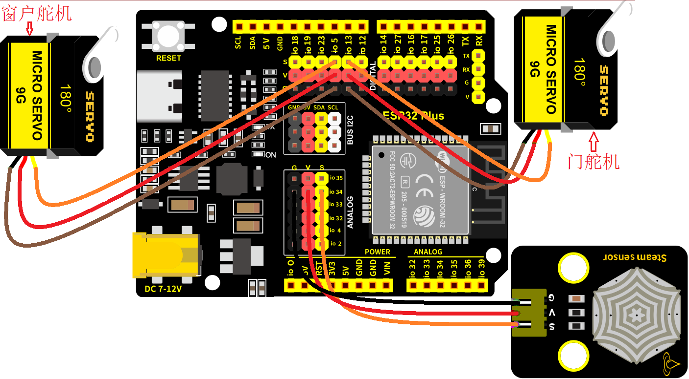
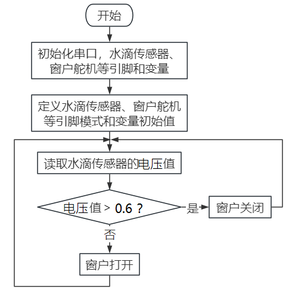

### 第6课 自动门窗

#### 6.1 项目介绍

当我们在制作智能家居时，经常会将舵机和门、窗等固定在一起。这样，我们就可以利用舵机转动，带动门、窗等开或关，从而起到家居生活的智能化功能。既然是自动门窗，那就需要动力装置，我们使用的是180度的舵机。再加上一些传感器，就会变得更加自动化，例如添加个雨滴传感器，就可以做下雨自动关窗；增加个RFID，就可以实现刷卡开门等。

#### 6.2 舵机相关资料

**舵机：** 舵机是一种位置伺服的驱动器，主要是由外壳、电路板、无核心马达、齿轮与位置检测器所构成。其工作原理是由接收机或者单片机发出信号给舵机，其内部有一个基准电路，产生周期为20ms，宽度为1.5ms的基准信号，将获得的直流偏置电压与电位器的电压比较，获得电压差输出。经由电路板上的IC判断转动方向，再驱动无核心马达开始转动，透过减速齿轮将动力传至摆臂，同时由位置检测器送回信号，判断是否已经到达定位。适用于那些需要角度不断变化并可以保持的控制系统。当电机转速一定时，通过级联减速齿轮带动电位器旋转，使得电压差为0，电机停止转动。

伺服电机有多种规格，但它们都有三根连接线，分别是棕色、红色、橙色(不同品牌可能有不同的颜色)。棕色为GND，红色为电源正极，橙色为信号线。


舵机的伺服系统由可变宽度的脉冲来进行控制，橙色的控制线是用来传送脉冲的。一般而言，PWM控制舵机的基准信号周期为20ms（50Hz），理论上脉宽应在1ms到2ms之间，对应控制舵机角度是0°～180°。但是，实际上更多控制舵机的脉宽范围是0.5ms到2.5ms，具体需要自己实际调试下。


经过实测，舵机的脉冲范围为0.65ms~2.5ms。180度舵机，对应的控制关系是这样的：

|高电平时间|舵机角度|基准信号周期时间（20ms）|
|-|-|-|
|0.65ms|0度|0.65ms高电平+19.35ms低电平|
|1.5ms|90度|1.5ms高电平+18.5ms低电平|
|2.5ms|180度|2.5ms高电平+17.5ms低电平|

**舵机的规格参数：**

|工作电压：|DC 4.8V〜6V|可操作角度范围：|大约180°(在500→2500μsec)|
|-|-|-|-|
|脉波宽度范围：|500→2500 μsec|外观尺寸：|22.9*12.2*30mm|

|空载转速：|0.12±0.01 sec/60度（DC 4.8V） 0.1±0.01 sec/60度（DC 6V）|
|-|-|
|空载电流：|200±20mA（DC 4.8V） 220±20mA（DC 6V）|
|停止扭力：|1.3±0.01kg·cm（DC 4.8V） 1.5±0.1kg·cm（DC 6V）|
|停止电流：|≦850mA（DC 4.8V） ≦1000mA（DC 6V）|
|待机电流：|3±1mA（DC 4.8V） 4±1mA（DC 6V）|
|重量:|9±1g (without servo horn)|
|使用温度：|-30℃~60℃|

#### 6.3 实验组件

||||||
|-|-|-|-|-|
|ESP32 Plus主板 *1|水滴传感器模块 *1|180度舵机 *2|3P线 *1|USB线 *1|

#### 6.4 模块接线图

水滴传感器，窗户舵机和门舵机的控制引脚：

|窗户舵机（橙黄色线引脚）|io5|
|-|-|
|门舵机（橙黄色线引脚）|io13|
|水滴传感器（S引脚）|io34|

⚠️ **特别注意：智能家居已经组装好了，这里不需要把水滴传感器和舵机拆下来又重新组装和接线，这里再次提供接线图，是为了方便您编写代码！**



#### 6.5 控制门来回转动的实验代码1

打开“Thonny”软件，点击“此电脑” → “D:” → “MicroPython资料” → “MicroPython_代码”。并鼠标左键双击“Project_06.1_servo.py”。

```python
# 作者 : www.keyes-robot.com

from machine import Pin, PWM
import time
pwm = PWM(Pin(13))  
pwm.freq(50)

'''
与角度对应的占空比
0°----2.5%----25
45°----5%----51.2
90°----7.5%----77
135°----10%----102.4
180°----12.5%----128
'''
angle_0 = 25
angle_90 = 77
angle_180 = 128

while True:
    pwm.duty(angle_0)
    time.sleep(1)
    pwm.duty(angle_90)
    time.sleep(1)
    pwm.duty(angle_180)
    time.sleep(1)
```

#### 6.6 实验结果1

按照接线图接好线，将 ESP32 主控板通过Micro USB数据线与计算机相连供电，外接电源供电，然后单击按钮，示例代码开始执行。


示例代码开始执行之后，你会看到的现象是：门的舵机带着门转动，来回旋转。


单击“停止/启动后端进程”退出程序。

#### 6.7 代码流程图



#### 6.8 下雨自动关窗的实验代码2 

使用窗户舵机和雨滴传感器搭配做个下雨自动关窗装置。

**雨滴传感器：** 这是个模拟输入传感器，水分覆盖到检测面上的面积越大，返回的值越大（模拟值范围0~4096，电压值范围0~3.3V）

打开“Thonny”软件，点击“此电脑” → “D:” → “MicroPython资料” → “MicroPython_代码”。并鼠标左键双击“Project_06.2_auto_window.py”。

```python
# 作者 : www.keyes-robot.com

# 导入引脚、ADC和DAC模块.
from machine import ADC,Pin,DAC,PWM
import time
pwm = PWM(Pin(5))  
pwm.freq(50)

# 打开ADC并配置0-3.3V的范围 
adc=ADC(Pin(34))
adc.atten(ADC.ATTN_11DB)
adc.width(ADC.WIDTH_12BIT)
pwm.duty(80) 
time.sleep(1)

# 每0.1秒读取一次ADC值，将ADC值转换为DAC值并输出，将这些数据打印到“Shell”窗口中。 
try:
    while True:
        adcVal=adc.read()
        dacVal=adcVal//16 
        voltage = adcVal / 4095.0 * 3.3
        print("ADC Val:",adcVal,"DACVal:",dacVal,"Voltage:",voltage,"V")
        if(voltage > 0.6):
            pwm.duty(25)
            time.sleep(1)
        else:
            pwm.duty(80)
            time.sleep(1)
        time.sleep(0.1)
except:
    pass
```

#### 6.9 实验结果2

按照接线图接好线，将 ESP32 主控板通过Micro USB数据线与计算机相连供电，外接电源供电，然后单击按钮，示例代码开始执行。


示例代码开始执行之后，你会看到的现象是：开始窗户自动打开，然后用湿润的手触碰一下雨滴传感器(电压值voltage>0.6时)，窗户就会关闭。


单击“停止/启动后端进程”退出程序。