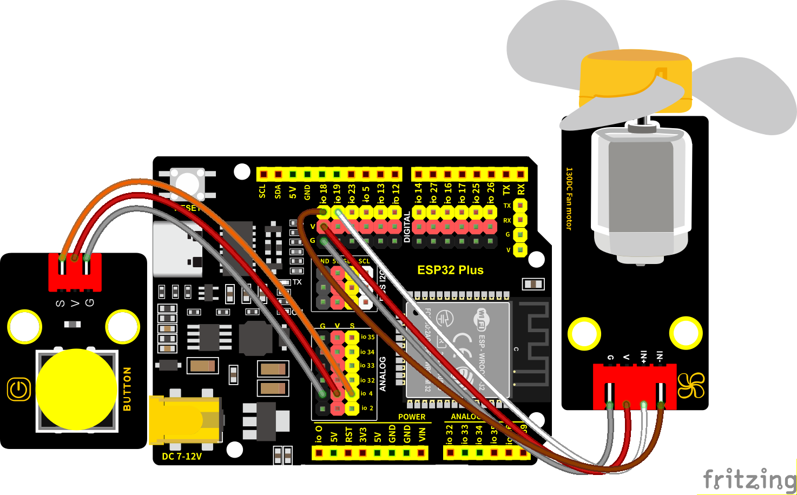

### 第8课 风扇

#### 8.1 项目介绍

130电机控制模块采用HR1124S电机控制芯片。HR1124S是应用于直流电机方案的单通道H桥驱动器芯片。HR1124S的H桥驱动部分采用低导通电阻的PMOS和NMOS功率管。低导通电阻保证芯片低的功率损耗，使得芯片安全工作更长时间。此外HR1124S拥有低待机电流，低静态工作电流，这些性能使HR1124S易用于玩具方案。

该模块兼容各种单片机控制板，如arduino系列单片机。模块上自带的防反插红色端子间距为2.54mm，实验中，我们可通过输出到两个信号端IN+和IN-的电压方向来控制电机的转动方向，使用PWM输出控制风扇的转速，让电机转动起来。

#### 8.2. 模块相关资料

**（1）元件知识：**

130电机控制模块采用HR1124S电机控制芯片。HR1124S是应用于直流电机方案的单通道H桥驱动器芯片。HR1124S的H桥驱动部分采用低导通电阻的PMOS和NMOS功率管。低导通电阻保证芯片低的功率损耗，使得芯片安全工作更长时间。此外HR1124S拥有低待机电流，低静态工作电流，这些性能使HR1124S易用于玩具方案。

该模块兼容各种单片机控制板，如arduino系列单片机。模块上自带的防反插红色端子间距为2.54mm，实验中，我们可通过输出到两个信号端IN+和IN-的电压方向来控制电机的转动方向，使用PWM输出控制风扇的转速，让电机转动起来。


|工作电压：|3.3-5V(DC)|最大电流：|200mA (DC5V)|
|-|-|-|-|
|最大功率：|1W|控制接口：|双数字口（数字输入）|
|工作温度：|-10°C ~+50°C|环保属性：|ROHS|

**（2）控制方法**

需要两个引脚控制风扇的电机，一引脚为IN+，二引脚为IN-。PWM值范围是0~255，当两个引脚的PWM输出一定差值时，风扇就能转动。

|IN+ - INB- = -45|顺时针转动|
|-|-|
|IN+- IN- ;= 45|逆时针转动|
|IN+ == 0 , IN- == 0|停止|

#### 8.3 实验组件

|||||
|-|-|-|-|
|ESP32 Plus主板 *1|按键 *2|130电机模块 *1|风扇叶 *1|
|||| |
|4p线 *1|3P线 *2|USB线 *1| |

#### 8.4 模块接线图

木板房子⑦处(左侧)按键1和130电机模块的控制引脚：

|木板房子⑦处(左侧)按键1（S引脚）|io4|
|-|-|
|电机模块的IN+引脚|io19|
|电机模块的IN-引脚|io18|

⚠️ **特别注意：智能家居已经组装好了，这里不需要把按键模块和130电机模块拆下来又重新组装和接线，这里再次提供接线图，是为了方便您编写代码！**



#### 8.5 控制风扇转动的实验代码1 

打开“Thonny”软件，点击“此电脑” → “D:” → “MicroPython资料” → “MicroPython_代码”。并鼠标左键双击“Project_08.1_fan.py”。


```python
# 作者 : www.keyes-robot.com

from machine import Pin,PWM
import time
#电机的两个引脚
INA =PWM(Pin(19,Pin.OUT),10000,0)#INA对应于IN+
INB =PWM(Pin(18,Pin.OUT),10000,2)#INB对应于IN- 

try:
    while True:
        #逆时针方向2秒
        INA.duty(0) #占空比范围为0-1023
        INB.duty(700)
        time.sleep(2)
        #停止1秒
        INA.duty(0)
        INB.duty(0)
        time.sleep(1)
        #顺时针旋转2秒
        INA.duty(700)
        INB.duty(0)
        time.sleep(2)
        #停止1秒
        INA.duty(0)
        INB.duty(0)
        time.sleep(1)
except:
    INA.duty(0)
    INB.duty(0)
    INA.deinit()
    INB.deinit()
```

#### 8.6 实验结果1

按照接线图接好线，将 ESP32 主控板通过Micro USB数据线与计算机相连供电，外接电源供电，然后单击按钮，示例代码开始执行。


示例代码开始执行之后，你会看到的现象是：电机模块上的风扇顺时针和逆时针的转动。


单击“停止/启动后端进程”退出程序。

#### 8.7 代码流程图


#### 8.8 按钮开关风扇的实验代码2 

一台简易的风扇，通过按键1开关风扇。

打开“Thonny”软件，点击“此电脑” → “D:” → “MicroPython资料” → “MicroPython_代码”。并鼠标左键双击“Project_08.2_button_fan.py”。

```python
# 作者 : www.keyes-robot.com

from machine import Pin,PWM
import time
#电机的两个引脚
INA =PWM(Pin(19,Pin.OUT),10000,0)##INA对应于IN+
INB =PWM(Pin(18,Pin.OUT),10000,2)#INB对应于IN-
button1 = Pin(4, Pin.IN, Pin.PULL_UP)
count = 0

try:
    while True:
        btnVal1 = button1.value()  # 读取按钮1的值
        if(btnVal1 == 0):
            time.sleep(0.01)
            while(btnVal1 == 0):
                btnVal1 = button1.value()
                if(btnVal1 == 1):
                    count = count + 1
                    print(count)
        val = count % 2
        if(val == 1):
            INA.duty(0) #占空比范围为0-1023
            INB.duty(700)
        else:
            INA.duty(0)
            INB.duty(0)
except:
    INA.duty(0)
    INB.duty(0)
    INA.deinit()
    INB.deinit()
```

#### 8.9 实验结果2

按照接线图接好线，将 ESP32 主控板通过Micro USB数据线与计算机相连供电，外接电源供电，然后单击按钮，示例代码开始执行。


示例代码开始执行之后，你会看到的现象是：先点击一下木板房子⑦处(左侧)按键1，风扇开始转动，再按一下木板房子⑦处(左侧)按键1，风扇停止。


单击“停止/启动后端进程”退出程序。