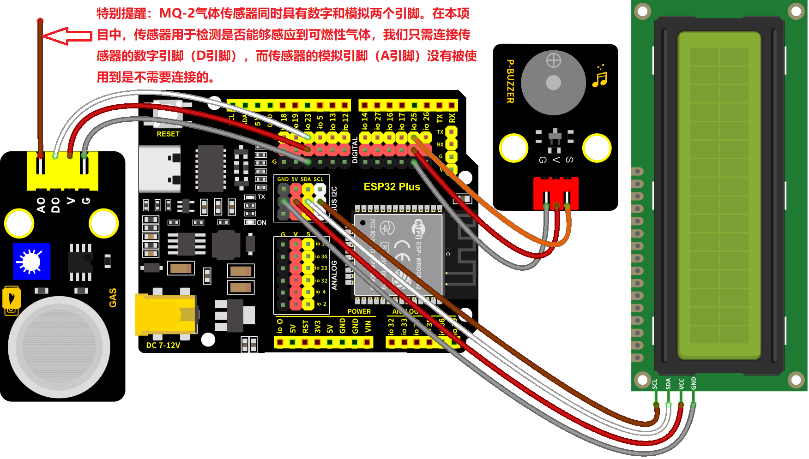
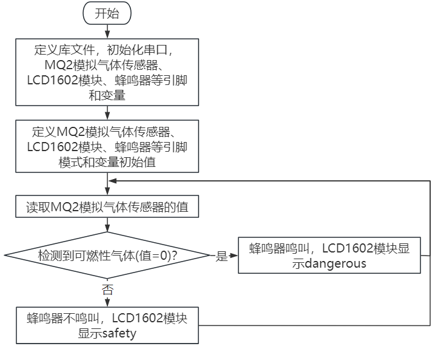

### 第10课 可燃性气体检测

#### 10.1 项目介绍

MQ-2气体传感器检测到可燃性气体比较浓时，蜂鸣器发出警报声，显示屏显示dangerous。

#### 10.2 模块相关资料


**（1）元件知识**

**MQ-2模拟气体传感器：** 所使用的气敏材料是在清洁空气中电导率较低的二氧化锡(SnO2)。当传感器所处环境中存在可燃气体时，传感器的电导率随空气中可燃气体浓度的增加而增大。使用简单的电路即可将电导率的变化转换为与该气体浓度相对应的输出信号。

MQ-2模拟气体传感器对丙烷、烟雾的灵敏度高，对天然气和其它可燃蒸气的检测也很理想。这种传感器可检测多种可燃性气体，是一款适合多种应用的低成本传感器。

广泛适用于家庭用气体泄漏报警器、工业用可燃气体报警器以及便携式气体检测仪器。

此外，上电后，传感器模块上的一个指示灯亮绿灯，可以通过调节蓝色的电位器(**使用一字螺丝刀调节**)使另一个指示灯(亮红灯)介于不亮与亮之间的临界点时，灵敏度最高。


⚠️ **特别提醒：MQ-2模拟气体传感器在使用之前必须加热一段时间，这样输出的电阻和电压较准确。但是加热电压不宜过高，否则会导致内部的信号线熔断。**

**（2）参数**


|工作电压：|3.3-5V|
|-|-|
|工作电流：|160mA (DC5V)|
|工作温度：|0°C ~ 40°C|
|控制接口：|数字、模拟输出|
|检测浓度：|300-10000ppm(可燃气体)|
|浓度斜率：|≤0.6(R3000ppm/R1000ppm C3H8)|
|灵敏度：|Rs(in air)/Rs(1000ppm异丁烷)≥5|
|敏感体表面电阻(Rs)|2KΩ-20KΩ(in 2000ppm C3H8 )|

#### 10.3 实验组件

|||||
|-|-|-|-|
|ESP32 Plus主板 *1|MQ2传感器 *1|无源蜂鸣器模块 *1|3P线 *1|
|||| |
|I2C LCD1602模块 *1|4P线 *2|USB线 *1| |

#### 10.4 模块接线图

MQ-2气体传感器，无源蜂鸣器和I2C 1602 LCD模块的控制引脚：

⚠️ **特别提醒：** MQ-2气体传感器同时具有数字和模拟两个引脚。在本项目中，我们将只连接传感器的数字引脚（D引脚），连接到IO23，用于检测是否能够感应到可燃气体。

|MQ-2气体传感器（D引脚）|io23|
|-|-|
|无源蜂鸣器（S引脚）|io25|
|I2C 1602 LCD模块（SDA引脚）|SDA|
|I2C 1602 LCD模块（SCL引脚）|SCL|

⚠️ **特别注意：智能家居已经组装好了，这里不需要把MQ-2气体传感器、无源蜂鸣器和I2C 1602 LCD模块拆下来又重新组装和接线，这里再次提供接线图，是为了方便您编写代码！**



#### 10.5 代码流程图



#### 10.6 实验代码 

打开“Thonny”软件，点击“此电脑” → “D:” → “MicroPython资料” → “MicroPython_代码”。然后鼠标左键双击“Project_10_gas_lcd.py”。


```python
# 作者 : www.keyes-robot.com

from time import sleep_ms, ticks_ms 
from machine import I2C, Pin, PWM 
from i2c_lcd import I2cLcd
import time

DEFAULT_I2C_ADDR = 0x27

i2c = I2C(scl=Pin(22), sda=Pin(21), freq=400000) 
lcd = I2cLcd(i2c, DEFAULT_I2C_ADDR, 2, 16)

gas = Pin(23, Pin.IN, Pin.PULL_UP)

buzzer = PWM(Pin(25))
buzzer.duty(0)

while True:
    gasVal = gas.value()  # 读取MQ-2的值
    print("gas =",gasVal) # 在shell窗口中打印出来
    #lcd.move_to(1, 1)
    #lcd.putstr('val: {}'.format(gasVal))
    if(gasVal == 1):
        lcd.clear()
        lcd.move_to(1, 0)
        lcd.putstr('Safety')
        buzzer.duty(0)
    else:
        lcd.clear()
        lcd.move_to(1, 0)
        lcd.putstr('dangerous')
        buzzer.duty(440) 
        time.sleep(0.1)
        buzzer.duty(0)
        time.sleep(0.1)
    time.sleep(0.1) #延时 0.1秒
```

#### 10.7 实验结果

按照接线图接好线，将 ESP32 主控板通过Micro USB数据线与计算机相连供电，外接电源供电，然后单击按钮，示例代码开始执行。


示例代码开始执行之后，你会看到的现象是：屏幕正常状态下显示safety，当气体传感器检测到一些危险气体，例如：烷类可燃性气体(使用打火机，轻轻按压打火处使气体喷出，但不要打出火来。但为了安全起见，也可以嘴对着传感器呼气)，检测到一定浓度时，蜂鸣器就会发出警报声，显示屏显示dangerous。


单击“停止/启动后端进程”退出程序。