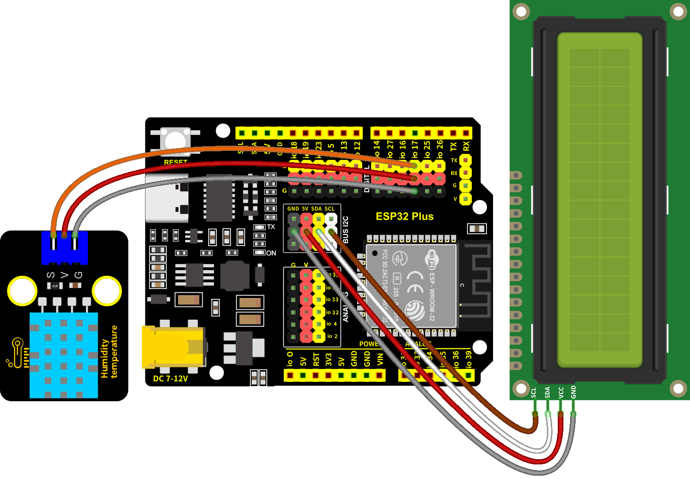

### 第11课 温湿度检测仪

#### 11.1 项目介绍


XHT11温湿度传感器（XHT11完全兼容DHT11）是一款含有已校准数字信号输出的温湿度复合传感器，其精度：湿度±5%RH，温度±2℃；量程：湿度5-95%RH，温度-20~60℃。XHT11温湿度传感器应用专用的数字模块采集技术和温湿度传感技术，确保产品具有极高的可靠性和卓越的长期稳定性。XHT11温湿度传感器包括一个电阻式感湿元件和一个NTC测温元件，非常适用于对精度和实时性要求不高的温湿度测量场合。

XHT11有三个引脚，分别为V，G，和S。S为数据输出的引脚，使用的是串行通讯。

#### 11.2 模块相关资料


|工作电压：|3.3V-5V（DC）|
|-|-|
|最大工作电流：|50mA|
|最大功率：|0.25W|
|控制接口：|数字双向单总线|
|温度范围：|0-50℃（±2℃）|
|湿度范围：|20-90%RH（±5%RH）|
|工作温度：|-25℃~+60℃|

**XHT11温湿度传感器的单总线格式定义：**

|名称|单总线格式定义|
|-|-|
|起始信号|微处理器把数据总线（SDA）拉低一段时间至少 18ms（最大不得超过30ms），通知传感器准备数据。|
|响应信号|传感器把数据总线（SDA）拉低 83µs，再接高 87µs以响应主机的起始信号。|
|湿度|湿度高位为湿度整数部分数据，湿度低位为湿度小数部分数据|
|温度|温度高位为温度整数部分数据，温度低位为温度小数部分数据，且温度低位Bit8 为 1 则表示负温度，否则为正温度。|
|校验位|校验位＝湿度高位+湿度低位+温度高位+温度低位|

**XHT11温湿度传感器数据时序图：**

用户主机（MCU）发送一次开始信号后，XHT11
从低功耗模式转换到高速模式，待主机开始信号结束后，XHT11
发送响应信号，送出 40bit 的数据，并触发一次信采集。信号发送如图所示。


#### 11.3 实验组件

||||
|-|-|-|
|ESP32 Plus主板 *1|XHT11传感器 *1|3P线 *1|
||||
|I2C LCD1602模块 *1|4P线 *1|USB线 *1|

#### 11.4 模块接线图

XHT11温湿度传感器和I2C 1602 LCD模块的控制引脚：

|XHT11温湿度传感器（S引脚）|io17|
|-|-|
|I2C 1602 LCD模块（SDA引脚）|SDA|
|I2C 1602 LCD模块（SCL引脚）|SCL|

⚠️ **特别注意：智能家居已经组装好了，这里不需要把XHT11温湿度传感器和I2C 1602 LCD模块拆下来又重新组装和接线，这里再次提供接线图，是为了方便您编写代码！**



#### 11.5 代码流程图


#### 11.6 实验代码

打开“Thonny”软件，点击“此电脑” → “D:” → “MicroPython资料” → “MicroPython_代码”。然后鼠标左键双击“Project_11_XHT11.py”。


```python
# 作者 : www.keyes-robot.com

# 导入machine, time和dht模块
import machine
import time
import dht
from time import sleep_ms, ticks_ms 
from machine import I2C, Pin 
from i2c_lcd import I2cLcd 

#关联DHT11与引脚(17).
DHT = dht.DHT11(machine.Pin(17))

DEFAULT_I2C_ADDR = 0x27

i2c = I2C(scl=Pin(22), sda=Pin(21), freq=400000) 
lcd = I2cLcd(i2c, DEFAULT_I2C_ADDR, 2, 16)

while True:
    DHT.measure() # 启动DHT11测量一次数据。
   # 调用DHT的内置函数获取温度和湿度数据，并打印在 “Shell”.
    print('temperature:',DHT.temperature(),'℃','humidity:',DHT.humidity(),'%')
    lcd.move_to(1, 0) 
    lcd.putstr('Temp:{}C'.format(DHT.temperature()))
    lcd.move_to(1, 1)
    lcd.putstr('Hum:{}%RH'.format(DHT.humidity()))
    time.sleep_ms(500)
```

#### 11.7 实验结果

按照接线图接好线，将 ESP32 主控板通过Micro USB数据线与计算机相连供电，外接电源供电，然后单击按钮，示例代码开始执行。


示例代码开始执行之后，你会看到的现象是：LCD1602显示屏显示温度值，T = \*\* ℃（代码中用C表示℃，因为代码中直接用℃容易乱码），湿度值H = \*\* %RH，用口对着温湿度传感器呼几下气体，可以看到温湿度值上升。


单击“停止/启动后端进程”退出程序。