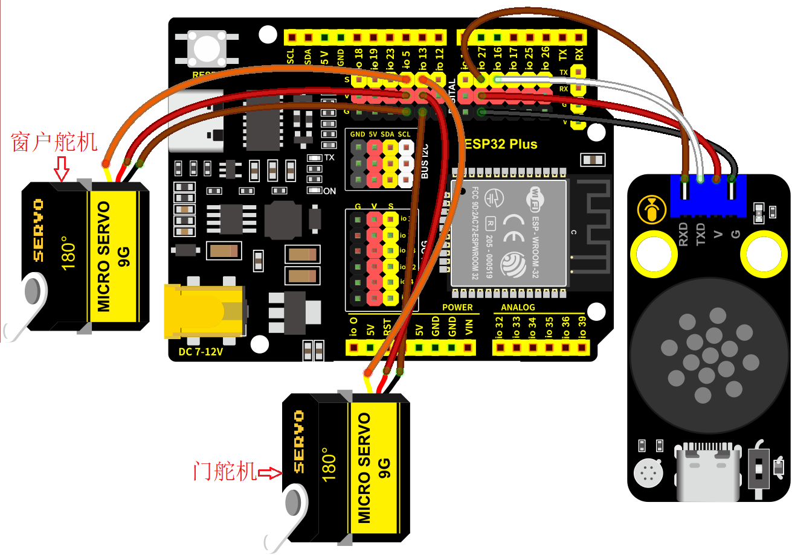
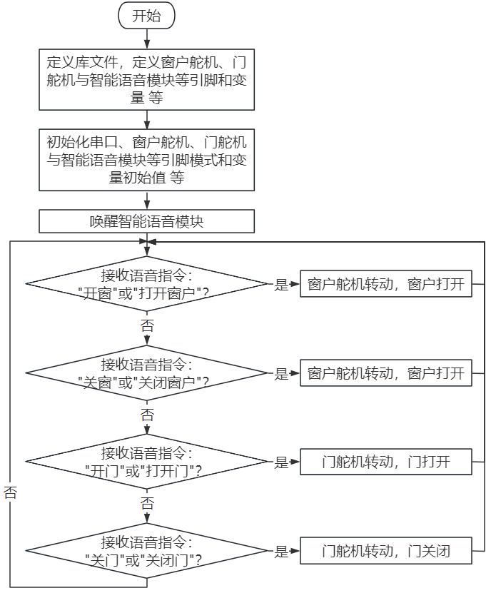

### 第16课 语音控制门窗系统

#### 16.1 项目介绍

语音控制门窗是一种基于智能语音识别技术的现代化家居控制系统，通过语音指令实现对门窗的开启、关闭等操作，为用户提供更便捷、智能的生活体验。

语音控制门窗系统代表了智能家居发展的重要方向，通过将传统的门窗控制与先进的语音识别技术相结合，不仅提升了用户的生活便利性，还为实现真正的智能家居生态奠定了基础。随着人工智能技术的不断进步，语音控制门窗将在安全性、智能化程度和用户体验方面持续优化，成为未来智能建筑的标准配置。

#### 16.2 实验组件

||||
|-|-|-|
|ESP32 Plus主板 *1|180度舵机 *2|智能语音模块 *1|
| ||  |
|4P线 *1|USB线 *1|   |

#### 16.3 模块接线图

智能语音模块，窗户舵机和门舵机的控制引脚：

|窗户舵机（橙黄色线引脚）|io5|
|-|-|
|门舵机（橙黄色线引脚）|io13|
|智能语音模块（TXD引脚）|io16|
|智能语音模块（RXD引脚）|io27|

⚠️ **特别注意：智能家居已经组装好了，这里不需要把智能语音模块和舵机拆下来又重新组装和接线，这里再次提供接线图，是为了方便您编写代码！**



#### 16.4 代码流程图



#### 16.5 实验代码

使用智能语音模块控制智能家居的门、窗开与关。

打开“Thonny”软件，点击“此电脑” → “D:” → “MicroPython资料” → “MicroPython_代码”。并鼠标左键双击“Project_16_voice_control_door_window.py”。

```Python
from machine import Pin, PWM, UART
import time

# 引脚定义
RX_PIN = 27  # 语音模块RX引脚GPIO27
TX_PIN = 16  # 语音模块TX引脚GPIO16
SERVO_PIN_WINDOW = 5   # 窗户舵机引脚GPIO5
SERVO_PIN_DOOR = 13    # 门舵机引脚GPIO13

# 舵机角度参数（MicroPython中PWM占空比范围通常为0-1023）
WINDOW_OPEN_ANGLE = 80 
WINDOW_CLOSE_ANGLE = 0
DOOR_OPEN_ANGLE = 175
DOOR_CLOSE_ANGLE = 0

# 语音指令定义
CMD_OPEN_WINDOW = 57
CMD_CLOSE_WINDOW = 58
CMD_OPEN_DOOR = 59
CMD_CLOSE_DOOR = 60

class ServoController:
    def __init__(self, pin, min_duty=25, max_duty=128, min_angle=0, max_angle=180):
        self.pwm = PWM(Pin(pin))
        self.pwm.freq(50)  # 舵机频率50Hz
        self.min_duty = min_duty
        self.max_duty = max_duty
        self.min_angle = min_angle
        self.max_angle = max_angle
        self.current_angle = 0
        
    def angle_to_duty(self, angle):
        """将角度转换为PWM占空比"""
        angle = max(self.min_angle, min(self.max_angle, angle))
        return int(self.min_duty + (angle - self.min_angle) * 
                  (self.max_duty - self.min_duty) / (self.max_angle - self.min_angle))
    
    def write(self, angle):
        """设置舵机角度"""
        duty = self.angle_to_duty(angle)
        self.pwm.duty(duty)
        self.current_angle = angle
        time.sleep_ms(1000)  # 等待舵机移动
    
    def detach(self):
        """断开舵机（停止供电）"""
        self.pwm.deinit()

class VoiceControlSystem:
    def __init__(self):
        # 初始化串口（语音模块）
        self.voice_uart = UART(2, baudrate=9600, rx=RX_PIN, tx=TX_PIN)
        
        # 初始化舵机
        self.window_servo = ServoController(SERVO_PIN_WINDOW)
        self.door_servo = ServoController(SERVO_PIN_DOOR)
        
        # 状态变量
        self.window_state = False  # False-关闭, True-打开
        self.door_state = False    # False-关闭, True-打开
        
        # 初始化位置
        self.initialize_positions()
        
    def initialize_positions(self):
        """初始化到关闭位置"""
        print("初始化系统位置...")
        self.window_servo.write(WINDOW_CLOSE_ANGLE)
        self.door_servo.write(DOOR_CLOSE_ANGLE)
        time.sleep_ms(1000)
        self.window_state = False
        self.door_state = False
        print("初始化完成")
    
    def process_voice_command(self, command):
        """处理语音指令"""
        print("收到语音指令:", command)
        
        if command == CMD_OPEN_WINDOW:
            self.control_window(True)
        elif command == CMD_CLOSE_WINDOW:
            self.control_window(False)
        elif command == CMD_OPEN_DOOR:
            self.control_door(True)
        elif command == CMD_CLOSE_DOOR:
            self.control_door(False)
        else:
            print("未知指令，请重试")
    
    def control_window(self, open_cmd):
        """控制窗户"""
        if open_cmd and not self.window_state:
            self.window_servo.write(WINDOW_OPEN_ANGLE)
            time.sleep_ms(1000)
            self.window_state = True
            print("窗户已打开")
        elif not open_cmd and self.window_state:
            self.window_servo.write(WINDOW_CLOSE_ANGLE)
            time.sleep_ms(1000)
            self.window_state = False
            print("窗户已关闭")
        else:
            print("窗户已经是目标状态")
    
    def control_door(self, open_cmd):
        """控制门"""
        if open_cmd and not self.door_state:
            self.door_servo.write(DOOR_OPEN_ANGLE)
            time.sleep_ms(1000)
            self.door_state = True
            print("门已打开")
        elif not open_cmd and self.door_state:
            self.door_servo.write(DOOR_CLOSE_ANGLE)
            time.sleep_ms(1000)
            self.door_state = False
            print("门已关闭")
        else:
            print("门已经是目标状态")
    
    def get_system_status(self):
        """获取系统状态"""
        return {
            "window": "打开" if self.window_state else "关闭",
            "door": "打开" if self.door_state else "关闭"
        }
    
    def emergency_stop(self):
        """紧急停止"""
        self.window_servo.detach()
        self.door_servo.detach()
        print("紧急停止！所有舵机已断电")
    
    def run(self):
        """主循环"""
        print("智能语音门窗控制系统已启动")
        print("等待语音指令...")
        print("可用指令：57-开窗户, 58-关窗户, 59-开门, 60-关门")
        
        while True:
            # 检查语音模块数据
            if self.voice_uart.any():
                try:
                    command = self.voice_uart.read(1)
                    if command:
                        self.process_voice_command(command[0])
                except Exception as e:
                    print("读取语音指令错误:", e)
            
            time.sleep_ms(100)

# 扩展功能类
class EnhancedVoiceControlSystem(VoiceControlSystem):
    def __init__(self):
        super().__init__()
        self.manual_control_enabled = True
        
    def manual_control(self, device, action):
        """手动控制接口"""
        if not self.manual_control_enabled:
            print("手动控制已禁用")
            return
            
        if device == "window":
            self.control_window(action == "open")
        elif device == "door":
            self.control_door(action == "open")
        else:
            print("未知设备")
    
    def set_servo_calibration(self, device, min_duty=None, max_duty=None):
        """校准舵机参数"""
        servo = self.window_servo if device == "window" else self.door_servo
        
        if min_duty is not None:
            servo.min_duty = min_duty
        if max_duty is not None:
            servo.max_duty = max_duty
            
        print(f"{device}舵机校准完成: min_duty={servo.min_duty}, max_duty={servo.max_duty}")

# 创建并运行系统
if __name__ == "__main__":
    try:
        system = VoiceControlSystem()
        system.run()
    except KeyboardInterrupt:
        print("系统已停止")
    except Exception as e:
        print("系统错误:", e)

```

#### 16.6 实验结果

按照接线图接好线，将 ESP32 主控板通过Micro USB数据线与计算机相连供电，外接电源供电，然后单击按钮，示例代码开始执行。


示例代码执行之后，可以通过智能语音模块来控制门和窗。

对着智能语音模块上的麦克风，使用唤醒词 “你好，小智” 或 “小智小智” 来唤醒智能语音模块，同时喇叭播放回复语 “有什么可以帮到您”；接下来即可通过Shell打印窗口查看智能语音模块接收到语音命令词所对应的命令参数 等。

智能语音模块唤醒后，对着麦克风说：“开窗” 或 “打开窗户”等命令词时，Shell打印窗口打印命令参数 “57”，同时喇叭播放对应的回复语 “已为您打开窗户”；

对着麦克风说：“关窗” 或 “关闭窗户” 等命令词时，Shell打印窗口打印命令参数 “58”，同时喇叭播放对应的回复语 “已为您关闭窗户”；

对着麦克风说：“开门” 或 “打开门”等命令词时，Shell打印窗口打印命令参数 “59”，同时喇叭播放对应的回复语 “已为您打开门”；

对着麦克风说：“关门” 或 “关闭门” 等命令词时，Shell打印窗口打印命令参数 “60”，同时喇叭播放对应的回复语 “已为您关闭门”。


单击“停止/启动后端进程”退出程序。
