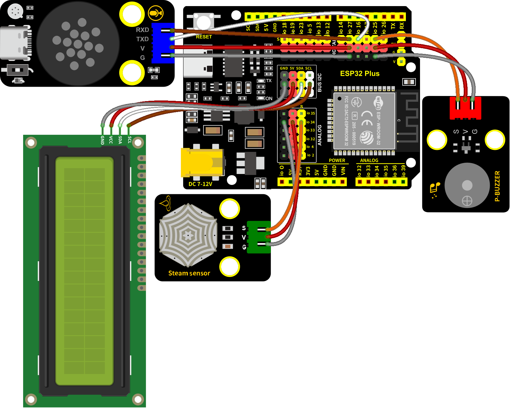

### 第17课 语音雨水检测系统

***注意：水洒在其他传感器上会导致短路，导致设备失效，洒在电池上会导致发热爆炸。请在使用设备时格外小心，尤其是幼儿使用时一定要在家长的监护下进行。为确保设备的安全运行，请遵循相关使用指南和安全规范。***

#### 17.1 项目介绍

本教程介绍了如何使用水滴传感器、蜂鸣器、I2C LCD1602模块、智能语音模块和ESP32来创建一个雨水检测系统。当传感器检测到雨时，ESP32可以触发各种动作，如发送通知、激活洒水器或打开蜂鸣器等。这个系统可用于监测园艺或农业的雨量，或检测屋顶或建筑物的漏水情况。水滴传感器可以很容易地连接到ESP32开发板上，形成一个简单而有效的雨水检测系统。

当水滴传感器检测到雨水时，它会向ESP32开发板发送一个信号，可以触发各种动作。例如，可以用一个蜂鸣器发出警报声，提醒用户正在下雨，在I2C LCD1602模块上显示当前雨水量百分数值，同时对着智能语音模块发出类似于“当前雨水量是多少”等命令词，智能语音模块接收到相应命令词后还能语音播报当前雨水量百分数值。这一功能对户外园艺或农业特别有用，使用户能够采取必要的预防措施，避免过度浇灌植物。

此外，使用水滴传感器和ESP32的雨水检测系统可用于检测屋顶或建筑物的漏水情况，帮助防止水入侵造成的损害。总的来说，水滴传感器是一个多功能的有效工具，可以在各种应用中检测水的存在。

#### 17.2 实验组件

|||||
|-|-|-|-|
|ESP32 Plus主板 *1|智能语音模块 *1|水滴传感器* 1|3P线 *2|
|||||
|I2C LCD1602模块 *1|无源蜂鸣器 *1|4P线 *2|USB线 *1|


#### 17.3 模块接线图

智能语音模块、无源蜂鸣器、I2C LCD1602模块和水滴传感器的控制引脚：

|水滴传感器（S引脚）|io26|
|-|-|
|无源蜂鸣器（S引脚）|io25|
|智能语音模块（TXD引脚）|io16|
|智能语音模块（RXD引脚）|io27|
|I2C 1602 LCD模块（SDA引脚）|SDA|
|I2C 1602 LCD模块（SCL引脚）|SCL|

⚠️ **特别注意：智能家居已经组装好了，这里不需要把水滴传感器、无源蜂鸣器、I2C LCD1602模块和智能语音模块拆下来又重新组装和接线，这里再次提供接线图，是为了方便您编写代码！**



#### 17.4 代码流程图


#### 17.5 实验代码

**注意：代码中的条件阈值可以根据实际情况自行设置。**

打开“Thonny”软件，点击“此电脑” → “D:” → “MicroPython资料” → “MicroPython_代码”。并鼠标左键双击“Project_17_rainwater_detection_system.py”。

```python
# 作者 : www.keyes-robot.com

from machine import Pin, PWM, I2C, UART, ADC
import time
import math

# 引脚定义
RX_PIN = 27
TX_PIN = 16
STEAM_PIN = 34
BUZZER_PIN = 25

# 变量定义
yuyin = 0
analog_value = 0
value = 0

# LCD初始化
i2c = I2C(scl=Pin(22), sda=Pin(21), freq=400000)
lcd = None

try:
    from i2c_lcd import I2cLcd
    lcd = I2cLcd(i2c, 0x27, 2, 16)
    print("LCD初始化成功")
except:
    print("LCD初始化失败")

# SU-03T语音模块串口初始化
uart = UART(2, baudrate=9600, rx=RX_PIN, tx=TX_PIN)

# 水滴传感器初始化（ADC）
steam_sensor = ADC(Pin(STEAM_PIN))
steam_sensor.atten(ADC.ATTN_11DB)  # 设置测量范围为0-3.3V

# 蜂鸣器初始化（PWM）
buzzer = PWM(Pin(BUZZER_PIN))
buzzer.duty(0)  # 初始关闭

# 串口通信协议定义
UART_SEND_MAX = 32
UART_MSG_HEAD_LEN = 2
UART_MSG_FOOT_LEN = 2

# 消息号定义
U_MSG_bozhensgshu = 1
U_MSG_boxiaoshu = 2
U_MSG_bobao1 = 3
U_MSG_bobao2 = 4
U_MSG_bobao3 = 5
U_MSG_bobao4 = 6
U_MSG_bobao5 = 7
U_MSG_bobao6 = 8
U_MSG_bobao7 = 9
U_MSG_bobao8 = 10
U_MSG_bobao9 = 11
U_MSG_bobao10 = 12
U_MSG_bobao11 = 13
U_MSG_bobao12 = 14
U_MSG_bobao13 = 15
U_MSG_bobao14 = 16
U_MSG_bobao15 = 17
U_MSG_bobao16 = 18
U_MSG_bobao17 = 19
U_MSG_bobao18 = 20

# 消息头和尾
g_uart_send_head = bytearray([0xaa, 0x55])
g_uart_send_foot = bytearray([0x55, 0xaa])

def uart_send_impl(buff):
    """串口发送实现"""
    uart.write(buff)

def int16_to_int32(value):
    """16位整数转32位整数"""
    if value & 0x8000:  # 负数
        return value | 0xFFFF0000
    else:  # 正数
        return value

def uart_bobao3():
    """播报函数3"""
    buff = bytearray(UART_SEND_MAX)
    # 消息头
    buff[0:2] = g_uart_send_head
    # 消息号
    buff[2] = U_MSG_bobao3
    # 消息尾
    buff[3:5] = g_uart_send_foot
    uart_send_impl(buff[:5])
    print("发送播报3命令")

def uart_bozhensgshu(zhengshu):
    """播报整数"""
    buff = bytearray(UART_SEND_MAX)
    # 消息头
    buff[0:2] = g_uart_send_head
    # 消息号
    buff[2] = U_MSG_bozhensgshu
    # 整数数据（32位，小端序）
    value = int16_to_int32(zhengshu)
    buff[3] = value & 0xFF
    buff[4] = (value >> 8) & 0xFF
    buff[5] = (value >> 16) & 0xFF
    buff[6] = (value >> 24) & 0xFF
    # 消息尾
    buff[7:9] = g_uart_send_foot
    uart_send_impl(buff[:9])
    print("发送整数:", zhengshu)

def read_steam_sensor():
    """读取水滴传感器值"""
    global analog_value, value
    try:
        # 读取模拟值（ESP32 ADC为12位，0-4095）
        analog_value = steam_sensor.read()
        # 转换为百分比（0-100%）
        value = round((analog_value / 4095.0) * 100)
        return True
    except Exception as e:
        print("传感器读取失败:", e)
        return False

def update_lcd():
    """更新LCD显示"""
    if lcd:
        lcd.clear()
        lcd.move_to(0, 0)
        lcd.putstr("RainWater(%):")
        lcd.move_to(13, 0)
        lcd.putstr(str(value))

def play_buzzer_tone(frequency, duration):
    """播放蜂鸣器音调"""
    if frequency > 0:
        buzzer.freq(frequency)
        buzzer.duty(512)  # 50%占空比
        time.sleep_ms(duration)
        buzzer.duty(0)    # 关闭
    else:
        buzzer.duty(0)

def handle_buzzer_alarm():
    """根据雨水量处理蜂鸣器警报"""
    if value >= 10 and value < 40:
        # 小雨警报 - 频率200Hz
        for i in range(3):
            play_buzzer_tone(200, 100)
            time.sleep_ms(100)
        print("小雨警报 - 频率200Hz")
        
    elif value >= 40 and value <= 90:
        # 中雨警报 - 频率400Hz
        for i in range(3):
            play_buzzer_tone(400, 100)
            time.sleep_ms(100)
        print("中雨警报 - 频率400Hz")
        
    elif value > 90:
        # 大雨警报 - 频率600Hz
        for i in range(3):
            play_buzzer_tone(600, 100)
            time.sleep_ms(100)
        print("大雨警报 - 频率600Hz")

def handle_voice_command():
    """处理语音命令"""
    global yuyin
    if uart.any():
        data = uart.read(1)
        if data:
            yuyin = data[0]  # 获取字节值
            print("收到语音命令:", yuyin)
            
            if yuyin == 49:  # 命令49：检测并播报雨水量
                if read_steam_sensor():
                    print("当前雨水量:", value, "%")
                    # 播报流程
                    time.sleep(3)
                    uart_bobao3()
                    time.sleep(3)
                    uart_bozhensgshu(value)
                    time.sleep(2)
                yuyin = 0
                return True
    return False

# 主循环
last_update_time = 0
update_interval = 500  # 0.5秒更新一次

print("系统启动完成，开始监测雨水量...")

while True:
    current_time = time.ticks_ms()
    
    # 处理语音命令
    handle_voice_command() 
    
    # 定期更新传感器数据和显示
    if time.ticks_diff(current_time, last_update_time) >= update_interval:
        if read_steam_sensor():
            # 打印到串口
            print("雨水量: {}% (原始值: {})".format(value, analog_value))
            
            # 更新LCD显示
            update_lcd()
            
            # 处理蜂鸣器警报
            handle_buzzer_alarm()
        
        last_update_time = current_time
    
    time.sleep_ms(300)  # 短暂延迟
```

#### 17.6 实验结果

按照接线图接好线，将 ESP32 主控板通过Micro USB数据线与计算机相连供电，外接电源供电，然后单击按钮，示例代码开始执行。


示例代码开始执行之后，I2C LCD1602模块显示屏显示当前雨水量的百分数相关信息 (用湿润的手触碰一下雨滴传感器上的检测区)，当水滴传感器检测到的雨水量的百分数越大，蜂鸣器报警声音越大。

对着智能语音模块上的麦克风，使用唤醒词 “你好，小智” 或 “小智小智” 来唤醒智能语音模块，同时喇叭播放回复语 “有什么可以帮到您”；

智能语音模块唤醒后，对着麦克风说：“当前雨水量是多少” 或 “当前雨量多少” 等命令词时，接着语音播报 “正在为您读取当前雨水量” + “当前雨水量为百分之” + “水滴传感器模拟值通过计算转化成的雨水量百分数值”。


单击“停止/启动后端进程”退出程序。
