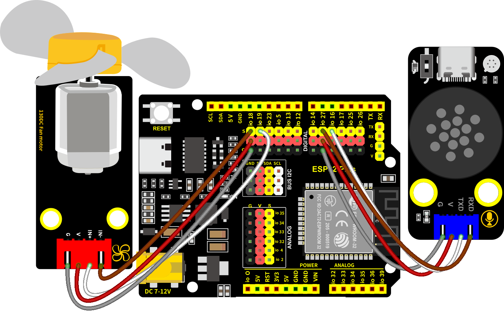

### 第18课 语音控制风扇系统

#### 18.1 项目介绍

夏天来了，风扇成了家里或商场里的“小救星”。但每次手动调节风速，是不是觉得有点麻烦？想象一下，只需动动嘴，风扇就乖乖听话，那该多方便！语音控制风扇，真的是懒人福音！无需动手，只需口头指令，就能轻松实现开关、调节风速等功能。

想象一下，回家一进门，喊一声类似于“打开风扇”等命令词，立刻就能感受到凉风拂面；感觉风速小，喊一声类似于“风大一点”等命令词，又能感受到凉风变大；感觉风速大了需要风速小点，喊一声类似于“风小一点”等命令词，立马能感受到凉风变小；需要外出出门时，喊一声类似于“关闭风扇”等命令词，风扇立刻就能停止。

这种便捷性，对于行动不便者或商场业主来说，更是大大提升了生活质量。


语音控制风扇系统是通过组合智能语音模块和电机模块，实现对家里的温度进行语音智能调节。

#### 18.2 实验组件

||||
|-|-|-|
|ESP32 Plus主板 *1|智能语音模块 *1|130电机模块 *1|
||||
|风扇叶 *1|4P线 *2|USB线 *1|

#### 18.3 接线图

智能语音模块和130电机模块的控制引脚：

|130电机模块（IN+引脚）|io19|
|-|-|
|130电机模块（IN-引脚）|io18|
|智能语音模块（TXD引脚）|io16|
|智能语音模块（RXD引脚）|io27|


⚠️ **特别注意：智能农场已经组装好了，这里不需要把电机模块和智能语音模块拆下来又重新组装和接线，这里再次提供接线图，是为了方便您编写代码！**



#### 18.4 代码流程图


#### 18.5 实验代码

打开“Thonny”软件，点击“此电脑” → “D:” → “MicroPython资料” → “MicroPython_代码”。并鼠标左键双击“Project_18_voice_control_fan_system.py”。

```Python
# 作者 : www.keyes-robot.com

from machine import UART, Pin, PWM
import time

# 定义引脚常量
RX_PIN = 27      # 引脚 GPT027 为 RX
TX_PIN = 16      # 引脚 GPT016 为 TX

#电机的两个引脚
INA =PWM(Pin(19,Pin.OUT),10000,0) #INA对应于IN+
INB =PWM(Pin(18,Pin.OUT),10000,2) #INB对应于IN-

# 使用UART2作为替代（如果硬件连接允许）
uart = UART(2, baudrate=9600, rx=RX_PIN, tx=TX_PIN)

def setup():
    print("系统启动...")
    INA.duty(0) # 初始关闭风扇
    INB.duty(0) 
    
def loop():
    if uart.any():  # 检查是否有数据可读
        command = uart.read(1)  # 读取一个字节
        if command:
            command = command[0]  # 获取字节值
            
            if command == 5:
                INA.duty(700) #占空比范围为0-1023
                INB.duty(0)
                print("打开风扇")
            elif command == 7:
                INA.duty(1000) 
                INB.duty(0)
                print("转速加快")
            elif command == 8:
                INA.duty(700) 
                INB.duty(0)
                print("转速减慢")
            elif command == 6:
                INA.duty(0) 
                INB.duty(0)
                print("关闭风扇")
            else:
                print(f"未知命令: {command}")
                return
            
            # 回传接收到的命令（可选）
            uart.write(str(command).encode())
            print(f"执行命令: {command}")

# 主程序
if __name__ == "__main__":
    setup()
    while True:
        loop()
        time.sleep(0.1)  # 短暂延迟以减少CPU占用
```

#### 18.6 实验结果

按照接线图接好线，将 ESP32 主控板通过Micro USB数据线与计算机相连供电，外接电源供电，然后单击按钮，示例代码开始执行。


示例代码开始执行之后，语音控制风扇。

对着智能语音模块上的麦克风，使用唤醒词 “你好，小智” 或 “小智小智” 来唤醒智能语音模块，同时喇叭播放回复语 “有什么可以帮到您”；

智能语音模块唤醒后，对着麦克风说：“打开风扇” 或 “请开风扇” 或 “开风扇” 等命令词时，喇叭播放对应的回复语 “已为您打开风扇”，同时风扇转动；

对着麦克风说：“风大一点” 或 “大一点” 等命令词时，喇叭播放对应的回复语 “风速已增加”，同时风扇转速加快；

对着麦克风说 “风小一点” 或 “小一点” 等命令词时，喇叭播放对应的回复语 “风速已减弱”，同时风扇转速减慢；

对着麦克风说：“关闭风扇” 或 “请关风扇” 或 “关风扇” 或 “关上风扇” 等命令词时，喇叭播放对应的回复语 “已为您关闭风扇”，同时风扇不转。


单击“停止/启动后端进程”退出程序。

