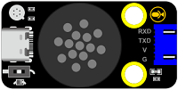
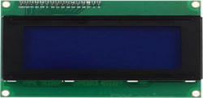
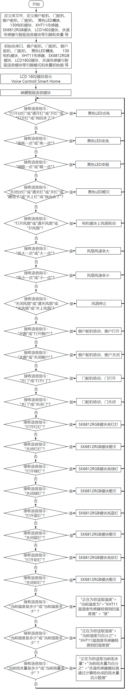
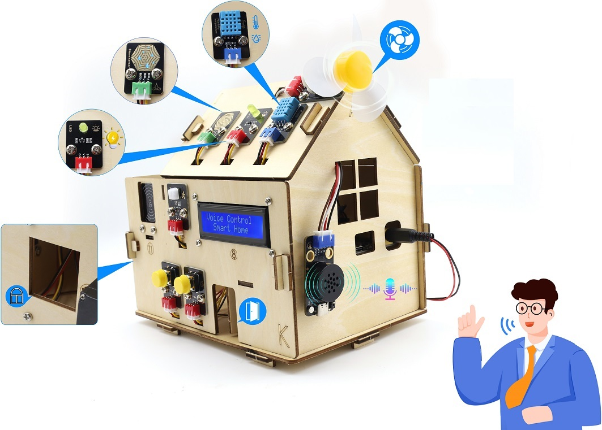

### 课程20 语音控制智能家居系统

#### 20.1 项目介绍

经过前面一系列的语音控制项目的学习，我们是不是可以通过智能语音模块控制智能家居更多传感器模块呢？当然是可以的。在本项目实验中，通过ESP32主控板控制更多传感器模块，然后通过智能语音模块进行实时语音播报智能家居的温湿度、雨水量等。同时，它还能控制LED灯进行照明，控制SK6812，控制门开与关，控制窗户开与关，控制电机模块和音乐播放等。


#### 20.2 实验组件

|||||
|-|-|-|-|
|ESP32 Plus主板 *1|XHT11传感器 *1|黄色LED模块 *1|SK6812RGB灯模块 *1|
|||||
|3P线 *4|130电机模块 *1|180度舵机 *2|水滴传感器 *1|
|||||
|智能语音模块 *1|4P线 *3|风扇叶 *1|I2C LCD1602模块 *1|
| | | |  |
|USB线 *1 | | |  |

#### 20.3 模块接线图

⚠️ **特别注意：智能家居已经组装好了，这里不需要把所有的传感器和模块都拆下来又重新组装和接线。由于传感器和模块较多，接线图中的接线复杂会导致传感器和模块的引脚接线看不清，所以使用表格来表示传感器和模块的引脚连接到ESP32主控板上的对应引脚，也是为了方便您编写代码！**

|传感器模块名称|传感器模块引脚|ESP32 Plus主板对应的接线|
|-|-|-|
|黄色LED模块|G/V/S|G/V/io12|
|130电机模块|GND/VCC/IN+/IN-|G/V/io19/io18|
|控制窗户的舵机1|棕色线/红色线/橙色线|G/V/io5|
|控制门的舵机2|棕色线/红色线/橙色线|G/V/io13|
|XHT11模块|G/V/S|G/V/io17|
|SK6812RGB灯模块|G/V/S|G/V/io26|
|智能语音模块|G/V/TXD/RXD|G/V/io16/io27|
|LCD1602显示屏模块|GND/VCC/SDA/SCL|GND/V/SDA/SCL|
|水滴传感器模块|G/V/S|G/V/io34|


#### 20.4 代码流程图



#### 20.5 实验代码

⚠️ **注意：代码中的条件阈值可以根据实际情况自行设置。**

```Python
# 作者 : www.keyes-robot.com

from machine import Pin, PWM, ADC, I2C, UART
import time
import math

# 定义引脚常量
LED_PIN = 12
STEAM_PIN = 34
MOTOR_PIN1 = 19
MOTOR_PIN2 = 18
DHT11_PIN = 17
RX_PIN = 27
TX_PIN = 16
SERVO_PIN1 = 5
SERVO_PIN2 = 13
SK6812RGB_PIN = 26
RGB_COUNT = 4

# 初始化硬件
led = PWM(Pin(LED_PIN))  # 使用PWM控制LED亮度
#led.freq(1000)

steam_sensor = ADC(Pin(STEAM_PIN))
steam_sensor.atten(ADC.ATTN_11DB)

motor1 = PWM(Pin(MOTOR_PIN1))
motor2 = PWM(Pin(MOTOR_PIN2))
motor1.freq(1000)
motor2.freq(1000)

# DHT11传感器 - 简化实现，实际需要安装dht库
dht_pin = Pin(DHT11_PIN, Pin.IN)

# 舵机初始化
servo1 = PWM(Pin(SERVO_PIN1))
servo2 = PWM(Pin(SERVO_PIN2))
servo1.freq(50)
servo2.freq(50)

# NeoPixel初始化
from neopixel import NeoPixel
strip = NeoPixel(Pin(SK6812RGB_PIN), RGB_COUNT)

# UART初始化
uart = UART(2, baudrate=9600, rx=RX_PIN, tx=TX_PIN)

# LCD初始化 - 简化实现
try:
    from lcd_api import LcdApi
    from i2c_lcd import I2cLcd
    I2C_ADDR = 0x27
    i2c = I2C(0, sda=Pin(21), scl=Pin(22))
    lcd = I2cLcd(i2c, I2C_ADDR, 2, 16)
    lcd_available = True
except:
    print("LCD初始化失败")
    lcd_available = False

# 状态变量
window_state = False
door_state = False 

# LED亮度等级 (PWM占空比)
LED_OFF = 0
LED_DIM = 128      # 约50/255
LED_MEDIUM = 384   # 约150/255  
LED_BRIGHT = 1023  # 最大PWM值

# 舵机角度参数
WINDOW_OPEN_ANGLE = 80
WINDOW_CLOSE_ANGLE = 0
DOOR_OPEN_ANGLE = 170
DOOR_CLOSE_ANGLE = 0

# 全局变量
cmd = 0
analog_value = 0
value1 = 0
temperature = 25  # 默认值
humidity = 50     # 默认值

# 舵机角度到PWM占空比的转换函数
def angle_to_duty(angle):
    # 对于50Hz舵机，0.5ms-2.5ms脉冲对应0-180度
    # ESP32 PWM分辨率0-1023对应0-20ms周期
    min_duty = 25   # 0.5ms / 20ms * 1023 ≈ 25
    max_duty = 128  # 2.5ms / 20ms * 1023 ≈ 128
    return int(min_duty + (angle / 180) * (max_duty - min_duty))

# 窗户控制函数
def open_window():
    global window_state
    if not window_state:
        servo1.duty(angle_to_duty(WINDOW_OPEN_ANGLE))
        window_state = True
        time.sleep(1)
        print("窗户已打开")
    else:
        print("窗户已经是打开状态")

def close_window():
    global window_state
    if window_state:
        servo1.duty(angle_to_duty(WINDOW_CLOSE_ANGLE))
        window_state = False
        time.sleep(1)
        print("窗户已关闭")
    else:
        print("窗户已经是关闭状态")

# 门控制函数
def open_door():
    global door_state
    if not door_state:
        servo2.duty(angle_to_duty(DOOR_OPEN_ANGLE))
        door_state = True
        time.sleep(1)
        print("门已打开")
    else:
        print("门已经是打开状态")

def close_door():
    global door_state
    if door_state:
        servo2.duty(angle_to_duty(DOOR_CLOSE_ANGLE))
        door_state = False
        time.sleep(1)
        print("门已关闭")
    else:
        print("门已经是关闭状态")

# NeoPixel控制函数
def color_wipe(color, wait):
    for i in range(len(strip)):
        strip[i] = color
        strip.write()
        time.sleep_ms(wait)

def theater_chase_rainbow(wait):
    for a in range(10):  # 减少循环次数以加快响应
        for b in range(3):
            # 清除所有像素
            for i in range(len(strip)):
                strip[i] = (0, 0, 0)
            
            # 设置每第3个像素的颜色
            for c in range(b, len(strip), 3):
                hue = (a * 65536 // 30 + c * 65536 // len(strip)) % 65536
                rgb = hsv_to_rgb(hue)
                strip[c] = rgb
            
            strip.write()
            time.sleep_ms(wait)

def hsv_to_rgb(hue):
    """将HSV颜色转换为RGB"""
    hue = hue % 65536
    h = hue / 65536.0
    
    if h < 1/3:  # 红色到绿色
        r = int(255 * (1 - h * 3))
        g = int(255 * (h * 3))
        b = 0
    elif h < 2/3:  # 绿色到蓝色
        r = 0
        g = int(255 * (2 - h * 3))
        b = int(255 * (h * 3 - 1))
    else:  # 蓝色到红色
        r = int(255 * (h * 3 - 2))
        g = 0
        b = int(255 * (3 - h * 3))
    
    return (r, g, b)

# 简化的DHT11读取函数
def read_dht11():
    global temperature, humidity
    try:
        # 这里应该是实际的DHT11读取代码
        # 由于没有dht库，我们使用模拟数据
        temperature = 20 + (time.time() % 10)  # 模拟温度变化
        humidity = 40 + (time.time() % 20)     # 模拟湿度变化
        return True
    except:
        return False

# 语音播报函数
def uart_bobao1():
    uart.write(b'\xaa\x55\x03\x55\xaa')  # U_MSG_bobao1 = 3

def uart_bobao2():
    uart.write(b'\xaa\x55\x04\x55\xaa')  # U_MSG_bobao2 = 4

def uart_bobao3():
    uart.write(b'\xaa\x55\x05\x55\xaa')  # U_MSG_bobao3 = 5

def uart_bobao4():
    uart.write(b'\xaa\x55\x06\x55\xaa')  # U_MSG_bobao4 = 6

def uart_bozhensgshu(value):
    """播报整数值"""
    data = bytearray(b'\xaa\x55\x01')  # U_MSG_bozhensgshu = 1
    # 添加4字节整数值 (小端序)
    data.extend(value.to_bytes(4, 'little'))
    data.extend(b'\x55\xaa')
    uart.write(data)

# LCD显示函数
def update_lcd():
    if lcd_available:
        lcd.clear()
        lcd.move_to(2, 0)
        lcd.putstr("Voice Control")
        lcd.move_to(3, 1)
        lcd.putstr("Smart Home")

# 处理语音命令
def handle_voice_command(cmd):   
    # LED控制
    if cmd == 1:
        led.duty(LED_MEDIUM)
    elif cmd == 2:
        led.duty(LED_OFF)
    elif cmd == 3:
        led.duty(LED_BRIGHT)
    elif cmd == 4:
        led.duty(LED_DIM)
    
    # 风扇控制
    elif cmd == 5:
        motor1.duty(400)  # 约40%功率
        motor2.duty(0)
    elif cmd == 6:
        motor1.duty(0)
        motor2.duty(0)
    elif cmd == 7:
        motor1.duty(800)  # 约80%功率
        motor2.duty(0)
    elif cmd == 8:
        motor1.duty(400)
        motor2.duty(0)
    
    # RGB灯控制
    elif cmd == 13:
        color_wipe((255, 0, 0), 50)  # 红色
    elif cmd == 14:
        color_wipe((0, 0, 0), 50)    # 关闭
    elif cmd == 15:
        color_wipe((0, 255, 0), 50)  # 绿色
    elif cmd == 16:
        color_wipe((0, 0, 0), 50)
    elif cmd == 17:
        color_wipe((0, 0, 255), 50)  # 蓝色
    elif cmd == 18:
        color_wipe((0, 0, 0), 50)
    elif cmd == 36:
        theater_chase_rainbow(50)  # 彩色
    elif cmd == 37:
        color_wipe((0, 0, 0), 50)
    
    # 门窗控制
    elif cmd == 57:
        open_window()
    elif cmd == 58:
        close_window()
    elif cmd == 59:
        open_door()
    elif cmd == 60:
        close_door()
    
    # 语音播报
    elif cmd == 47:
        cmd = 0
        time.sleep(2)
        uart_bobao1()
        time.sleep(2)
        uart_bozhensgshu(temperature)
        time.sleep(2)
        uart_bobao2()
        time.sleep(2)
    
    elif cmd == 48:
        cmd = 0
        time.sleep(2)
        uart_bobao4()
        time.sleep(2)
        uart_bozhensgshu(humidity)
        time.sleep(2)
    
    elif cmd == 49:
        cmd = 0
        time.sleep(3)
        uart_bobao3()
        time.sleep(3)
        uart_bozhensgshu(value1)
        time.sleep(2)

# 主循环
def main_loop():
    global cmd, analog_value, value1
    
    # 初始化
    close_window()
    close_door()
    color_wipe((0, 0, 0), 50)
    update_lcd()
    
    while True:
        # 读取传感器数据
        read_dht11()
        analog_value = steam_sensor.read()
        value1 = round((analog_value / 4095.0) * 100)
        
        # 处理UART命令
        if uart.any():
            data = uart.read(1)
            if data:
                cmd = data[0] 
                print("执行命令:", cmd)
                handle_voice_command(cmd)

# 启动主循环
if __name__ == "__main__":
    try:
        main_loop()
    except KeyboardInterrupt:
        # 清理资源
        led.duty(0)
        motor1.duty(0)
        motor2.duty(0)
        color_wipe((0, 0, 0), 50)
        print("程序已停止")
```
#### 20.6 实验结果

按照接线图接好线，将 ESP32 主控板通过Micro USB数据线与计算机相连供电，外接电源供电，然后单击按钮，示例代码开始执行。


示例代码开始执行之后，LCD1602模块显示屏显示“Voice Controll Smart Home”。



对着智能语音模块上的麦克风，使用唤醒词 “你好，小智” 或 “小智小智” 来唤醒智能语音模块，同时喇叭播放回复语 “有什么可以帮到您”；

智能语音模块唤醒后，对着麦克风说：“打开台灯” 或 “请开灯” 或 “开灯” 或 “打开灯” 或 “我回来了” 等命令词时，喇叭播放对应的回复语 “已为您打开照明”，同时LED点亮；

对着麦克风说：“调亮一点” 或 “亮一点” 等命令词时，喇叭播放对应的回复语 “灯光已调亮”，同时LED变亮；

对着麦克风说：“调暗一点” 或 “暗一点” 等命令词时，喇叭播放对应的回复语 “灯光已调暗”，同时LED变暗；

对着麦克风说：“关闭台灯” 或 “请关灯” 或 “关灯” 或 “睡觉了” 或 “关上灯” 或 “我出去了”等命令词时，喇叭播放对应的回复语 “已为您关闭照明”，同时LED熄灭；

对着麦克风说：“打开风扇” 或 “请开风扇” 或 “开风扇” 等命令词时，喇叭播放对应的回复语 “已为您打开风扇”，同时风扇转动；

对着麦克风说：“风大一点” 或 “大一点” 等命令词时，喇叭播放对应的回复语 “风速已增加”，同时风扇转速加快；

对着麦克风说 “风小一点” 或 “小一点” 等命令词时，喇叭播放对应的回复语 “风速已减弱”，同时风扇转速减慢；

对着麦克风说：“关闭风扇” 或 “请关风扇” 或 “关风扇” 或 “关上风扇” 等命令词时，喇叭播放对应的回复语 “已为您关闭风扇”，同时风扇不转；

对着麦克风说：“打开红灯” 等命令词时，喇叭播放对应的回复语 “已为您打开红灯”，同时SK6812灯亮红色灯；

对着麦克风说：“关闭红灯” 等命令词时，喇叭播放对应的回复语 “已为您关闭红灯”，同时SK6812灯熄灭；

对着麦克风说：“打开蓝灯” 等命令词时，喇叭播放对应的回复语 “已为您打开蓝灯”，同时SK6812灯亮蓝色灯；

对着麦克风说：“关闭蓝灯” 等命令词时，喇叭播放对应的回复语 “已为您关闭蓝灯”，同时SK6812灯熄灭；

对着麦克风说：“打开绿灯” 等命令词时，喇叭播放对应的回复语 “已为您打开绿灯”，同时SK6812灯亮绿色灯；

对着麦克风说：“关闭绿灯” 等命令词时，喇叭播放对应的回复语 “已为您关闭绿灯”，同时SK6812灯熄灭；

对着麦克风说：“打开彩灯” 等命令词时，喇叭播放对应的回复语 “已为您打开彩灯”，同时SK6812灯亮彩色灯；

对着麦克风说：“关闭彩灯” 等命令词时，喇叭播放对应的回复语 “已为您关闭彩灯”，同时SK6812灯熄灭；

对着麦克风说：“开窗” 或 “打开窗户”等命令词时，串口打印命令参数 “57”，同时喇叭播放对应的回复语 “已为您打开窗户”；

对着麦克风说：“关窗” 或 “关闭窗户” 等命令词时，串口打印命令参数 “58”，同时喇叭播放对应的回复语 “已为您关闭窗户”；

对着麦克风说：“开门” 或 “打开门”等命令词时，串口打印命令参数 “59”，同时喇叭播放对应的回复语 “已为您打开门”；

对着麦克风说：“关门” 或 “关闭门” 等命令词时，串口打印命令参数 “60”，同时喇叭播放对应的回复语 “已为您关闭门”；

对着麦克风说：“当前雨水量是多少” 或 “当前雨量多少” 等命令词时，接着语音播报 “正在为您读取当前雨水量” + “当前雨水量为百分之” + “水滴传感器模拟值通过计算转化成的雨水量百分数值”；

对着麦克风说：“当前温度是多少” 或 “当前温度多少” 等命令词时，接着语音播报 “正在为您读取温度” + “当前温度为” + “XHT11温湿度传感器检测到的温度值” + “度”；

对着麦克风说：“当前湿度是多少” 或 “当前湿度多少” 等命令词时，接着语音播报 “正在为您读取湿度” + “当前湿度为百分之” + “XHT11温湿度传感器检测到的湿度值”

