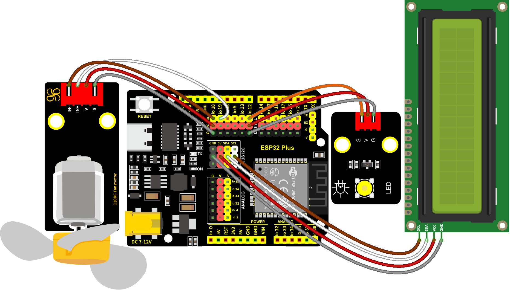
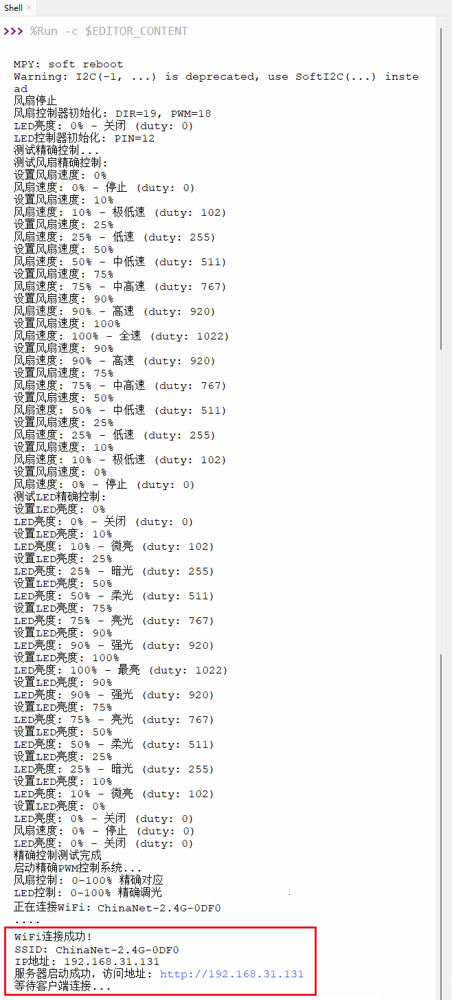
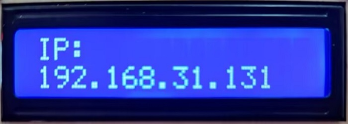
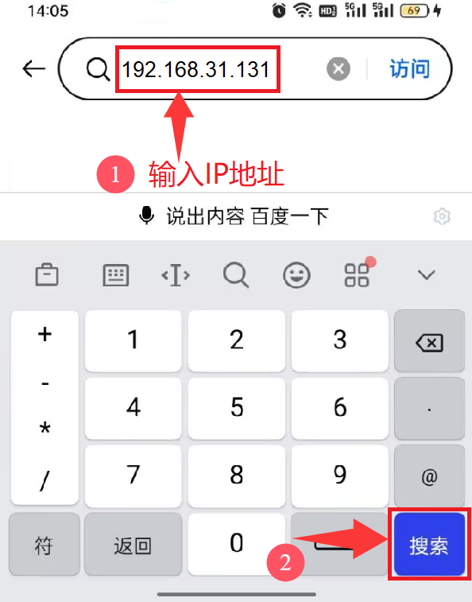
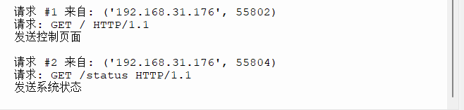
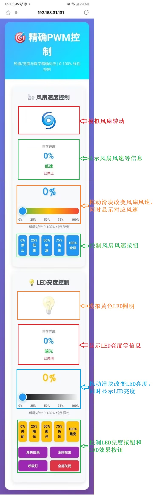

### 第21课 WiFi+网页控制LED和风扇

#### 21.1 项目介绍

物联网，就是将硬件设备接入网络。接入网络最便捷的方法就是使用WiFi连接了。ESP32 Plus主控板自带有WiFi模块，所以将我们的智能家居接入网络还是比较简单的。

我们将智能家居连接到局域网，也就是你家里的WiFi或者你手机开启的热点。连接成功后就会分配一个地址，这个地址就可以用来通讯了，我们将分配到的地址在Shell窗口中打印出来。

本项目内容包括ESP32的WiFi配置、网页设置以及如何编写代码等实现WiFi网页远程监控和控制LED和风扇。

#### 21.2 相关资料

Station模式：当ESP32选择Station模式时，它作为一个WiFi客户端。它可以连接路由器网络，通过WiFi连接与路由器上的其他设备通信。如下图所示，PC和路由器已经连接，ESP32如果要与PC通信，需要将PC和路由器连接起来。


#### 21.3 实验组件

|||||
|-|-|-|-|
|ESP32 Plus主板 *1|130电机模块 *1|黄色LED模块 *1|3P线 *1|
|||||
|I2C LCD1602模块 *1|风扇叶 *1|4P线 *2|USB线 *1|

#### 21.4 模块接线图

黄色LED灯，I2C 1602 LCD模块和130电机模块的控制引脚：

|黄色LED灯（S引脚）|io12|
|-|-|
|130电机模块（IN+引脚）|io19|
|130电机模块（IN-引脚）|io18|
|I2C 1602 LCD模块（SDA引脚）|SDA|
|I2C 1602 LCD模块（SCL引脚）|SCL|

⚠️ **特别注意：智能家居已经组装好了，这里不需要把黄色LED灯，I2C 1602 LCD模块和130电机模块拆下来又重新组装和接线，这里再次提供接线图，是为了方便您编写代码！**



#### 21.5 WIFI网页控制LED和风扇的实验代码

打开“Thonny”软件，点击“此电脑” → “D:” → “Python资料” → “Python_代码”。并鼠标左键双击 “Project_21_wifi_control_led_fan.py”。

⚠️ <span style="color: rgb(255, 76, 65);">**特别提醒：**</span> 打开代码文件后，需要修改ESP32开发板需要连接的WiFi名称与密码，您需要分别将 `ChinaNet-2.4G-0DF0` 和 `ChinaNet@233` 替换为您自己的 Wi-Fi 名称和 WiFi 密码。WiFi名称和WiFi密码修改后才能上传下面的示例代码，否则你的ESP32开发板将无法连接网络。

```python
SSID = "ChinaNet-2.4G-0DF0"  # 替换为你的Wi-Fi名称
PASSWORD = "ChinaNet@233"  # 替换为你的Wi-Fi密码
```
⚠️ **注意：** 请确保代码中的WiFi名称和WiFi密码与连接到您的电脑、手机/平板、ESP32开发板和路由器的网络相同，它们必须在同一局域网（WiFi）内。

⚠️ **注意：** WiFi必须是2.4Ghz频率的，否则ESP32无法连接WiFi。

```python
# 作者 : www.keyes-robot.com

from machine import Pin, ADC, PWM, I2C
from time import sleep_ms, ticks_ms  
from i2c_lcd import I2cLcd 
import network
import socket
import time
import math

# WiFi配置, 目的是连接Wi-Fi
SSID = "ChinaNet-2.4G-0DF0"  # 替换为你的Wi-Fi名称
PASSWORD = "ChinaNet@233"  # 替换为你的Wi-Fi密码

# 引脚定义
FAN_PIN1 = 19  # 风扇方向控制引脚
FAN_PIN2 = 18  # 风扇PWM调速引脚
LED_PIN = 12   # LED PWM调光引脚

# 初始化LCD
DEFAULT_I2C_ADDR = 0x27
i2c = I2C(scl=Pin(22), sda=Pin(21), freq=400000) 
lcd = I2cLcd(i2c, DEFAULT_I2C_ADDR, 2, 16)

# 风扇控制子函数
class FanController:
    def __init__(self, dir_pin, pwm_pin):
        self.dir_pin = Pin(dir_pin, Pin.OUT)
        self.pwm = PWM(Pin(pwm_pin))
        self.pwm.freq(1000)  # 1kHz PWM频率
        self.current_speed = 0
        self.is_running = False
        self.stop()
        print(f"风扇控制器初始化: DIR={dir_pin}, PWM={pwm_pin}")
    
    def set_speed(self, speed_percent):
        """设置风扇速度 0-100% - 精确对应"""
        speed_percent = max(0, min(100, speed_percent))
        
        # 精确计算PWM占空比
        duty = int(speed_percent * 10.23)  # 0-100% 对应 0-1023
        
        if speed_percent == 0:
            self.dir_pin.value(0)
            self.pwm.duty(0)
            self.is_running = False
        else:
            self.dir_pin.value(0)  # 设置方向
            self.pwm.duty(duty)
            self.is_running = True
        
        self.current_speed = speed_percent
        
        # 精确的速度描述
        speed_desc = self.get_speed_description(speed_percent)
        print(f"风扇速度: {speed_percent}% - {speed_desc} (duty: {duty})")
        
        return speed_percent
    
    def get_speed_description(self, speed):
        """获取精确的速度描述"""
        if speed == 0: return "停止"
        elif speed <= 10: return "极低速"
        elif speed <= 25: return "低速"
        elif speed <= 50: return "中低速" 
        elif speed <= 75: return "中高速"
        elif speed <= 90: return "高速"
        else: return "全速"
    
    def stop(self):
        """停止风扇"""
        self.dir_pin.value(0)
        self.pwm.duty(0)
        self.current_speed = 0
        self.is_running = False
        print("风扇停止")
    
    def get_status(self):
        return {
            "running": self.is_running,
            "speed": self.current_speed,
            "speed_desc": self.get_speed_description(self.current_speed),
            "duty": self.pwm.duty()
        }
    
    def deinit(self):
        self.stop()
        self.pwm.deinit()

# 黄色LED控制子函数
class LEDController:
    def __init__(self, pin):
        self.pwm = PWM(Pin(pin))
        self.pwm.freq(1000)  # 1kHz PWM频率
        self.current_brightness = 0
        self.is_on = False
        self.set_brightness(0)
        print(f"LED控制器初始化: PIN={pin}")
    
    def set_brightness(self, brightness_percent):
        """设置LED亮度 0-100% - 精确对应"""
        brightness_percent = max(0, min(100, brightness_percent))
        
        # 精确计算PWM占空比
        duty = int(brightness_percent * 10.23)  # 0-100% 对应 0-1023
        self.pwm.duty(duty)
        self.current_brightness = brightness_percent
        self.is_on = brightness_percent > 0
        
        # 精确的亮度描述
        brightness_desc = self.get_brightness_description(brightness_percent)
        print(f"LED亮度: {brightness_percent}% - {brightness_desc} (duty: {duty})")
        
        return brightness_percent
    
    def get_brightness_description(self, brightness):
        """获取精确的亮度描述"""
        if brightness == 0: return "关闭"
        elif brightness <= 10: return "微亮"
        elif brightness <= 25: return "暗光"
        elif brightness <= 50: return "柔光"
        elif brightness <= 75: return "亮光"
        elif brightness <= 90: return "强光"
        else: return "最亮"
    
    def fade_in(self, duration_ms=2000):
        """LED渐亮效果 - 精确的百分比变化"""
        print("LED渐亮...")
        steps = 100  # 更多步数实现更平滑的变化
        delay = duration_ms // steps
        
        for i in range(steps + 1):
            brightness = int((i / steps) * 100)
            self.set_brightness(brightness)
            time.sleep_ms(delay)
    
    def fade_out(self, duration_ms=2000):
        """LED渐暗效果 - 精确的百分比变化"""
        print("LED渐暗...")
        steps = 100  # 更多步数实现更平滑的变化
        delay = duration_ms // steps
        
        for i in range(steps, -1, -1):
            brightness = int((i / steps) * 100)
            self.set_brightness(brightness)
            time.sleep_ms(delay)
    
    def breath_effect(self, cycles=3, duration_ms=3000):
        """呼吸灯效果 - 精确的百分比变化"""
        print(f"LED呼吸效果 {cycles} 次循环...")
        for cycle in range(cycles):
            print(f"呼吸循环 {cycle + 1}/{cycles}")
            self.fade_in(duration_ms // 2)
            self.fade_out(duration_ms // 2)
    
    def get_status(self):
        return {
            "on": self.is_on,
            "brightness": self.current_brightness,
            "brightness_desc": self.get_brightness_description(self.current_brightness),
            "duty": self.pwm.duty()
        }
    
    def deinit(self):
        self.set_brightness(0)
        self.pwm.deinit()

# 创建设备实例
fan = FanController(FAN_PIN1, FAN_PIN2)
led = LEDController(LED_PIN)

# WiFi连接子函数
def connect_wifi():
    """连接WiFi"""
    wlan = network.WLAN(network.STA_IF)
    wlan.active(True)
    
    if not wlan.isconnected():
        print(f"正在连接WiFi: {SSID}")
        wlan.connect(SSID, PASSWORD)
        
        timeout = 30
        while not wlan.isconnected() and timeout > 0:
            time.sleep(1)
            print('.', end='')
            timeout -= 1
    
    if wlan.isconnected():
        ip = wlan.ifconfig()[0]
        print(f"\nWiFi连接成功!")
        print(f"SSID: {SSID}")
        print(f"IP地址: {ip}")
        return ip
    else:
        print("\nWiFi连接失败!")
        return None

# 控制页面HTML
def create_html_page():
    """生成控制页面HTML - 优化数字对应显示"""
    html = """HTTP/1.1 200 OK\r\nContent-Type: text/html\r\n\r\n
<!DOCTYPE html>
<html>
<head>
    <title>ESP32 PWM精确控制</title>
    <meta charset="UTF-8">
    <meta name="viewport" content="width=device-width, initial-scale=1.0">
    <style>
        * {
            margin: 0;
            padding: 0;
            box-sizing: border-box;
        }
        
        body {
            font-family: 'Arial', sans-serif;
            background: linear-gradient(135deg, #667eea 0%, #764ba2 100%);
            min-height: 100vh;
            padding: 20px;
        }
        
        .container {
            max-width: 1000px;
            margin: 0 auto;
            background: white;
            border-radius: 20px;
            box-shadow: 0 15px 30px rgba(0,0,0,0.1);
            overflow: hidden;
        }
        
        .header {
            background: linear-gradient(135deg, #4facfe 0%, #00f2fe 100%);
            color: white;
            padding: 30px;
            text-align: center;
        }
        
        .header h1 {
            font-size: 2.5em;
            margin-bottom: 10px;
        }
        
        .control-panels {
            display: grid;
            grid-template-columns: 1fr 1fr;
            gap: 20px;
            padding: 30px;
        }
        
        @media (max-width: 768px) {
            .control-panels {
                grid-template-columns: 1fr;
            }
        }
        
        .panel {
            background: #f8f9fa;
            border-radius: 15px;
            padding: 25px;
            box-shadow: 0 5px 15px rgba(0,0,0,0.1);
        }
        
        .panel-title {
            font-size: 1.5em;
            color: #495057;
            margin-bottom: 20px;
            text-align: center;
            display: flex;
            align-items: center;
            justify-content: center;
            gap: 10px;
        }
        
        .status-display {
            background: white;
            border-radius: 10px;
            padding: 15px;
            margin-bottom: 20px;
            text-align: center;
            border: 2px solid #e9ecef;
        }
        
        .status-value {
            font-size: 2em;
            font-weight: bold;
            color: #2196F3;
            margin: 10px 0;
        }
        
        .status-description {
            font-size: 1.1em;
            color: #28a745;
            font-weight: bold;
            margin: 5px 0;
        }
        
        .status-label {
            font-size: 0.9em;
            color: #6c757d;
        }
        
        .slider-control {
            margin: 25px 0;
        }
        
        .slider {
            width: 100%;
            height: 25px;
            margin: 20px 0;
            -webkit-appearance: none;
            border-radius: 12px;
            outline: none;
        }
        
        .fan-slider {
            background: linear-gradient(90deg, #4CAF50, #FFC107, #F44336);
        }
        
        .led-slider {
            background: linear-gradient(90deg, #000, #666, #FFF);
        }
        
        .slider::-webkit-slider-thumb {
            -webkit-appearance: none;
            width: 35px;
            height: 35px;
            background: #2196F3;
            border-radius: 50%;
            cursor: pointer;
            box-shadow: 0 2px 10px rgba(33,150,243,0.4);
            border: 3px solid white;
        }
        
        .value-display {
            font-size: 3em;
            font-weight: bold;
            text-align: center;
            margin: 20px 0;
            font-family: 'Courier New', monospace;
        }
        
        .fan-value {
            color: #2196F3;
            text-shadow: 2px 2px 4px rgba(33,150,243,0.3);
        }
        
        .led-value {
            color: #FFC107;
            text-shadow: 2px 2px 4px rgba(255,193,7,0.3);
        }
        
        .preset-buttons {
            display: grid;
            grid-template-columns: repeat(5, 1fr);
            gap: 8px;
            margin: 20px 0;
        }
        
        .effect-buttons {
            display: grid;
            grid-template-columns: 1fr 1fr;
            gap: 10px;
            margin: 20px 0;
        }
        
        .btn {
            padding: 12px 8px;
            border: none;
            border-radius: 8px;
            font-size: 0.9em;
            font-weight: bold;
            cursor: pointer;
            transition: all 0.3s ease;
            box-shadow: 0 4px 15px rgba(0,0,0,0.1);
        }
        
        .btn:hover {
            transform: translateY(-2px);
            box-shadow: 0 6px 20px rgba(0,0,0,0.15);
        }
        
        .btn:active {
            transform: translateY(0);
        }
        
        .btn-fan { background: #2196F3; color: white; }
        .btn-led { background: #FFC107; color: black; }
        .btn-effect { background: #9C27B0; color: white; }
        .btn-stop { background: #dc3545; color: white; }
        
        .visualization {
            text-align: center;
            margin: 20px 0;
            padding: 20px;
            background: white;
            border-radius: 10px;
        }
        
        .fan-visual {
            font-size: 4em;
            color: #2196F3;
            transition: all 0.5s ease;
        }
        
        .led-visual {
            font-size: 4em;
            transition: all 0.3s ease;
        }
        
        .fan-spinning {
            animation: spin linear infinite;
        }
        
        @keyframes spin {
            from { transform: rotate(0deg); }
            to { transform: rotate(360deg); }
        }
        
        .led-on {
            color: #FFC107;
            text-shadow: 0 0 20px #FFC107, 0 0 40px #FFC107;
        }
        
        .response-message {
            text-align: center;
            padding: 15px;
            margin: 20px 0;
            border-radius: 10px;
            font-weight: bold;
            display: none;
        }
        
        .success { background: #d4edda; color: #155724; }
        .error { background: #f8d7da; color: #721c24; }
        
        .speed-labels, .brightness-labels {
            display: flex;
            justify-content: space-between;
            margin-top: -5px;
            font-size: 0.8em;
            color: #6c757d;
            font-weight: bold;
        }
        
        .precision-info {
            text-align: center;
            font-size: 0.9em;
            color: #6c757d;
            margin-top: 10px;
            font-style: italic;
        }
    </style>
</head>
<body>
    <div class="container">
        <div class="header">
            <h1>🎯 精确PWM控制</h1>
            <p>风速/亮度与数字精确对应 | 0-100% 线性控制</p>
        </div>
        
        <div class="control-panels">
            <!-- 风扇控制面板 -->
            <div class="panel">
                <h2 class="panel-title">🌬️ 风扇速度控制</h2>
                
                <div class="visualization">
                    <div class="fan-visual" id="fan-visual">🌀</div>
                </div>
                
                <div class="status-display">
                    <div class="status-label">当前速度</div>
                    <div class="status-value" id="fan-current-speed">0%</div>
                    <div class="status-description" id="fan-speed-desc">停止</div>
                    <div class="status-label" id="fan-status-text">风扇状态</div>
                </div>
                
                <div class="slider-control">
                    <div class="value-display fan-value" id="fan-speed-display">0%</div>
                    <input type="range" min="0" max="100" value="0" class="slider fan-slider" id="fan-slider" step="1">
                    <div class="speed-labels">
                        <span>0%</span>
                        <span>25%</span>
                        <span>50%</span>
                        <span>75%</span>
                        <span>100%</span>
                    </div>
                    <div class="precision-info">精确对应: 0-100% 线性控制</div>
                </div>
                
                <div class="preset-buttons">
                    <button class="btn btn-fan" onclick="setFanSpeed(0)">0%<br>停止</button>
                    <button class="btn btn-fan" onclick="setFanSpeed(25)">25%<br>低速</button>
                    <button class="btn btn-fan" onclick="setFanSpeed(50)">50%<br>中速</button>
                    <button class="btn btn-fan" onclick="setFanSpeed(75)">75%<br>高速</button>
                    <button class="btn btn-fan" onclick="setFanSpeed(100)">100%<br>全速</button>
                </div>
            </div>
            
            <!-- LED控制面板 -->
            <div class="panel">
                <h2 class="panel-title">💡 LED亮度控制</h2>
                
                <div class="visualization">
                    <div class="led-visual" id="led-visual">💡</div>
                </div>
                
                <div class="status-display">
                    <div class="status-label">当前亮度</div>
                    <div class="status-value" id="led-current-brightness">0%</div>
                    <div class="status-description" id="led-brightness-desc">关闭</div>
                    <div class="status-label" id="led-status-text">LED状态</div>
                </div>
                
                <div class="slider-control">
                    <div class="value-display led-value" id="led-brightness-display">0%</div>
                    <input type="range" min="0" max="100" value="0" class="slider led-slider" id="led-slider" step="1">
                    <div class="brightness-labels">
                        <span>0%</span>
                        <span>25%</span>
                        <span>50%</span>
                        <span>75%</span>
                        <span>100%</span>
                    </div>
                    <div class="precision-info">精确对应: 0-100% 线性调光</div>
                </div>
                
                <div class="preset-buttons">
                    <button class="btn btn-led" onclick="setLEDBrightness(0)">0%<br>关闭</button>
                    <button class="btn btn-led" onclick="setLEDBrightness(25)">25%<br>暗光</button>
                    <button class="btn btn-led" onclick="setLEDBrightness(50)">50%<br>柔光</button>
                    <button class="btn btn-led" onclick="setLEDBrightness(75)">75%<br>亮光</button>
                    <button class="btn btn-led" onclick="setLEDBrightness(100)">100%<br>最亮</button>
                </div>
                
                <div class="effect-buttons">
                    <button class="btn btn-effect" onclick="ledFadeIn()">渐亮效果</button>
                    <button class="btn btn-effect" onclick="ledFadeOut()">渐暗效果</button>
                    <button class="btn btn-effect" onclick="ledBreath()">呼吸灯</button>
                    <button class="btn btn-stop" onclick="setLEDBrightness(0)">全部关闭</button>
                </div>
            </div>
        </div>
        
        <div class="response-message" id="response-message"></div>
    </div>

    <script>
        // 风扇控制
        const fanSlider = document.getElementById('fan-slider');
        const fanSpeedDisplay = document.getElementById('fan-speed-display');
        const fanCurrentSpeed = document.getElementById('fan-current-speed');
        const fanSpeedDesc = document.getElementById('fan-speed-desc');
        const fanStatusText = document.getElementById('fan-status-text');
        const fanVisual = document.getElementById('fan-visual');
        
        // LED控制
        const ledSlider = document.getElementById('led-slider');
        const ledBrightnessDisplay = document.getElementById('led-brightness-display');
        const ledCurrentBrightness = document.getElementById('led-current-brightness');
        const ledBrightnessDesc = document.getElementById('led-brightness-desc');
        const ledStatusText = document.getElementById('led-status-text');
        const ledVisual = document.getElementById('led-visual');
        
        const responseMessage = document.getElementById('response-message');
        
        // 风扇滑块事件 - 实时显示精确数值
        fanSlider.addEventListener('input', function() {
            const speed = parseInt(this.value);
            fanSpeedDisplay.textContent = speed + '%';
            updateFanVisual(speed);
            updateFanDescription(speed);
        });
        
        fanSlider.addEventListener('change', function() {
            const speed = parseInt(this.value);
            setFanSpeed(speed);
        });
        
        // LED滑块事件 - 实时显示精确数值
        ledSlider.addEventListener('input', function() {
            const brightness = parseInt(this.value);
            ledBrightnessDisplay.textContent = brightness + '%';
            updateLEDVisual(brightness);
            updateLEDDescription(brightness);
        });
        
        ledSlider.addEventListener('change', function() {
            const brightness = parseInt(this.value);
            setLEDBrightness(brightness);
        });
        
        // 风扇控制函数 - 精确数值传输
        function setFanSpeed(speed) {
            fetch('/control?device=fan&value=' + speed)
                .then(response => response.text())
                .then(data => {
                    showMessage('风扇: ' + data, 'success');
                    fanSlider.value = speed;
                    fanSpeedDisplay.textContent = speed + '%';
                    fanCurrentSpeed.textContent = speed + '%';
                    updateFanVisual(speed);
                    updateFanDescription(speed);
                    updateFanStatus(speed);
                })
                .catch(error => {
                    showMessage('风扇控制失败: ' + error, 'error');
                });
        }
        
        // LED控制函数 - 精确数值传输
        function setLEDBrightness(brightness) {
            fetch('/control?device=led&value=' + brightness)
                .then(response => response.text())
                .then(data => {
                    showMessage('LED: ' + data, 'success');
                    ledSlider.value = brightness;
                    ledBrightnessDisplay.textContent = brightness + '%';
                    ledCurrentBrightness.textContent = brightness + '%';
                    updateLEDVisual(brightness);
                    updateLEDDescription(brightness);
                    updateLEDStatus(brightness);
                })
                .catch(error => {
                    showMessage('LED控制失败: ' + error, 'error');
                });
        }
        
        // LED特效函数
        function ledFadeIn() {
            fetch('/control?device=led&effect=fade_in')
                .then(response => response.text())
                .then(data => {
                    showMessage('LED: ' + data, 'success');
                    setLEDBrightness(100);
                })
                .catch(error => {
                    showMessage('特效执行失败: ' + error, 'error');
                });
        }
        
        function ledFadeOut() {
            fetch('/control?device=led&effect=fade_out')
                .then(response => response.text())
                .then(data => {
                    showMessage('LED: ' + data, 'success');
                    setLEDBrightness(0);
                })
                .catch(error => {
                    showMessage('特效执行失败: ' + error, 'error');
                });
        }
        
        function ledBreath() {
            fetch('/control?device=led&effect=breath')
                .then(response => response.text())
                .then(data => {
                    showMessage('LED: ' + data, 'success');
                })
                .catch(error => {
                    showMessage('呼吸灯执行失败: ' + error, 'error');
                });
        }
        
        // 精确的描述更新函数
        function updateFanDescription(speed) {
            const descriptions = {
                0: '停止',
                10: '极低速',
                25: '低速',
                50: '中低速',
                75: '中高速',
                90: '高速',
                100: '全速'
            };
            
            let desc = '停止';
            if (speed > 0 && speed <= 10) desc = '极低速';
            else if (speed <= 25) desc = '低速';
            else if (speed <= 50) desc = '中低速';
            else if (speed <= 75) desc = '中高速';
            else if (speed <= 90) desc = '高速';
            else if (speed > 90) desc = '全速';
            
            fanSpeedDesc.textContent = desc;
        }
        
        function updateLEDDescription(brightness) {
            const descriptions = {
                0: '关闭',
                10: '微亮',
                25: '暗光',
                50: '柔光',
                75: '亮光',
                90: '强光',
                100: '最亮'
            };
            
            let desc = '关闭';
            if (brightness > 0 && brightness <= 10) desc = '微亮';
            else if (brightness <= 25) desc = '暗光';
            else if (brightness <= 50) desc = '柔光';
            else if (brightness <= 75) desc = '亮光';
            else if (brightness <= 90) desc = '强光';
            else if (brightness > 90) desc = '最亮';
            
            ledBrightnessDesc.textContent = desc;
        }
        
        // 可视化更新
        function updateFanVisual(speed) {
            if (speed > 0) {
                fanVisual.classList.add('fan-spinning');
                // 速度越快，旋转越快
                fanVisual.style.animationDuration = (2 - speed/50) + 's';
            } else {
                fanVisual.classList.remove('fan-spinning');
            }
        }
        
        function updateLEDVisual(brightness) {
            if (brightness > 0) {
                ledVisual.classList.add('led-on');
                ledVisual.style.opacity = brightness / 100;
                ledVisual.style.filter = `brightness(${100 + brightness}%) drop-shadow(0 0 ${brightness/3}px gold)`;
            } else {
                ledVisual.classList.remove('led-on');
                ledVisual.style.opacity = '0.3';
                ledVisual.style.filter = 'none';
            }
        }
        
        function updateFanStatus(speed) {
            if (speed > 0) {
                fanStatusText.textContent = '运行中';
                fanStatusText.style.color = '#28a745';
            } else {
                fanStatusText.textContent = '已停止';
                fanStatusText.style.color = '#dc3545';
            }
        }
        
        function updateLEDStatus(brightness) {
            if (brightness > 0) {
                ledStatusText.textContent = '开启中';
                ledStatusText.style.color = '#28a745';
            } else {
                ledStatusText.textContent = '已关闭';
                ledStatusText.style.color = '#dc3545';
            }
        }
        
        function showMessage(message, type) {
            responseMessage.textContent = message;
            responseMessage.className = 'response-message ' + type;
            responseMessage.style.display = 'block';
            
            setTimeout(() => {
                responseMessage.style.display = 'none';
            }, 3000);
        }
        
        // 页面加载时获取当前状态
        window.onload = function() {
            fetch('/status')
                .then(response => response.json())
                .then(data => {
                    // 风扇状态
                    const fanSpeed = data.fan.speed;
                    fanSlider.value = fanSpeed;
                    fanSpeedDisplay.textContent = fanSpeed + '%';
                    fanCurrentSpeed.textContent = fanSpeed + '%';
                    updateFanVisual(fanSpeed);
                    updateFanDescription(fanSpeed);
                    updateFanStatus(fanSpeed);
                    
                    // LED状态
                    const ledBrightness = data.led.brightness;
                    ledSlider.value = ledBrightness;
                    ledBrightnessDisplay.textContent = ledBrightness + '%';
                    ledCurrentBrightness.textContent = ledBrightness + '%';
                    updateLEDVisual(ledBrightness);
                    updateLEDDescription(ledBrightness);
                    updateLEDStatus(ledBrightness);
                })
                .catch(error => {
                    console.log('获取状态失败:', error);
                });
        };
    </script>
</body>
</html>
"""
    return html

def handle_control_request(device, value, effect=None):
    """处理控制请求 - 确保数值精确对应"""
    try:
        if device == "fan":
            speed = int(value)
            actual_speed = fan.set_speed(speed)
            return f"速度设置为 {actual_speed}% - {fan.get_speed_description(actual_speed)}"
        
        elif device == "led":
            if effect:
                if effect == "fade_in":
                    led.fade_in()
                    return "渐亮效果完成 - 亮度 100%"
                elif effect == "fade_out":
                    led.fade_out()
                    return "渐暗效果完成 - 亮度 0%"
                elif effect == "breath":
                    led.breath_effect()
                    return "呼吸灯效果完成"
            else:
                brightness = int(value)
                actual_brightness = led.set_brightness(brightness)
                return f"亮度设置为 {actual_brightness}% - {led.get_brightness_description(actual_brightness)}"
        
        return "未知设备"
    
    except ValueError:
        return "无效的参数值"
    except Exception as e:
        return f"控制错误: {str(e)}"

def get_system_status():
    """获取系统状态"""
    return {
        "fan": fan.get_status(),
        "led": led.get_status()
    }

def main():
    """主程序"""
    print("启动精确PWM控制系统...")
    print("风扇控制: 0-100% 精确对应")
    print("LED控制: 0-100% 精确调光")
    
    # 连接WiFi
    ip = connect_wifi()
    
    # 在LCD显示IP
    lcd.move_to(0, 0)
    lcd.putstr('IP:')
    lcd.move_to(0, 1)
    lcd.putstr(ip)
    
    if not ip:
        print("无法启动，WiFi连接失败")
        return
    
    # 创建服务器
    addr = socket.getaddrinfo('0.0.0.0', 80)[0][-1]
    server = socket.socket()
    server.setsockopt(socket.SOL_SOCKET, socket.SO_REUSEADDR, 1)
    server.bind(addr)
    server.listen(5)
    
    print(f"服务器启动成功，访问地址: http://{ip}")
    print("等待客户端连接...")
    
    request_count = 0
    
    while True:
        try:
            client, addr = server.accept()
            request_count += 1
            
            print(f"\n请求 #{request_count} 来自: {addr}")
            
            # 接收请求
            request = client.recv(1024).decode('utf-8')
            if not request:
                client.close()
                continue
            
            # 解析请求
            request_line = request.split('\n')[0]
            print(f"请求: {request_line}")
            
            # 处理不同请求
            if "GET / " in request or "GET /index" in request:
                # 返回控制页面
                html = create_html_page()
                client.send(html)
                print("发送控制页面")
                
            elif "GET /control" in request:
                # 处理控制命令
                if "?device=fan&value=" in request:
                    value = request.split('?device=fan&value=')[1].split(' ')[0]
                    response = handle_control_request("fan", value)
                    client.send(f"HTTP/1.1 200 OK\r\nContent-Type: text/plain\r\n\r\n{response}")
                    print(f"风扇控制: {response}")
                    
                elif "?device=led&value=" in request:
                    value = request.split('?device=led&value=')[1].split(' ')[0]
                    response = handle_control_request("led", value)
                    client.send(f"HTTP/1.1 200 OK\r\nContent-Type: text/plain\r\n\r\n{response}")
                    print(f"LED控制: {response}")
                    
                elif "?device=led&effect=" in request:
                    effect = request.split('?device=led&effect=')[1].split(' ')[0]
                    response = handle_control_request("led", None, effect)
                    client.send(f"HTTP/1.1 200 OK\r\nContent-Type: text/plain\r\n\r\n{response}")
                    print(f"LED特效: {response}")
                    
                else:
                    client.send(b"HTTP/1.1 400 Bad Request\r\n\r\nInvalid request")
                    
            elif "GET /status" in request:
                # 返回当前状态
                status = get_system_status()
                status_json = '{"fan": {"speed": %d, "running": %s, "speed_desc": "%s"}, "led": {"brightness": %d, "on": %s, "brightness_desc": "%s"}}' % (
                    status["fan"]["speed"], 
                    str(status["fan"]["running"]).lower(),
                    status["fan"]["speed_desc"],
                    status["led"]["brightness"],
                    str(status["led"]["on"]).lower(),
                    status["led"]["brightness_desc"]
                )
                client.send(f"HTTP/1.1 200 OK\r\nContent-Type: application/json\r\n\r\n{status_json}")
                print("发送系统状态")
                
            else:
                # 404 Not Found
                client.send(b"HTTP/1.1 404 Not Found\r\n\r\nPage not found")
                
            client.close()
            
        except OSError as e:
            print(f"Socket错误: {e}")
        except Exception as e:
            print(f"处理请求时出错: {e}")
            try:
                client.close()
            except:
                pass
        
        time.sleep(0.1)

# 精确测试函数
def test_precision_control():
    """测试精确控制功能"""
    print("测试精确控制...")
    
    # 测试风扇精确控制
    print("测试风扇精确控制:")
    test_speeds = [0, 10, 25, 50, 75, 90, 100, 90, 75, 50, 25, 10, 0]
    for speed in test_speeds:
        print(f"设置风扇速度: {speed}%")
        fan.set_speed(speed)
        time.sleep(1)
     
    # 测试LED精确控制
    print("测试LED精确控制:")
    test_brightness = [0, 10, 25, 50, 75, 90, 100, 90, 75, 50, 25, 10, 0]
    for brightness in test_brightness:
        print(f"设置LED亮度: {brightness}%")
        led.set_brightness(brightness)
        time.sleep(0.5)
    
    # 回到初始状态
    fan.set_speed(0)
    led.set_brightness(0)
    
    print("精确控制测试完成")

if __name__ == "__main__":
    # 先测试精确控制
    test_precision_control()
    time.sleep(2)
    
    # 运行主程序
    try:
        main()
    except KeyboardInterrupt:
        print("\n程序被用户中断")
    except Exception as e:
        print(f"程序错误: {e}")
    finally:
        # 清理资源
        fan.deinit()
        led.deinit()
        print("资源清理完成")
```

#### 21.6 实验结果

⚠️ <span style="color: rgb(255, 76, 65);">**注意：手机/平板需要和智能家居连接同一个WiFi，或者手机/平板打开热点，智能家居连接手机/平板的热点，且示例代码中的WiFi名称与WiFi密码和手机/平板、智能家居是同一个WiFi名称与密码。** </span>

⚠️ **<span style="color: rgb(255, 76, 65);">注意：</span>WiFi必须是2.4Ghz频率的，否则ESP32无法连接WiFi，不支持连接5GHz频段的WiFi。**。

⚠️ **<span style="color: rgb(255, 76, 65);">特别注意：</span> 手机或平板一定要与ESP32开发板连接的是同一个WiFi，否则将无法进入控制页面。还有就是ESP32开发板在使用WiFi功能时功耗很大，需要外接DC电源(电源电压必须充足，最好使用新电池)才能满足它的工作电力需求，如果达不到它的工作电力需求ESP32板将会一直复位导致代码无法正常运行。**

按照接线图接好线，将 ESP32 主控板通过Micro USB数据线与计算机相连供电，外接电源供电，然后单击按钮，示例代码开始执行。


示例代码开始执行之后，你会看到的现象是：Shell窗口中会打印风扇和黄色LED的引脚信息，接着风扇开启，并且风速先逐渐增大后逐渐减少，直到风扇停止，同时Shell窗口中会打印风扇转动的风速变化相关信息；黄色LED逐渐变亮后逐渐变暗，同时Shell窗口中打印LED亮暗渐变的相关信息。如果成功连接上WiFi，Shell窗口中还会打印WiFi名称和分配到的IP地址（<span style="color: rgb(255, 76, 65);">假如Shell窗口中没有打印出分配到的IP地址，可以按下ESP32主控板上的复位键重启，重新连接WiFi</span>），同时LCD1602显示对应的IP地址。不同的网络（WiFi），IP地址是不一样。





然后，您可以在手机端/平板端的浏览器中输入Shell窗口打印的 ESP32 IP地址（或LCD1602显示的 ESP32 IP地址），使用浏览器打开ESP32的IP地址，并访问网页。在本例中，您可以在浏览器中输入你自己的**ESP32 IP地址**(**这里是以192.168.31.131为例，而你需要将IP地址：192.168.31.131 修改成你自己的 ESP32 IP地址**)，在浏览器中打开ESP32的IP地址来查看风扇模块和黄色LED模块的控制网页。



进入对应WiFi网页之后，可以看到网页中显示风扇和LED等相关设备。同时，Shell窗口中会打印 “发送控制页面”、“发送系统状态” 等相关信息。



接下来，我们可以通过手机/平板等设备的WiFi网页来操作黄色LED和风扇。

⚠️ **<span style="color: rgb(255, 76, 65);">特别注意：</span> 一定要外接电源，外接DC电源(电源电压必须充足，最好使用新电池)才能满足ESP32主控板和风扇模块的工作电力需求，如果达不到它的工作电力需求，ESP32主控板将会一直复位导致代码无法正常运行。**



单击“停止/启动后端进程”退出程序。