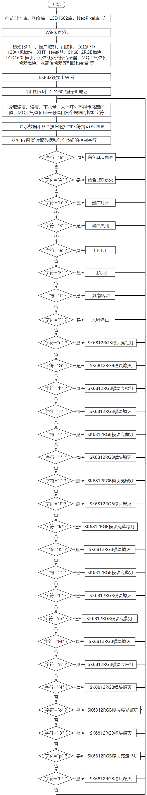
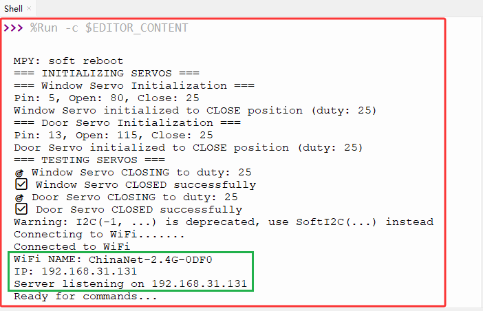
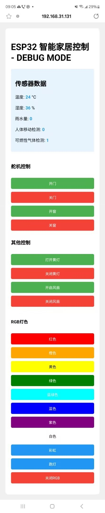
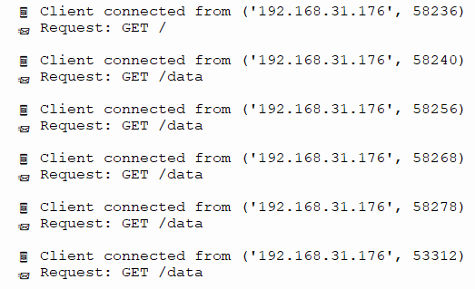
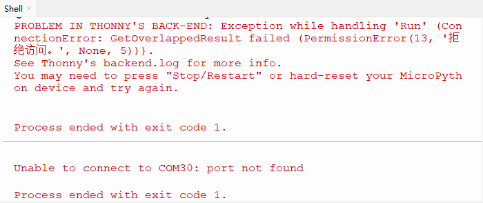
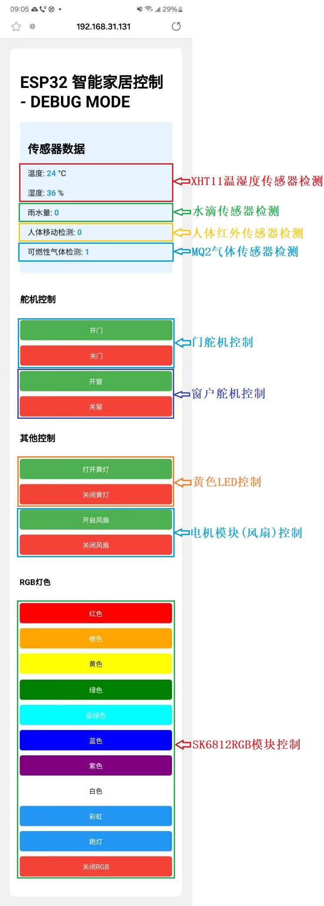
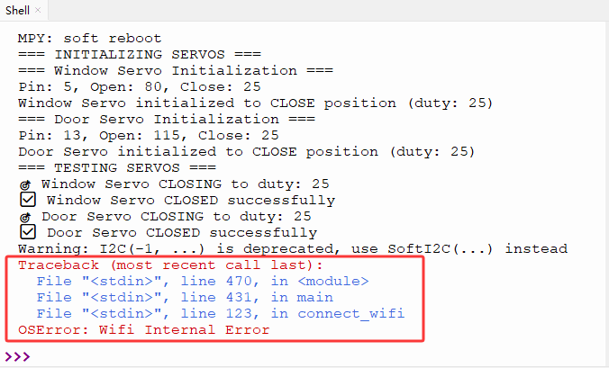
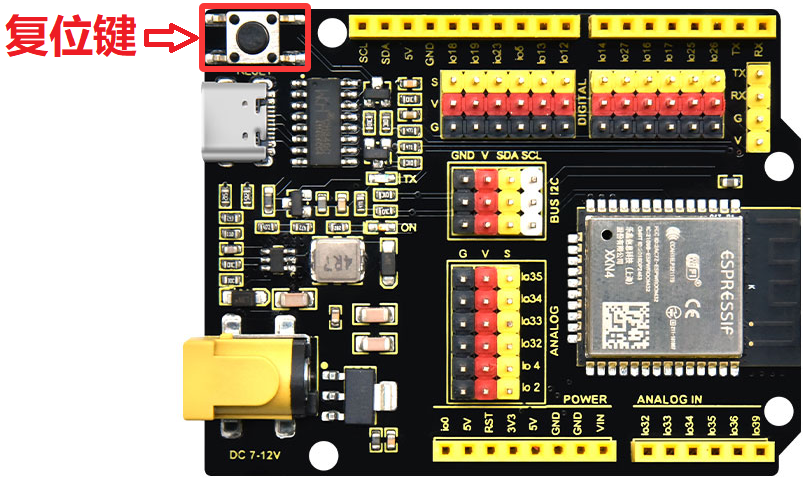

### 第22课 WiFi+网页 控制智能家居

#### 22.1 项目介绍

大部分人都有手机，现在大部分物联网产品的控制端都是用手机，使用起来就很便捷，打开手机APP，点击一下就能启动各种设备。

本教程将为您详细介绍如何使用ESP32开发板实现WIFI网页控制智能家居系统，系统包括XHT11温湿度传感器、人体红外热释电传感器、MQ2气体传感器、水滴传感器继电器、黄色LED模块、130电机(风扇)模块、门舵机、窗户舵机和SK6812RGB灯模块 等传感器模块。

教程内容包括ESP32的WiFi配置、网页设置以及如何编写代码等实现远程监控和控制。您将学习如何将ESP32连接到WIFI网页服务器，并通过发布和订阅消息来读取温湿度、雨水量、可燃性气体是否溢出和人体检测等相关数据，并根据需要控制LED、风扇、门舵机、窗户舵机和SK6812RGB灯等状态。此外，无论您是物联网初学者还是有经验的开发者，本教程都将帮助您掌握ESP32基于WiFi网页的远程监测与控制系统开发，为您的项目增添智能的家居管理功能。

#### 22.2 实验组件

|||||
|-|-|-|-|
|ESP32 Plus主板 *1|XHT11传感器 *1|黄色LED模块 *1|SK6812RGB灯模块 *1|
|||||
|人体红外热释传感器 *1|130电机模块 *1|180度舵机 *2|水滴传感器模块 *1|
|||||
|MQ2传感器 *1|风扇叶 *1|I2C LCD1602模块 * 1|USB线 *1|
||| | |
|4P线 *3|3P线 *5| | |

#### 22.3 模块接线图 

⚠️ **特别注意：智能家居已经组装好了，这里不需要把所有的传感器/模块拆下来又重新组装和接线，这里再次提供接线图，是为了方便您编写代码！**

|传感器模块名称|传感器模块引脚|ESP32 Plus主板对应的接线|
|-|-|-|
|人体红外热释传感器模块|G/V/S|G/V/io14|
|黄色LED模块|G/V/S|G/V/io12|
|电机模块|GND/VCC/IN+/IN-|G/V/io19/io18|
|控制门的舵机1|棕色线/红色线/橙色线|G/V/io13|
|控制窗的舵机2|棕色线/红色线/橙色线|G/V/io5|
|MQ-2气体传感器模块|GND/VCC/D|G/V/io23|
|XHT11模块|G/V/S|G/V/io17|
|SK6812RGB灯模块|G/V/S|G/V/io26|
|LCD1602显示屏模块|GND/VCC/SDA/SCL|GND/V/SDA/SCL|
|水滴传感器模块|G/V/S|G/V/io34|

#### 22.4 代码流程图

 

#### 22.5 WiFi网页控制智能家居的实验代码 

打开“Thonny”软件，点击“此电脑” → “D:” → “Python资料” → “Python_代码”。并鼠标左键双击 “Project22.2_wifi_control_smart_home.py”。

⚠️ <span style="color: rgb(255, 76, 65);">**特别提醒：**</span> 打开代码文件后，需要修改ESP32开发板需要连接的WiFi名称与密码，您需要分别将 `ChinaNet-2.4G-0DF0` 和 `ChinaNet@233` 替换为您自己的 Wi-Fi 名称和 WiFi 密码。WiFi名称和WiFi密码修改后才能上传代码，否则你的ESP32开发板将无法连接网络。

```python
SSID = "ChinaNet-2.4G-0DF0"   # 替换为你的Wi-Fi名称
PASSWORD = "ChinaNet@233"   # 替换为你的Wi-Fi密码 
```

⚠️ **<span style="color: rgb(255, 76, 65);">注意：</span> 请确保代码中的WiFi名称和WiFi密码与连接到您的计算机、手机/平板电脑、ESP32开发板和路由器的网络相同，它们必须在同一局域网（WiFi）内。**

⚠️ **<span style="color: rgb(255, 76, 65);">注意：</span>WiFi必须是2.4Ghz频率的，否则ESP32无法连接WiFi，不支持连接5GHz频段的WiFi。**。

```python
# 作者 : www.keyes-robot.com

from machine import Pin, ADC, PWM, I2C
from time import sleep_ms, ticks_ms  
from i2c_lcd import I2cLcd   
import network
import socket 
import time
import json
from neopixel import NeoPixel
import dht

# WiFi配置, 目的是连接Wi-Fi
SSID = "ChinaNet-2.4G-0DF0"   # 替换为你的Wi-Fi名称
PASSWORD = "ChinaNet@233"   # 替换为你的Wi-Fi密码  

# 定义传感器模块引脚
LED_PIN = 26
LED_COUNT = 4
WATER_PIN = 34
FAN_PIN1 = 19
FAN_PIN2 = 18
LED_Y_PIN = 12
GAS_PIN = 23
PYROELECTRIC_PIN = 14
DHT11_PIN = 17
SERVO_PIN1 = 5
SERVO_PIN2 = 13 

# 初始化设备
led_y = Pin(LED_Y_PIN, Pin.OUT)
fan_pin1 = Pin(FAN_PIN1, Pin.OUT)
fan_pin2 = Pin(FAN_PIN2, Pin.OUT)
water_sensor = ADC(Pin(WATER_PIN))
water_sensor.atten(ADC.ATTN_11DB)
gas_sensor = Pin(GAS_PIN, Pin.IN)
pir_sensor = Pin(PYROELECTRIC_PIN, Pin.IN)
dht_sensor = dht.DHT11(Pin(DHT11_PIN))

# 调试版舵机控制类
class DebugServo:
    def __init__(self, pin, name="Servo", open_duty=115, close_duty=25):
        self.name = name
        self.pin = pin
        self.servo = PWM(Pin(pin))
        self.servo.freq(50)  # 必须为50Hz
        self.open_duty = open_duty
        self.close_duty = close_duty
        self.current_duty = close_duty
        self.is_open = False
        
        # 测试PWM输出
        print(f"=== {self.name} Initialization ===")
        print(f"Pin: {pin}, Open: {open_duty}, Close: {close_duty}")
        
        # 初始化为关闭位置
        self.servo.duty(close_duty)
        print(f"{self.name} initialized to CLOSE position (duty: {close_duty})")
        sleep_ms(1000)
    
    def open(self):
        """打开舵机"""
        print(f"🎯 {self.name} OPENING to duty: {self.open_duty}")
        try:
            self.servo.duty(self.open_duty)
            self.current_duty = self.open_duty
            self.is_open = True
            sleep_ms(800)  # 给舵机足够时间移动
            print(f"✅ {self.name} OPENED successfully")
            return True
        except Exception as e:
            print(f"❌ {self.name} OPEN failed: {e}")
            return False
    
    def close(self):
        """关闭舵机"""
        print(f"🎯 {self.name} CLOSING to duty: {self.close_duty}")
        try:
            self.servo.duty(self.close_duty)
            self.current_duty = self.close_duty
            self.is_open = False
            sleep_ms(800)  # 给舵机足够时间移动
            print(f"✅ {self.name} CLOSED successfully")
            return True
        except Exception as e:
            print(f"❌ {self.name} CLOSE failed: {e}")
            return False
    
    def get_status(self):
        """获取状态"""
        return f"{self.name}: {'OPEN' if self.is_open else 'CLOSED'} (duty: {self.current_duty})"

# 初始化舵机 - 尝试不同的占空比值
print("=== INITIALIZING SERVOS ===")
servo1 = DebugServo(SERVO_PIN1, "Window Servo", open_duty=80, close_duty=25)
servo2 = DebugServo(SERVO_PIN2, "Door Servo", open_duty=115, close_duty=25)

# 测试舵机
print("=== TESTING SERVOS ===")
servo1.close()
servo2.close()
sleep_ms(1000)

# 初始化NeoPixel
strip = NeoPixel(Pin(LED_PIN), LED_COUNT)

# 初始化LCD
DEFAULT_I2C_ADDR = 0x27
i2c = I2C(scl=Pin(22), sda=Pin(21), freq=400000) 
lcd = I2cLcd(i2c, DEFAULT_I2C_ADDR, 2, 16)

# 传感器数据变量
rainwater = 0
gas = 0
pir = 0
temperature = 0
humidity = 0

# 连接WiFi，获取IP地址
def connect_wifi():
    wlan = network.WLAN(network.STA_IF)
    wlan.active(True)
    wlan.connect(SSID, PASSWORD)
    
    print("Connecting to WiFi...", end="")
    while not wlan.isconnected():
        print(".", end="")
        time.sleep(1)
    
    print("\nConnected to WiFi")
    print("WiFi NAME:", SSID)
    print("IP:", wlan.ifconfig()[0])
    return wlan.ifconfig()[0]

# 读取传感器的数据
def get_sensors_data():
    global rainwater, gas, pir, temperature, humidity
    
    try:
        dht_sensor.measure()
        temperature = dht_sensor.temperature()
        humidity = dht_sensor.humidity()
    except:
        temperature = 0
        humidity = 0
    
    rainwater = water_sensor.read()
    gas = gas_sensor.value()
    pir = pir_sensor.value()
    
# SK6812RGB灯相关函数
def color_wipe(color, wait):
    for i in range(LED_COUNT):
        strip[i] = color
        strip.write()
        time.sleep_ms(wait)

def rainbow(wait):
    for j in range(256):
        for i in range(LED_COUNT):
            strip[i] = wheel((i + j) & 255)
        strip.write()
        time.sleep_ms(wait)
        
def wheel(pos):
    if pos < 85:
        return (pos * 3, 255 - pos * 3, 0)
    elif pos < 170:
        pos -= 85
        return (255 - pos * 3, 0, pos * 3)
    else:
        pos -= 170 
        return (0, pos * 3, 255 - pos * 3)
    
def theater_chase_rainbow(wait):
    first_pixel_hue = 0
    for a in range(30):
        for b in range(3):
            strip.fill((0, 0, 0))
            for c in range(b, len(strip), 3):
                hue = first_pixel_hue + c * 65536 // len(strip)
                rgb = hsv_to_rgb(hue / 65536.0, 1.0, 1.0)
                strip[c] = (int(rgb[0]), int(rgb[1]), int(rgb[2]))
            strip.write()
            time.sleep_ms(wait)
            first_pixel_hue += 65536 // 90

def hsv_to_rgb(h, s, v):
    if s == 0.0:
        return (v * 255, v * 255, v * 255)
    i = int(h * 6.0)
    f = (h * 6.0) - i
    p = v * (1.0 - s)
    q = v * (1.0 - s * f)
    t = v * (1.0 - s * (1.0 - f))
    i = i % 6
    if i == 0:
        return (v * 255, t * 255, p * 255)
    if i == 1:
        return (q * 255, v * 255, p * 255)
    if i == 2:
        return (p * 255, v * 255, t * 255)
    if i == 3:
        return (p * 255, q * 255, v * 255)
    if i == 4:
        return (t * 255, p * 255, v * 255)
    if i == 5:
        return (v * 255, p * 255, q * 255)

# 发送HTML页面, 发送传感器数据, 处理控制请求
def handle_request(client, request):
    get_sensors_data()
    
    if "GET / " in request:
        # 发送HTML页面
        html = create_html_page()
        client.send(html)
    
    elif "GET /data" in request:
        # 发送传感器数据
        data = f"{rainwater},{gas},{pir},{temperature},{humidity}"
        client.send(f"HTTP/1.1 200 OK\r\nContent-Type: text/plain\r\n\r\n{data}")
    
    elif "GET /control" in request:       
        response = "OK"
        
        # 处理控制请求 - 添加详细调试
        if "?cmd=e" in request:
            print("\n" + "="*50)
            print("🚪 DOOR OPEN COMMAND RECEIVED")
            servo2.open()  # 开门 
            print(f"Door status: {servo2.get_status()}")
            
        elif "?cmd=E" in request:
            print("\n" + "="*50)
            print("🚪 DOOR CLOSE COMMAND RECEIVED")
            servo2.close()  # 关门 
            print(f"Door status: {servo2.get_status()}")
            
        elif "?cmd=a" in request:
            led_y.on()   # 点亮黄色LED 
            print("Yellow LED ON")
            
        elif "?cmd=A" in request:
            led_y.off()  # 关闭黄色LED
            print("Yellow LED OFF")
            
        elif "?cmd=b" in request:
            print("\n" + "="*50)
            print("🪟 WINDOW OPEN COMMAND RECEIVED")
            servo1.open()  # 开窗
            print(f"Window status: {servo1.get_status()}")
            
        elif "?cmd=B" in request:
            print("\n" + "="*50)
            print("🪟 WINDOW CLOSE COMMAND RECEIVED")
            servo1.close()  # 关窗
            print(f"Window status: {servo1.get_status()}")
            
        elif "?cmd=f" in request:
            fan_pin2.off() 
            fan_pin1.on()  # 开启风扇
            print("Fan ON")
            
        elif "?cmd=F" in request:
            fan_pin2.off()
            fan_pin1.off()  # 关闭风扇
            print("Fan OFF")
        
        # RGB LED控制
        elif "?cmd=g" in request:
            color_wipe((255, 0, 0), 50)  # RGB亮红灯
            print("Red on")
        elif "?cmd=G" in request:
            color_wipe((0, 0, 0), 50)   # RGB熄灭
            print("RGB off")
        elif "?cmd=h" in request:
            color_wipe((200, 100, 0), 50)  # RGB亮橙灯
            print("Orange on")
        elif "?cmd=H" in request:
            color_wipe((0, 0, 0), 50)
            print("RGB off")
        elif "?cmd=i" in request:
            color_wipe((200, 200, 0), 50)  # RGB亮黄灯
            print("Yellow on")
        elif "?cmd=I" in request:
            color_wipe((0, 0, 0), 50)
            print("RGB off")
        elif "?cmd=j" in request:
            color_wipe((0, 255, 0), 50)  # RGB亮绿灯
            print("Green on")
        elif "?cmd=J" in request:
            color_wipe((0, 0, 0), 50)
            print("RGB off")
        elif "?cmd=k" in request:
            color_wipe((0, 100, 255), 50)  # RGB亮蓝绿灯
            print("Green-blue on")
        elif "?cmd=K" in request:
            color_wipe((0, 0, 0), 50)
            print("RGB off")
        elif "?cmd=l" in request:
            color_wipe((0, 0, 255), 50)  # RGB亮蓝灯
            print("Blue on")
        elif "?cmd=L" in request:
            color_wipe((0, 0, 0), 50)
            print("RGB off")
        elif "?cmd=m" in request:
            color_wipe((100, 0, 255), 50)  # RGB亮紫灯
            print("Purple on")
        elif "?cmd=M" in request:
            color_wipe((0, 0, 0), 50)
            print("RGB off")
        elif "?cmd=n" in request:
            color_wipe((255, 255, 255), 50)  # RGB亮白灯
            print("White on")
        elif "?cmd=N" in request:
            color_wipe((0, 0, 0), 50)
            print("RGB off")
        elif "?cmd=o" in request:
            rainbow(10)   # RGB亮彩虹灯
            print("Rainbow on")
        elif "?cmd=O" in request:
            color_wipe((0, 0, 0), 50)
            print("RGB off")
        elif "?cmd=p" in request:
            theater_chase_rainbow(50)  # RGB实现跑灯效果
            print("Chase on")
        elif "?cmd=P" in request:
            color_wipe((0, 0, 0), 50)
            print("RGB off")
        
        client.send("HTTP/1.1 200 OK\r\n\r\nOK")

# 网页页面
def create_html_page():
    html = """HTTP/1.1 200 OK\r\nContent-Type: text/html\r\n\r\n
    <!DOCTYPE html>
    <html>
    <head>
        <title>ESP32 Smart Home</title>
        <meta charset="UTF-8">
        <meta name="viewport" content="width=device-width, initial-scale=1.0">
        <style>
            body { font-family: Arial; margin: 20px; background: #f0f0f0; }
            .container { max-width: 800px; margin: 0 auto; background: white; padding: 20px; border-radius: 10px; }
            .sensor-data { background: #e8f4fd; padding: 15px; border-radius: 5px; margin: 10px 0; }
            .control-panel { display: grid; grid-template-columns: repeat(auto-fit, minmax(150px, 1fr)); gap: 10px; margin: 20px 0; }
            .btn { padding: 10px; border: none; border-radius: 5px; cursor: pointer; font-size: 14px; }
            .btn-on { background: #4CAF50; color: white; }
            .btn-off { background: #f44336; color: white; }
            .btn-special { background: #2196F3; color: white; }
            .data-value { font-weight: bold; color: #2196F3; }
        </style>
        <script>
            function updateData() {
                fetch('/data')
                    .then(response => response.text())
                    .then(data => {
                        const values = data.split(',');
                        document.getElementById('rainwater').textContent = values[0];
                        document.getElementById('gas').textContent = values[1];
                        document.getElementById('pir').textContent = values[2];
                        document.getElementById('temp').textContent = values[3];
                        document.getElementById('humi').textContent = values[4];
                    });
            }
            
            function sendCommand(cmd) {
                console.log('Sending command:', cmd);
                fetch('/control?cmd=' + cmd)
                    .then(response => {
                        console.log('Command', cmd, 'sent successfully');
                    })
                    .catch(err => {
                        console.error('Command error:', err);
                    }); 
            }
            
            setInterval(updateData, 2000);
            window.onload = updateData;
        </script>
    </head>
    <body>
        <div class="container">
            <h1>ESP32 智能家居控制 - DEBUG MODE</h1>
            
            <div class="sensor-data"> 
                <h2>传感器数据</h2>
                <p>温度: <span id="temp" class="data-value">0</span> °C</p>
                <p>湿度: <span id="humi" class="data-value">0</span> %</p>
                <p>雨水量: <span id="rainwater" class="data-value">0</span></p>
                <p>人体移动检测: <span id="pir" class="data-value">0</span></p>
                <p>可燃性气体检测: <span id="gas" class="data-value">0</span></p>
            </div>
            
            <div class="control-panel">
                <h3>舵机控制</h3>
                <button class="btn btn-on" onclick="sendCommand('e')">开门</button>
                <button class="btn btn-off" onclick="sendCommand('E')">关门</button>
                <button class="btn btn-on" onclick="sendCommand('b')">开窗</button>
                <button class="btn btn-off" onclick="sendCommand('B')">关窗</button>
                
                <h3>其他控制</h3>
                <button class="btn btn-on" onclick="sendCommand('a')">打开黄灯</button>
                <button class="btn btn-off" onclick="sendCommand('A')">关闭黄灯</button>
                <button class="btn btn-on" onclick="sendCommand('f')">开启风扇</button>
                <button class="btn btn-off" onclick="sendCommand('F')">关闭风扇</button>
            </div>
            
            <div class="control-panel">
                <h4>RGB灯色</h4>
                <button class="btn" style="background:red;color:white" onclick="sendCommand('g')">红色</button>
                <button class="btn" style="background:orange;color:white" onclick="sendCommand('h')">橙色</button>
                <button class="btn" style="background:yellow;color:black" onclick="sendCommand('i')">黄色</button>
                <button class="btn" style="background:green;color:white" onclick="sendCommand('j')">绿色</button>
                <button class="btn" style="background:cyan;color:white" onclick="sendCommand('k')">蓝绿色</button>
                <button class="btn" style="background:blue;color:white" onclick="sendCommand('l')">蓝色</button>
                <button class="btn" style="background:purple;color:white" onclick="sendCommand('m')">紫色</button>
                <button class="btn" style="background:white;color:black" onclick="sendCommand('n')">白色</button>
                <button class="btn btn-special" onclick="sendCommand('o')">彩虹</button>
                <button class="btn btn-special" onclick="sendCommand('p')">跑灯</button>
                <button class="btn btn-off" onclick="sendCommand('G')">关闭RGB</button>
            </div>
        </div>
    </body>
    </html>
    """
    return html

def main():
    ip = connect_wifi()
    
    # 在LCD显示IP
    lcd.move_to(0, 0)
    lcd.putstr('IP:')
    lcd.move_to(0, 1)
    lcd.putstr(ip) 
    
    # 创建socket服务器
    addr = socket.getaddrinfo('0.0.0.0', 80)[0][-1]
    server = socket.socket()
    server.setsockopt(socket.SOL_SOCKET, socket.SO_REUSEADDR, 1)
    server.bind(addr)
    server.listen(5)
    
    print("Server listening on", ip)
    print("Ready for commands...")
    
    while True:
        try:
            client, addr = server.accept()
            print(f"\n📱 Client connected from {addr}")
            
            request = client.recv(1024).decode()
            print(f"📨 Request: {request.split()[0]} {request.split()[1]}")
            
            handle_request(client, request)
            
            client.close()
            
        except Exception as e:
            print(f"❌ Server error: {e}")
            try:
                client.close()
            except:
                pass
            time.sleep(1)

if __name__ == "__main__":
    main()
```
#### 22.6 实验结果

⚠️ <span style="color: rgb(255, 76, 65);">**注意：手机/平板需要和智能家居连接同一个WiFi，或者手机/平板打开热点，智能家居连接手机/平板的热点，且示例代码中的WiFi名称与WiFi密码和手机/平板、智能家居是同一个WiFi名称与密码。** </span>

⚠️ **<span style="color: rgb(255, 76, 65);">注意：</span>WiFi必须是2.4Ghz频率的，否则ESP32无法连接WiFi，不支持连接5GHz频段的WiFi。**。

⚠️ **<span style="color: rgb(255, 76, 65);">特别注意：</span> 手机或平板一定要与ESP32开发板连接的是同一个WiFi，否则将无法进入控制页面。还有就是ESP32开发板在使用WiFi功能时功耗很大，需要外接DC电源(电源电压必须充足，最好使用新电池)才能满足它的工作电力需求，如果达不到它的工作电力需求，ESP32板将会一直复位导致代码无法正常运行。**

按照接线图接好线，将 ESP32 主控板通过Micro USB数据线与计算机相连供电，外接电源供电，然后单击按钮，示例代码开始执行。


示例代码开始执行之后，你会看到的现象是：Shell窗口中会打印如下相关信息。同时，如果成功连接上WiFi，Shell窗口中还会打印WiFi名称和分配到的IP地址（假如Shell窗口中没有打印出分配到的IP地址，可以按下ESP32主控板上的复位键重启，重新连接WiFi），同时LCD1602显示对应的IP地址。不同的网络（WiFi），IP地址不一样。




然后，您可以在手机端/平板端的浏览器中输入串口监视器打印的 ESP32 IP地址 或 LCD显示屏显示的 ESP32 IP地址，使用浏览器打开ESP32的IP地址，并访问网页。在本例中，您可以在浏览器中输入你自己的**ESP32 IP地址**(**这里是以192.168.31.131为例，而你需要将IP地址：192.168.31.131 修改成你自己的 ESP32 IP地址**)，在浏览器中打开ESP32的IP地址来查看传感器（XHT11温湿度传感器、人体红外热释电传感器、MQ2气体传感器、水滴传感器继电器）检测的数据、舵机控制（门舵机、窗户舵机）和黄色LED模块控制网页。


进入对应WiFi网页之后，可以看到网页中显示 “传感器数据”、“舵机控制”、“其他控制”、“RGB灯色” 等相关设备。



同时，Shell窗口中会打印如下相关信息。



接下来，我们可以通过手机/平板等设备的WiFi网页来操作 “ESP32智能家居控制” 网页中的相关设备。

⚠️ **<span style="color: rgb(255, 76, 65);">特别提醒：</span> 如果未接外接DC电源(或者外接电源电压不足)时，会出现如下现象，USB串口流失，退出程序。这时候需要重新更换新电池，外接电源，重新单击按钮，使示例代码重新运行。**



⚠️ **<span style="color: rgb(255, 76, 65);">特别注意：</span> 一定要外接电源，外接DC电源 (电源电压必须充足，最好使用新电池) 才能满足ESP32主控板，2个舵机和风扇模块的工作电力需求，如果达不到它们的工作电力需求，ESP32板将会一直复位导致代码无法正常运行；同时，手机/平板的APP 上的WiFi会断开。**



⚠️ **<span style="color: rgb(255, 76, 65);">特别提醒：</span> 如果单击按钮，Shell窗口中打印WiFi连接不成功等报错信息时 (如下图所示)，请按一下ESP32主控板上的复位键重启，重新连接WiFi，并且确保示例代码中的WiFi名称与WiFi密码和手机/平板、智能家居是同一个WiFi名称与密码，然后再次单击按钮 运行示例代码。**





单击“停止/启动后端进程”退出程序。
