## 9.2.1 Windows 系统

### 9.2.1.1 Mixly IDE下载

我们通过百度网盘分享：mixly2.0 文件

**下载链接：** [https://pan.baidu.com/s/1sV0DUDKg7OiQcKyIkBI1Ew?pwd=keye](https://pan.baidu.com/s/1sV0DUDKg7OiQcKyIkBI1Ew?pwd=keye) 

**提取码：** keye 

根据计算机系统选择下载对应的mixly2.0版本，如下图所示：

Windows系统一般是下载“**mixly2.0-win32-x64-rc4完整版.zip**”版本.

### 9.2.1.2 Mixly IDE安装

下载mixly2.0-win32-x64-rc4完整版压缩包之后，重新命名为：mixly2.0 ，解压到电脑的本地硬盘。

⚠️ **特别提醒：** (1)建议解压到硬盘根目录，路径不能包含中文及特殊字符(如:._( )等)。 (2)建议安装路径如 D:\mixly2.0

因为Mixly是一个绿色免安装软件，所以“mixly2.0-win32-x64-rc4完整版”版本在解压之后就可以直接使用了。如果是下载 “一键更新版.7z” 版本的压缩包，压缩包解压后，需要左键双击打开 “一键更新.bat” 文件按照提示更新Mixly。

## 9.2.2 MacOS 系统

### 9.2.2.1 Mixly IDE下载

我们通过百度网盘分享：mixly2.0 文件

**下载链接：** [https://pan.baidu.com/s/1sV0DUDKg7OiQcKyIkBI1Ew?pwd=keye](https://pan.baidu.com/s/1sV0DUDKg7OiQcKyIkBI1Ew?pwd=keye) 

**提取码：** keye 

根据电脑系统选择下载对应的mixly2.0版本，如下图所示：

**Mixly For Mac(根据电脑系统选择)：**

### 9.2.2.2 Mixly IDE安装

提供有MAC安装Mixly2.0.txt的文本，安装时可以参考里面的安装方法。

## 9.2.3 Linux 系统

### 9.2.3.1 Mixly IDE下载

我们通过百度网盘分享：mixly2.0 文件

**下载链接：** [https://pan.baidu.com/s/1sV0DUDKg7OiQcKyIkBI1Ew?pwd=keye](https://pan.baidu.com/s/1sV0DUDKg7OiQcKyIkBI1Ew?pwd=keye) 

**提取码：** keye 

根据电脑系统选择下载对应的mixly2.0版本，如下图所示：

**Mixly For Linux(根据系统选择)：**

### 9.2.3.2 Mixly IDE安装

提供有Linux安装Mixly2.0.txt的文本，安装时可以参考里面的安装方法。

## 9.2.4 Mixly IDE页面介绍

这里双击 “**Mixly.exe**” 就能打开Mixly软件。如下图所示：

打开Mixly软件后，找到并且单击“ **Arduino ESP32** ”就可以进入Mixly编程界面。软件界面如下图所示：

总体来说，Mixly软件界面分为4部分。

1\. 界面左侧为模块区，这里包含了Mixly中所有能用到的程序模块，根据功能的不同，大概分为以下几类:“输入/输出”、“控制”、“数学”、“逻辑”、“文本”、“数组”、“变量”、“函数”、“串口”、“传感器”、“执行器”、“显示器”、“通信”、“存储”、“网络”。每种类型的模块都用不同的颜色块表示，其中每一个分类中的模块会在附录A中有专门的介绍。

2\. 模块区的右侧是程序构建区，模块区的模块可通过鼠标拖拽放到程序构建区，拖诟过来的模块会在这里组合成一段有一定逻辑关系的程序块。这个区域有点类似代码程序编辑软件中写代码的地方，在这个区域的右下角有一个垃圾桶，当我们删除模块时，就要将模块拖到垃圾桶中，在垃圾桶的上方有三个圆形的按钮，能够实现程序构建区的放大、缩小以及居中。

3\. 模块区和程序构建区的上方是基本功能区，类似一般软件的菜单区。这里不仅包含了“新建”、“打开”、“保存”、“另存为”、“导出库”和“管理库”软件都具有的按钮，还包含了硬件编程软件中需要用到的“编译”、“上传”、“控制板选择”、“串口端口”、“串口”这样的按钮。

4\. 界面的最下方是提示区，这里在软件编译、上传的过程中会显示相应的提示信息。我们可以通过提示信息来解决编译上传过程中出现的一些问题。

**最后还要补充两点：**

第一点: Mixly支持多国语言，我们可以通过如下界面找到并且点击  进入个性化设置页面，找到语言下面的简体中文下拉菜单，选择不同的语言版本，此时这个下拉菜单显示的是简体中文，如下图所示：

第二点: 在界面最上方右侧有一个  按钮，单击这个按钮就能进入纯代码形式，如下图所示：

Mixly作为一款将图形化编程方式和代码编程方式融合在一起的开发环境，如果只能单独地显示代码或显示图形程序块，那么肯定是不够好的。在Mixly中是能够将代码和图形程序块一起呈现在屏幕上的，这个功能可以通过界面最上方右侧有一个按钮实现，单击这个  按钮之后，如下图所示：

这时，在程序构建区的右侧会显示出对应的代码，这段代码是与程序构建区中的模块所组成的程序块对应的，会随着模块的变化而变化，不过区域中的代码是不可编辑的。同时，界面最右侧那个向左的箭头按钮变成了向右的箭头。

⚠️ **注意：想了解更多关于Mixly相关知识的请点击链接：** [https://mixly.readthedocs.io/zh-cn/latest/](https://mixly.readthedocs.io/zh-cn/latest/) 。

## 9.2.5 添加Mixly库文件(**重要**)

⚠️ **注意：Mixly 库文件必须添加好，否则后面涉及到相关模块的示例代码是打不开的**。

**特别提醒：** Mixly 库文件在**Mixly资料**文件夹提供有，请下载并且安装好库文件。

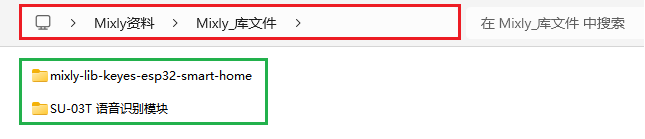

Mixly软件下载安装后，点击 **Arduino ESP32** 进入代码编辑器，先点击右上角 “**设置**”，再点击 “**管理库**” 进入添加库文件界面。如下图所示：

进入添加库文件界面后，先点击 “ **导入库** ” ，再点击  进入库文件所放的位置，找到 **index.xml** 库文件并选中它，然后单击 “ **确定** ”。之后，就可以看到库文件在导入中，一会儿会出现 “**导入成功**” 字样，说明库文件导入成功。如下图所示：

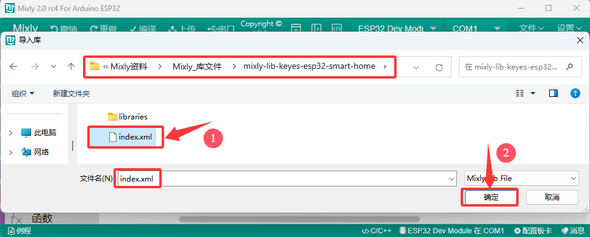

点击 “**管理库**”，可以看到添加成功的库文件。如下图所示：

关闭添加库文件的窗口界面，在代码编辑器左侧看到刚刚添加的库文件。如下图所示：

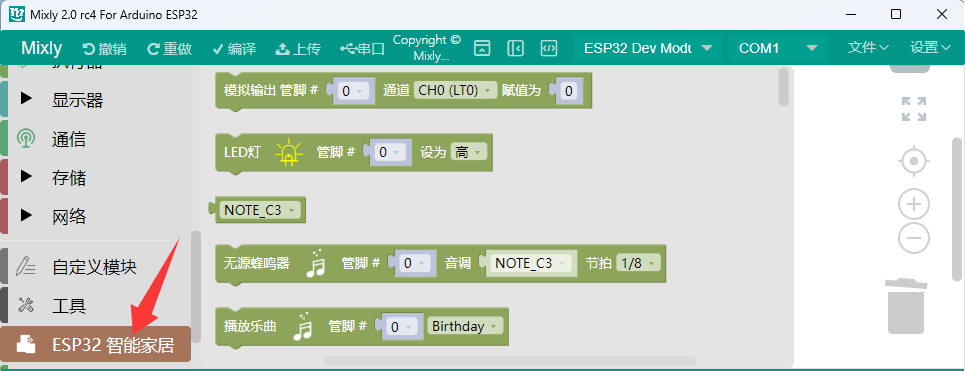

使用上述相同的添加方法将 **智能语音模块** 的库文件添加好。

所有的库文件添加好之后，可在Mixly IDE 左侧模块栏看到所添加的库文件。

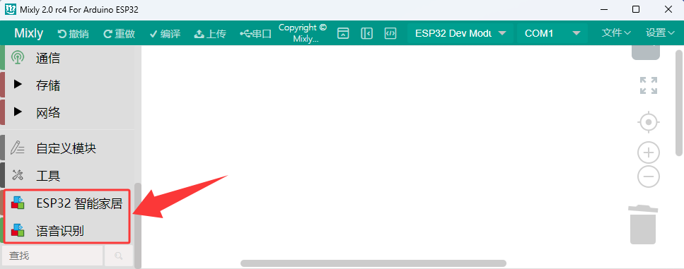

## 9.2.6 编写代码并上传 

⚠️ **特别注意：后面的示例代码上传步骤也一样，可以参考**。

**确保ESP32主控板与计算机连接成功，然后双击 “ **Mixly.exe** ” 图标打开Mixly软件。**

方法①：从直接拖动代码块到程序构建区进行代码编写，选用管脚 **IO12** ，如下图所示：

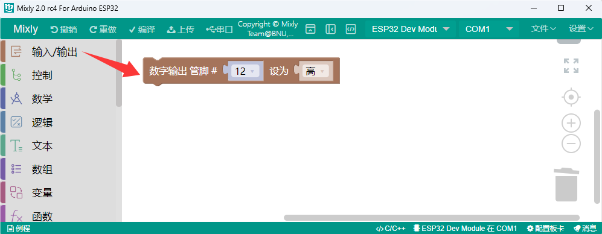

编写完成后保存到电脑上，单击“ **文件** ”-->“ **另存为** ”，如下图所示：

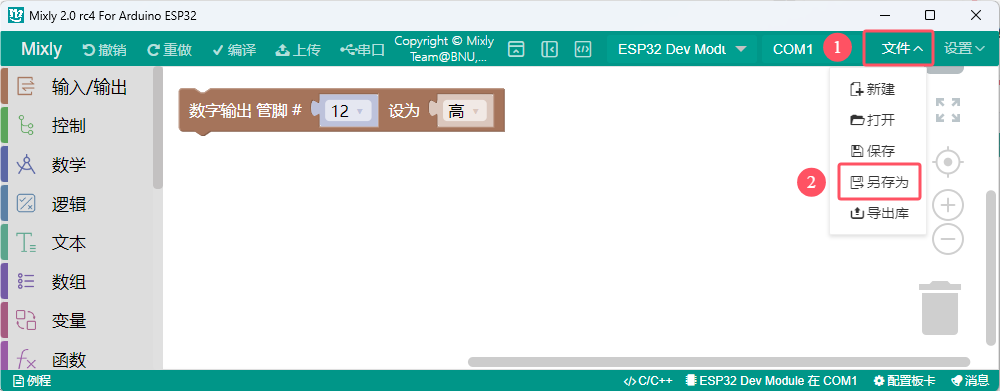

选择ESP32主控板的板型 “ **ESP32 Dev Moduel** ” 和串口端口（COM3）（ **提示：不同的电脑，串口端口是不一样的**) ，(**注意：** 将ESP32主板通过USB线连接到计算机后才能看到对应的串口端口。)，如下图所示：

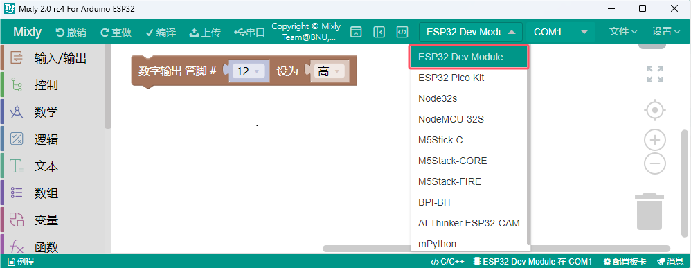

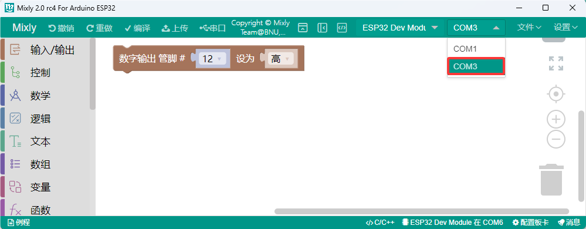

单击  将代码上传到ESP32主控板，如下图所示：

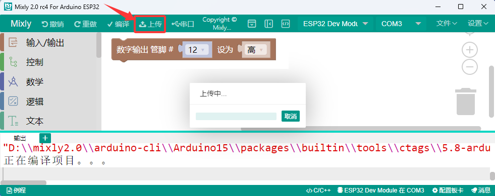

可以看到智能家居的黄色LED点亮了。

方法②：从电脑打开已经编写好的代码  

将我们提供的代码文件压缩包解压，把解压后的代码文件夹保存到方便使用的位置。我们提供本课程需要用到的所有代码文件，并保存到方便使用的位置。本课程以代码存放于D盘为例，路径为 <u>D:Mixly资料\Mixly_代码</u>。（**你也可以放入其他磁盘，只要方便示例代码导入就行**）

单击“ **文件** ” --> “ **打开** ”，然后选择保存代码的路径，选中代码文件打开即可。如下图所示：

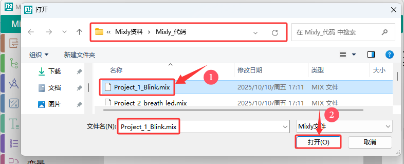

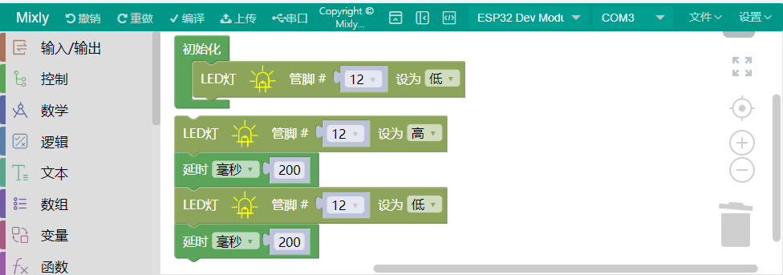

代码文件打开后，需要手动选择ESP32主控板的板型 “ **ESP32 Dev Moduel** ” 和串口端口（COM3）（**提示：不同的电脑，串口端口是不一样的**） （**注意：** 将ESP32主板通过USB线连接到计算机后才能看到对应的端口。)，如下图所示：

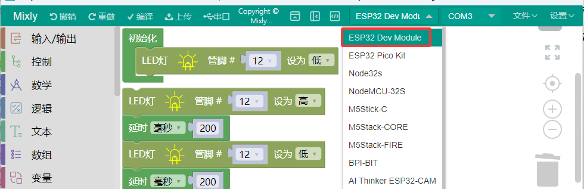

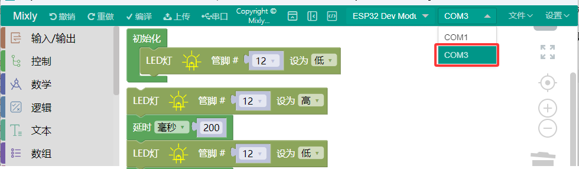

单击  将代码上传到ESP32主控板，如下图所示：

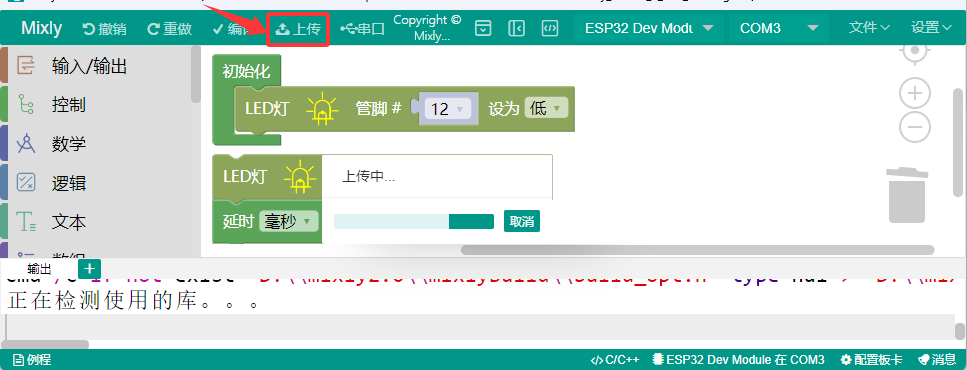

这样，可以看到智能家居的黄色LED闪烁了。
