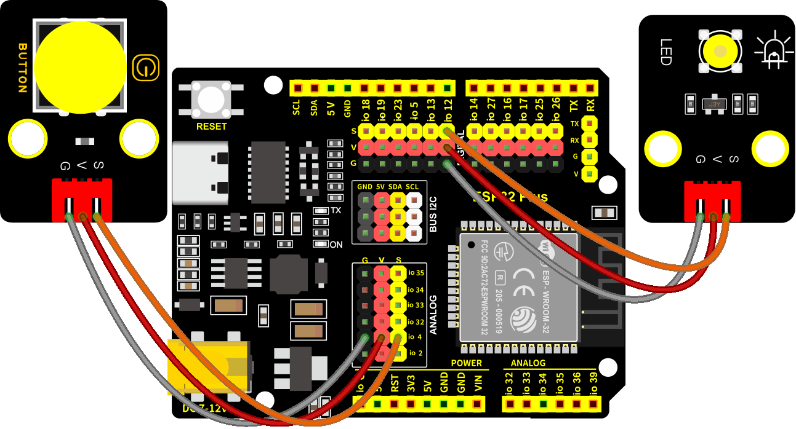
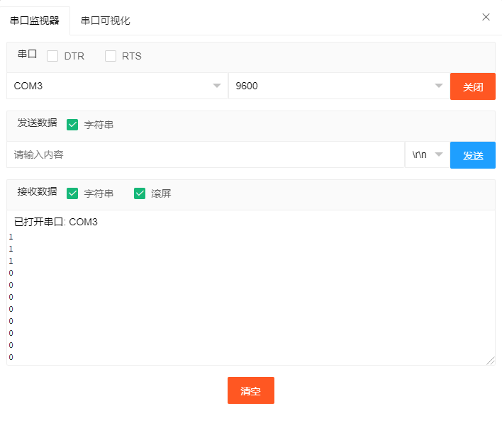
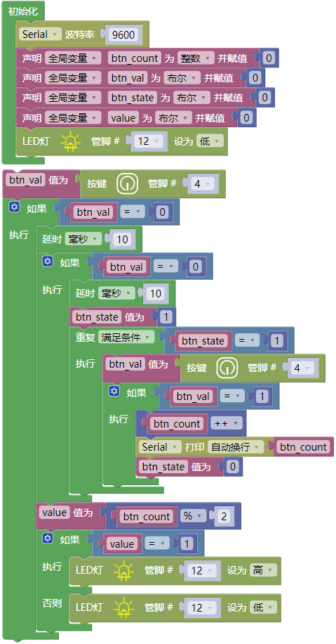
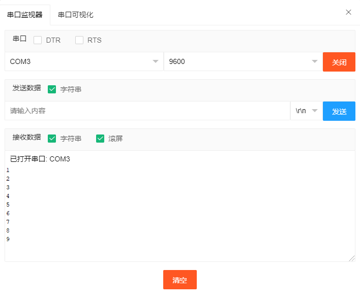

### 第3课 台灯

#### 3.1 项目介绍

常见的台灯，用到了LED灯和按键。通过按按键来控制灯的开与关。

按键按下，我们的单片机读取到低电平，松开读取到高电平。在这一实验课程中，我们利用按键和黄色LED做一个扩展，当按键按下时即读取到低电平时点亮黄色LED灯，松开按键时即读取到高电平时熄灭黄色LED灯，这样就可以通过一个模块控制另一个模块了。

#### 3.2 模块相关资料

附原理图，按键有四个引脚，其中1和3是相连的，2和4是相连的，在我们未按下按键时，13与24是断开的，信号端S读取的是被4.7K的上拉电阻R1所拉高的高电平，而当我们按下按键时，13和24连通。信号端S连接到了GND，此时读取到的电平为低电平，即按下按键，传感器信号端为低电平；松开按键时，信号端为高电平。

#### 3.3 实验组件

||||||
|-|-|-|-|-|
|ESP32 Plus主板 *1|黄色LED模块 *1|按键 *1|3P线 *2|USB线 *1|

#### 3.4 模块接线图

木板房子⑦处(左侧)按键1和黄色LED的控制引脚：

|木板房子⑦处(左侧)按键1（S引脚）|io4|
|-|-|
|黄色LED灯（S引脚）|io12|

⚠️ **特别注意：智能家居已经组装好了，这里不需要把按键模块和LED模块拆下来又重新组装和接线，这里再次提供接线图，是为了方便您编写代码！**

#### 3.5 读取按钮值的实验代码1

读取木板房子⑦处(左侧)按键的状态值，在串口监视器中显示出来，这样就可以直观的看到按键的状态值，即可得到0或1两种状态值。

#### 3.6 实验结果1

按照接线图接好线，外接电源，选择好正确的开发板板型（ESP32 Dev Module）和 适当的串口端口（COMxx），然后单击按钮上传示例代码至ESP32主控板。示例代码上传成功后，上电后，点击打开IDE的串口监视器，设置波特率为9600，如下图操作。

再按下木板房子⑦处(左侧)按键1就可以看到按键状态值的改变，如下图。

#### 3.7 代码流程图

#### 3.8 台灯的实验代码2 

计算木板房子⑦处(左侧)按键1被点击的次数，然后再对计算的次数进行对2求余数，可以看到打印的数字。

#### 3.9 实验结果2

按照接线图接好线，外接电源，选择好正确的开发板板型（ESP32 Dev Module）和 适当的串口端口（COMxx），然后单击按钮上传示例代码至ESP32主控板。示例代码上传成功后，上电后，点击打开IDE的串口监视器，设置波特率为9600，打印出木板房子⑦处(左侧)按键1被点击的次数，并且点击一次木板房子⑦处(左侧)按键1，LED灯就亮，再点击一次，LED关闭。

