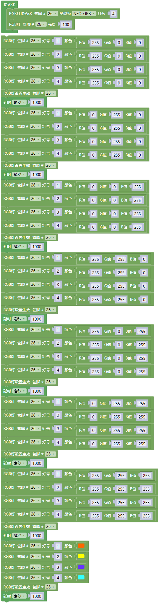
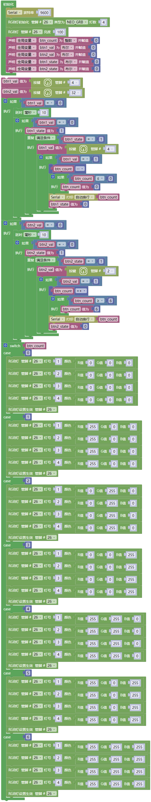

### 第7课 氛围灯

#### 7.1 项目介绍

智能家居的氛围灯是4个SK6812RGB LED，RGB LED属于简单的发光模块，可以通过调节色彩调出不同颜色的灯效，可广泛应用于建筑物、桥梁、道路、花园、庭院、地板等领域的装饰照明与会场布置、圣诞节、万圣节、情人节、复活节、国庆节等节日期间烘托气氛等场景。在本实验中，实现各种灯光效果。

#### 7.2 模块相关资料

**SK6812RGB：** 从原理图中可以看出，这4个RGBLED都是串联起来的，在电压电流充足的情况下可以接几百个RGB LED，都可以用一根信号线控制任意一个RGB LED，并且让它显示任意一种颜色。每一颗RGBLED都是一个独立的像素点，每个像素点都是由R、G、B三基色颜色组成，可实现256级亮度显示，完成16777216种颜色的全真色彩显示，同时像素点内部包含了智能数字接口数据锁存信号整形放大驱动电路，还内置信号整形电路，有效保证了像素点光的颜色高度一致。

数据协议采用单线归零码的通讯方式，像素点在上电复位以后，S端接受从控制器传输过来的数据，首先送过来的24bit数据被第一个像素点提取后，送到像素点内部的数据锁存器。这个6812RGB通讯协议与驱动已经在底层封装好了，我们直接调用函数的接口就可以使用，简单方便，LED具有低电压驱动，环保节能，亮度高，散射角度大，一致性好，超低功率，超长寿命等优点。

#### 7.3 实验组件

||||||
|-|-|-|-|-|
|ESP32 Plus主板 *1|按键 *2|SK6812RGB灯 *1|3P线 *3|USB线 *1|

#### 7.4 模块接线图

木板房子⑦处(左侧)按键1，木板房子⑨处(右侧)按键2和SK6812RGB灯模块的控制引脚：

|SK6812RGB灯（S引脚）|io26|
|-|-|
|木板房子⑦处(左侧)按键1（S引脚）|io4|
|木板房子⑨处(右侧)按键2（S引脚）|io32|

⚠️ **特别注意：智能家居已经组装好了，这里不需要把LED模块拆下来又重新组装和接线，这里再次提供接线图，是为了方便您编写代码！**

#### 7.5 控制SK6812的实验代码1 

控制SK6812显示各种灯效

#### 7.6 实验结果1

按照接线图接好线，外接电源，选择好正确的开发板板型（ESP32 Dev Module）和 适当的串口端口（COMxx），然后单击按钮上传示例代码至ESP32主控板。示例代码上传成功后，智能家居的氛围灯显示各种颜色和各种灯效。

#### 7.7 代码流程图

#### 7.8 按钮切换灯颜色的实验代码2

两个按钮，左右切换氛围灯的颜色。

#### 7.9 实验结果2

按照接线图接好线，外接电源，选择好正确的开发板板型（ESP32 Dev Module）和 适当的串口端口（COMxx），然后单击按钮上传示例代码至ESP32主控板。示例代码上传成功后，上电后，点击木板房子⑨处(右侧)按键2，SK6812RGB模块依次亮红、绿、蓝、黄、品红、白等颜色灯；点击木板房子⑦处(左侧)按键1，SK6812RGB模块依次亮品红、黄、蓝、绿、红等颜色灯和熄灭。通过点击木板房子⑦处(左侧)按键1和木板房子⑨处(右侧)按键2来切换氛围灯的颜色。

