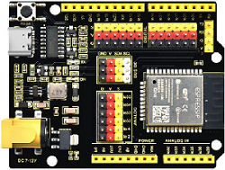
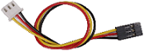
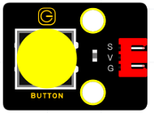
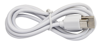
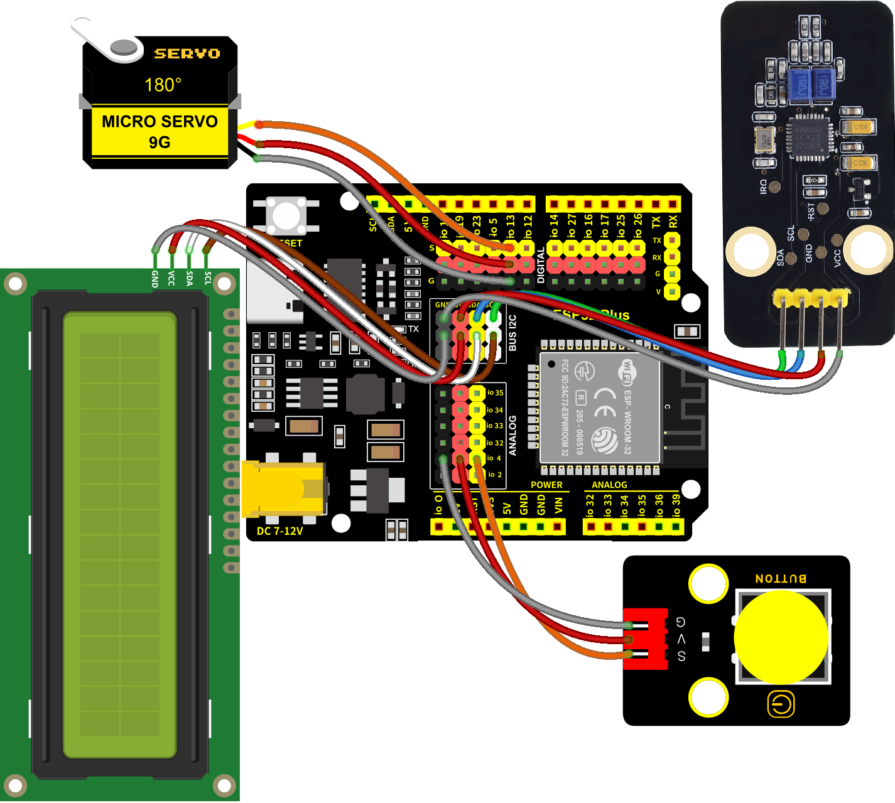
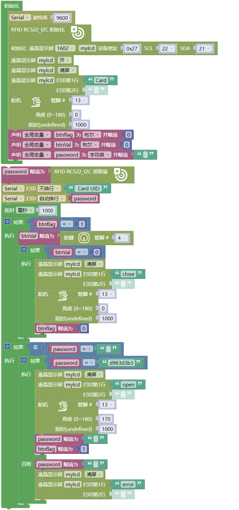

### 第12课 刷卡开门

#### 12.1 项目介绍

现在很多小区的门使用了刷卡开门这个功能，非常的方便。这节课我们将学习使用及RFID-MFRC522模块和磁卡（钥匙扣/白卡）控制门转动。

#### 12.2 模块相关资料

**（1）元件知识**

**RFID：** RFID (Radio Frequency Identification)是一种无线通信技术。一个完整的RFID系统一般由应答器和读取器组成。通常我们使用标签作为应答器，每个标签都有一个唯一的代码，它附着在物体上，用来识别目标物体。阅读器是用来读取(或写入)标签信息的设备。

从RFID技术衍生的产品可以分为三类：无源RFID产品、有源RFID产品和半有源RFID产品。而无源RFID产品是市场上最早、最成熟、使用最广泛的产品。它在我们的日常生活中随处可见，如公交卡、餐卡、银行卡、酒店门禁卡等，这些都属于近距离接触识别。无源RFID产品的主要工作频率有:125KHZ(低频)、13.56MHZ(高频)、433MHZ(超高频)、915MHZ(超高频)。有源和半有源RFID产品工作在更高的频率。

我们使用的RFID模块是无源RFID产品，工作频率为13.56MHz。

**RFID-MFRC522刷卡模块：** MFRC522是一个高度集成的读取/写入器IC，用于13.56MHz的非接触式通信。MFRC522的内部发射器能够驱动一个读取/写入天线，设计用于与ISO/IEC 14443A/MIFARE卡和应答器通信，而无需额外的有源电路。接收模块为来自ISO/IEC 14443 A/MIFARE兼容卡和应答器的信号解调和解码提供了一个健壮和高效的实现。数字模块管理完整的ISO/IEC 14443A组帧和错误检测(奇偶校验和CRC)功能。

该RFID模块采用MFRC522作为控制芯片，采用I2C (Inter－Integrated Circuit)接口。

**（2）规格参数：**

工作电压：DC 3.3V-5V

工作电流：13—100mA/DC 5V

空闲电流：10-13mA/DC 5V

休眠电流：\<80uA

峰值电流：\<100mA

工作频率：13.56MHz

最大功率：0.5W

支持的卡类型：mifare1 S50、mifare1 S70、mifare UltraLight、mifare Pro、mifare Desfire

环境工作温度：摄氏-20—80℃  
环境储存温度：摄氏-40—85℃  
环境相对湿度：相对湿度5%—95%

数据传输速率：最大10Mbit/s

#### 12.3 实验组件

|||||
|-|-|-|-|
|ESP32 Plus主板 *1|RFID-MFRC522刷卡模块 *1|180度舵机 *1|3P线 *1|
|||||
|I2C LCD1602模块 *1|按键 *1|白卡 *1|4P线 *1| 
||||  |
|4pin 黑红蓝绿母对母连拼 *1|USB线 *1|钥匙扣 *1|  |

#### 12.4 模块接线图

RFID-RC522刷卡模块，木板房子⑦处(左侧)按键1，门舵机和I2C 1602 LCD模块的控制引脚：

|木板房子⑦处(左侧)按键1（S引脚）|io4|
|-|-|
|门舵机（橙黄色线引脚）|io13|
|RFID-MFRC522刷卡模块（SDA引脚）|SDA|
|RFID-MFRC522刷卡模块（SCL引脚）|SCL|
|I2C 1602 LCD模块（SDA引脚）|SDA|
|I2C 1602 LCD模块（SCL引脚）|SCL|

⚠️ **特别注意：智能家居已经组装好了，这里不需要把RFID-RC522模块、按键、舵机和I2C 1602 LCD模块拆下来又重新组装和接线，这里再次提供接线图，是为了方便您编写代码！**

#### 12.5 代码流程图

#### 12.6 实验代码

⚠️ 特别注意：对于不同的RFID-RC522的白磁卡和蓝色钥匙扣，其白磁卡值和蓝色钥匙扣的值可能都不一样。所以，当使用你自己的白磁卡片靠近RFID-MFRC522刷卡模块的感应区域时，你需要将你在串口监视器窗口中读取对应的白磁卡值(Card UID)更换代码程序中的值 (⚠️ **特别提醒：需要先上传示例代码至ESP32主控板上，打开串口监视器，设置波特率为9600，白磁卡片靠近RFID-MFRC522刷卡模块的感应区域，可以读取到白磁卡值，将对应的白磁卡值(Card UID)更换代码程序中的值。**)。

#### 12.7 实验结果

按照接线图接好线，外接电源，选择好正确的开发板板型（ESP32 Dev Module）和 适当的串口端口（COMxx），然后单击按钮上传示例代码至ESP32主控板。示例代码上传成功后，上电后，将我们提供的白磁卡片靠近(或接触)RFID-MFRC522刷卡模块的感应区域，门就会转动打开，LCD1602显示”open”。按住(停留时间大概1s)木板房子⑦处(左侧)按键1，门转动关闭，LCD1602显示”close”。用另一个蓝色的钥匙扣靠近(或接触)RFID-MFRC522刷卡模块的感应区域，LCD1602显示“error”。

