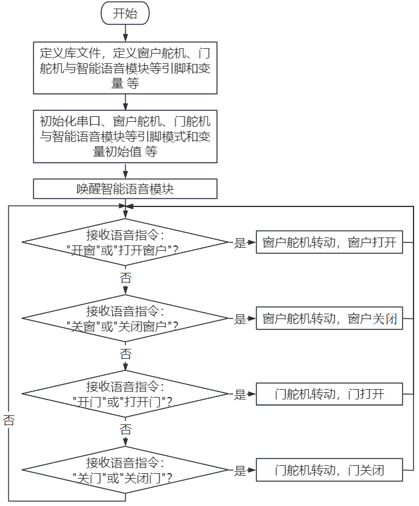
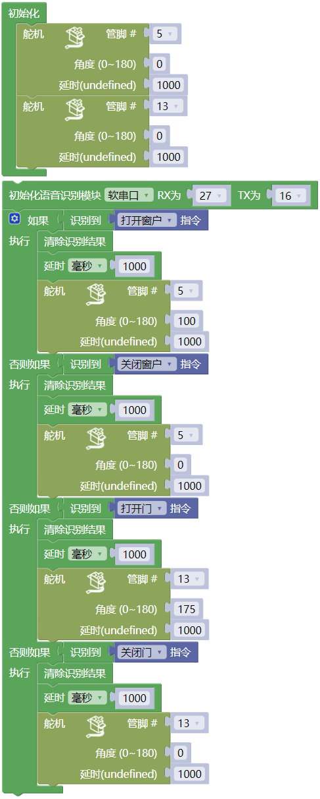

### 第16课 语音控制门窗系统

#### 16.1 项目介绍

语音控制门窗是一种基于智能语音识别技术的现代化家居控制系统，通过语音指令实现对门窗的开启、关闭等操作，为用户提供更便捷、智能的生活体验。

语音控制门窗系统代表了智能家居发展的重要方向，通过将传统的门窗控制与先进的语音识别技术相结合，不仅提升了用户的生活便利性，还为实现真正的智能家居生态奠定了基础。随着人工智能技术的不断进步，语音控制门窗将在安全性、智能化程度和用户体验方面持续优化，成为未来智能建筑的标准配置。

#### 16.2 实验组件

||||
|-|-|-|
|ESP32 Plus主板 *1|180度舵机 *2|智能语音模块 *1|
| ||  |
|4P线 *1|USB线 *1|   |

#### 16.3 模块接线图

水滴传感器，窗户舵机和门舵机的控制引脚：

|窗户舵机（橙黄色线引脚）|io5|
|-|-|
|门舵机（橙黄色线引脚）|io13|
|智能语音模块（TXD引脚）|io16|
|智能语音模块（RXD引脚）|io27|

⚠️ **特别注意：智能家居已经组装好了，这里不需要把智能语音模块和舵机拆下来又重新组装和接线，这里再次提供接线图，是为了方便您编写代码！**

#### 16.4 代码流程图

#### 16.5 实验代码

使用智能语音模块控制智能家居的门、窗开与关。

#### 16.6 实验结果

按照接线图接好线，外接电源，选择好正确的开发板板型（ESP32 Dev Module）和 适当的串口端口（COMxx），然后单击按钮上传代码。上传代码成功后，可以通过智能语音模块来控制门和窗。

对着智能语音模块上的麦克风，使用唤醒词 “你好，小智” 或 “小智小智” 来唤醒智能语音模块，同时喇叭播放回复语 “有什么可以帮到您”；接下来即可通过串口监视器打印窗口查看智能语音模块接收到语音命令词所对应的命令参数 等。

智能语音模块唤醒后，对着麦克风说：“开窗” 或 “打开窗户”等命令词时，串口打印命令参数 “57”，同时喇叭播放对应的回复语 “已为您打开窗户”；

对着麦克风说：“关窗” 或 “关闭窗户” 等命令词时，串口打印命令参数 “58”，同时喇叭播放对应的回复语 “已为您关闭窗户”；

对着麦克风说：“开门” 或 “打开门”等命令词时，串口打印命令参数 “59”，同时喇叭播放对应的回复语 “已为您打开门”；

对着麦克风说：“关门” 或 “关闭门” 等命令词时，串口打印命令参数 “60”，同时喇叭播放对应的回复语 “已为您关闭门”。

