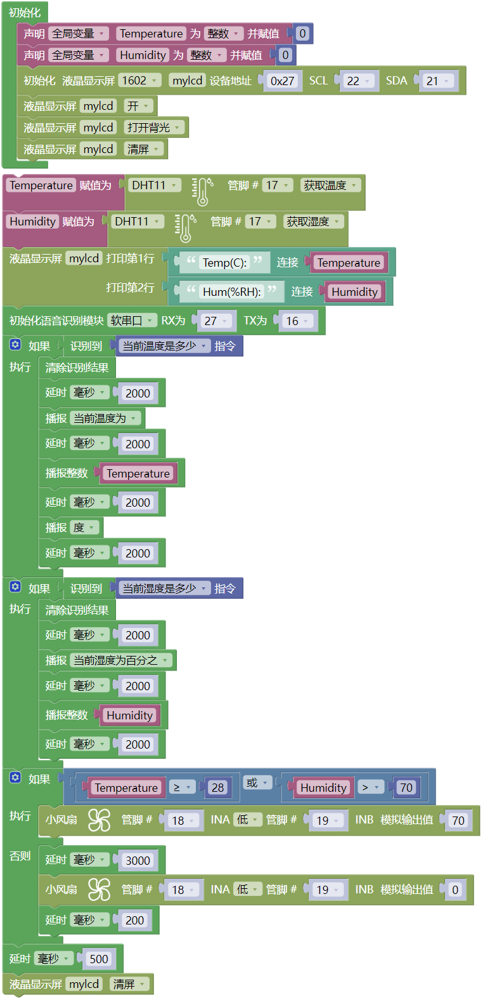

### 第19课  语音温湿控系统

#### 19.1 项目介绍

本教程介绍如何使用温湿度传感器、风扇模块、智能语音模块和I2C LCD1602模块，构建一个智能温湿度控制系统。

该系统的温湿度传感器能够测量环境温度和湿度，并根据需求控制风扇降温。当温度超过设定阈值时，系统会自动开启风扇，将环境温度降至设定值以下。系统的 I2C LCD1602模块 显示当前温度和湿度值。同时，我们对着智能语音模块发出类似的“当前温度是多少”和“当前湿度是多少”等命令词，智能语音模块接收到相应命令词后语音播报当前温度和当前湿度的百分数值。该系统能够实现自动调节环境温湿度的功能，对于需要控制环境温湿度的项目具有很好的应用价值。

这个应用场景需要通过单线通信来获取XHT11温湿度传感器的数据，并将温度和湿度数值显示在I2C LCD1602模块上。还能语音播报检测到的当前温度和当前湿度，同时，当温度或湿度超过设定的阈值时，风扇模块会开启，用来降低温度以保护家里的动植物。这种模块的优点是安装容易，且功能强大。它不仅可以通过PWM调节速度，还能够通过单线通信来传输数据。总的来说，这个应用场景是一个非常实用的解决方案，可以帮助主人监测和控制家居的环境。

#### 19.3 模块接线图

|||||
|-|-|-|-|
|ESP32 Plus主板 *1|XHT11传感器 *1|智能语音模块 *1|3P线 *1|
|||||
|I2C LCD1602模块 *1|130电机模块 *1|4P线 *2|USB线 *1|

**1.3. 模块接线图：**

智能语音模块、XHT11温湿度传感器、I2C LCD1602模块和130电机模块的控制引脚：

|XHT11温湿度传感器（S引脚）|io17|
|-|-|
|130电机模块（IN+引脚）|io18|
|130电机模块（IN-引脚）|io19|
|智能语音模块（TXD引脚）|io16|
|智能语音模块（RXD引脚）|io27|
|I2C 1602 LCD模块（SDA引脚）|SDA|
|I2C 1602 LCD模块（SCL引脚）|SCL|

⚠️ **特别注意：智能家居已经组装好了，这里不需要把XHT11温湿度传感器、电机模块、I2C LCD1602模块和智能语音模块拆下来又重新组装和接线，这里再次提供接线图，是为了方便您编写代码！**

#### 19.4 代码流程图

#### 19.5 实验代码 

⚠️ **注意：代码中的条件阈值可以根据实际情况自行设置。**

#### 19.6 实验结果 

按照接线图接好线，外接电源，选择好正确的开发板板型（ESP32 Dev Module）和 适当的串口端口（COMxx），然后单击按钮上传代码。上传代码成功后，LCD1602显示屏实时显示XHT11传感器检测到环境中的湿度值和温度值。当空气温度大于等于28℃或空气湿度大于70%RH时，风扇模块会开启，进行散热降湿，当空气温度小于28℃且空气湿度小于等于70%RH时，风扇模块会关闭（风扇为模拟散热，散热效果一般），达到农场自动控温控湿效果，节省能源。

对着智能语音模块上的麦克风，使用唤醒词 “你好，小智” 或 “小智小智” 来唤醒智能语音模块，同时喇叭播放回复语 “有什么可以帮到您”；

智能语音模块唤醒后，对着麦克风说：“当前温度是多少” 或 “当前温度多少” 等命令词时，接着语音播报 “正在为您读取温度” + “当前温度为” + “XHT11温湿度传感器检测到的温度值” + “度”；

对着麦克风说：“当前湿度是多少” 或 “当前湿度多少” 等命令词时，接着语音播报 “正在为您读取湿度” + “当前湿度为百分之” + “XHT11温湿度传感器检测到的湿度值”。

