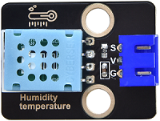
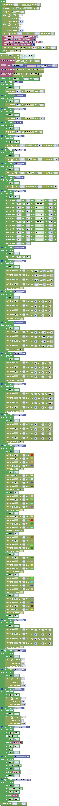
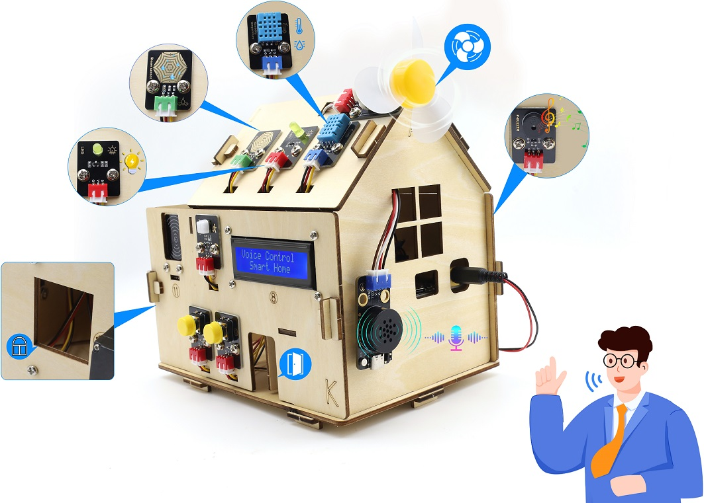

### 第20课 语音控制智能家居系统

#### 20.1 项目介绍

经过前面一系列的语音控制项目的学习，我们是不是可以通过智能语音模块控制智能家居更多传感器模块呢？当然是可以的。在本项目实验中，通过ESP32主控板控制更多传感器模块，然后通过智能语音模块进行实时语音播报智能家居的温湿度、雨水量等。同时，它还能控制LED灯进行照明，控制SK6812，控制门开与关，控制窗户开与关，控制电机模块和音乐播放等。

#### 20.2 实验组件

|||||
|-|-|-|-|
|ESP32 Plus主板 *1|XHT11传感器 *1|黄色LED模块 *1|SK6812RGB灯模块 *1|
|||||
|无源蜂鸣器*1|130电机模块 *1|180度舵机 *2|水滴传感器 *1|
|||||
|智能语音模块 *1|4P线 *3|风扇叶 *1|I2C LCD1602模块 *1|
|| | | |
|3P线 *5|USB线*1 | | |

#### 20.3 模块接线图

⚠️ **特别注意：智能农场已经组装好了，这里不需要把所有的传感器和模块都拆下来又重新组装和接线。由于传感器和模块较多，接线图中的接线复杂会导致传感器和模块的引脚接线看不清，所以使用表格来表示传感器和模块的引脚连接到ESP32主控板上的对应引脚，也是为了方便您编写代码！**

|传感器模块名称|传感器模块引脚|ESP32 Plus主板对应的接线|
|-|-|-|
|无源蜂鸣器|G/V/S|G/V/io25|
|黄色LED模块|G/V/S|G/V/io12|
|130电机模块|GND/VCC/IN+/IN-|G/V/io19/io18|
|控制门的舵机1|棕色线/红色线/橙色线|G/V/io13|
|控制窗的舵机2|棕色线/红色线/橙色线|G/V/io5|
|XHT11模块|G/V/S|G/V/io17|
|SK6812RGB灯模块|G/V/S|G/V/io26|
|LCD1602显示屏模块|GND/VCC/SDA/SCL|GND/V/SDA/SCL|
|水滴传感器模块|G/V/S|G/V/io34|
|智能语音模块|G/V/TXD/RXD|G/V/io16/io27|

#### 20.4 代码流程图

#### 20.5 实验代码

#### 20.6 实验结果

按照接线图接好线，外接电源，选择好正确的开发板板型（ESP32 Dev Module）和 适当的串口端口（COMxx），然后单击按钮上传代码。上传代码成功。LCD1602模块显示屏显示“Voice Controll Smart Home”。

对着智能语音模块上的麦克风，使用唤醒词 “你好，小智” 或 “小智小智” 来唤醒智能语音模块，同时喇叭播放回复语 “有什么可以帮到您”；

智能语音模块唤醒后，对着麦克风说：“打开台灯” 或 “请开灯” 或 “开灯” 或 “打开灯” 或 “我回来了” 等命令词时，喇叭播放对应的回复语 “已为您打开照明”，同时LED点亮；

对着麦克风说：“调亮一点” 或 “亮一点” 等命令词时，喇叭播放对应的回复语 “灯光已调亮”，同时LED变亮；

对着麦克风说：“调暗一点” 或 “暗一点” 等命令词时，喇叭播放对应的回复语 “灯光已调暗”，同时LED变暗；

对着麦克风说：“关闭台灯” 或 “请关灯” 或 “关灯” 或 “睡觉了” 或 “关上灯” 或 “我出去了”等命令词时，喇叭播放对应的回复语 “已为您关闭照明”，同时LED熄灭；

对着麦克风说：“打开风扇” 或 “请开风扇” 或 “开风扇” 等命令词时，喇叭播放对应的回复语 “已为您打开风扇”，同时风扇转动；

对着麦克风说：“风大一点” 或 “大一点” 等命令词时，喇叭播放对应的回复语 “风速已增加”，同时风扇转速加快；

对着麦克风说 “风小一点” 或 “小一点” 等命令词时，喇叭播放对应的回复语 “风速已减弱”，同时风扇转速减慢；

对着麦克风说：“关闭风扇” 或 “请关风扇” 或 “关风扇” 或 “关上风扇” 等命令词时，喇叭播放对应的回复语 “已为您关闭风扇”，同时风扇不转；

对着麦克风说 “播放音乐” 等命令词时，喇叭播放对应的回复语 “已为您播放音乐”，同时蜂鸣器播放音乐；

对着麦克风说：“关闭音乐” 等命令词时，喇叭播放对应的回复语 “已为您关闭音乐”，同时蜂鸣器不响；

对着麦克风说：“打开红灯” 等命令词时，喇叭播放对应的回复语 “已为您打开红灯”，同时SK6812灯亮红色灯；

对着麦克风说：“关闭红灯” 等命令词时，喇叭播放对应的回复语 “已为您关闭红灯”，同时SK6812灯熄灭；

对着麦克风说：“打开蓝灯” 等命令词时，喇叭播放对应的回复语 “已为您打开蓝灯”，同时SK6812灯亮蓝色灯；

对着麦克风说：“关闭蓝灯” 等命令词时，喇叭播放对应的回复语 “已为您关闭蓝灯”，同时SK6812灯熄灭；

对着麦克风说：“打开绿灯” 等命令词时，喇叭播放对应的回复语 “已为您打开绿灯”，同时SK6812灯亮绿色灯；

对着麦克风说：“关闭绿灯” 等命令词时，喇叭播放对应的回复语 “已为您关闭绿灯”，同时SK6812灯熄灭；

对着麦克风说：“打开彩灯” 等命令词时，喇叭播放对应的回复语 “已为您打开彩灯”，同时SK6812灯亮彩色灯；

对着麦克风说：“关闭彩灯” 等命令词时，喇叭播放对应的回复语 “已为您关闭彩灯”，同时SK6812灯熄灭；

对着麦克风说：“开窗” 或 “打开窗户”等命令词时，串口打印命令参数 “57”，同时喇叭播放对应的回复语 “已为您打开窗户”；

对着麦克风说：“关窗” 或 “关闭窗户” 等命令词时，串口打印命令参数 “58”，同时喇叭播放对应的回复语 “已为您关闭窗户”；

对着麦克风说：“开门” 或 “打开门”等命令词时，串口打印命令参数 “59”，同时喇叭播放对应的回复语 “已为您打开门”；

对着麦克风说：“关门” 或 “关闭门” 等命令词时，串口打印命令参数 “60”，同时喇叭播放对应的回复语 “已为您关闭门”；

对着麦克风说：“当前雨水量是多少” 或 “当前雨量多少” 等命令词时，接着语音播报 “正在为您读取当前雨水量” + “当前雨水量为百分之” + “水滴传感器模拟值通过计算转化成的雨水量百分数值”；

对着麦克风说：“当前温度是多少” 或 “当前温度多少” 等命令词时，接着语音播报 “正在为您读取温度” + “当前温度为” + “XHT11温湿度传感器检测到的温度值” + “度”；

对着麦克风说：“当前湿度是多少” 或 “当前湿度多少” 等命令词时，接着语音播报 “正在为您读取湿度” + “当前湿度为百分之” + “XHT11温湿度传感器检测到的湿度值”。

